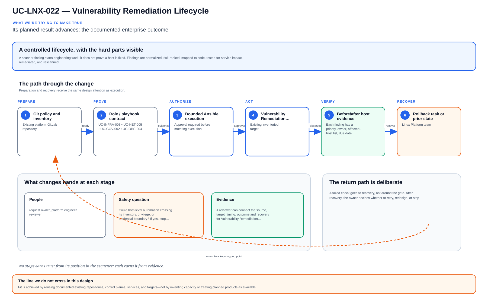

# UC-LNX-022: Vulnerability Remediation Lifecycle

Last verified: 2026-08-02

## Use-case record

| Field | Value |
| --- | --- |
| Portfolio | Enterprise Linux Systems Engineering Platform |
| Canonical coverage target | Scan, prioritize, remediate, verify and document CIS, STIG, FIPS and organizational findings |
| Delivery model | End-to-end infrastructure as code |
| Primary roles | Vulnerability engineer, Linux platform engineer, service owner, risk/compliance reviewer |
| Target environment | Managed Linux hosts, images, packages, configuration, and exceptions |
| Current state | **Defined backlog with patch/compliance evidence. No accepted finding ingestion, risk SLA, remediation pipeline, exception lifecycle, or rescan proof exists.** |
| Related change | None; implementation requires a future approved change record |
| Owner | Linux Platform team |

## Purpose

A scanner finding starts engineering work; it does not prove a host is fixed. Findings are normalized, risk-ranked, mapped to code, tested for service impact, remediated, and rescanned.

## Expected outcome

Each finding has a priority, owner, affected-host list, due date, remediation or exception, and closure evidence. Unresolved exposure remains visible rather than disappearing behind a filter.

## Trigger and actors

| Item | Definition |
| --- | --- |
| Trigger | A scan, advisory, threat intelligence update, or control review creates a finding |
| Engineering owners | Vulnerability engineer, Linux platform engineer, service owner, risk/compliance reviewer |
| Approver | Confirms scope, risk, window, plan, and recovery readiness |
| Operations/SRE | Reviews health, evidence, incident linkage, and acceptance |

## Preconditions

- The sequential change record authorizes this exact use case and no conflicting infrastructure work is active.
- GitLab, tagged runner, Jenkins, AWX, inventory, DNS, and observability dependencies are healthy.
- Exact target/canary limits and owners are known; secrets are referenced from approved systems.
- The selected SHA passed source, syntax, lint, policy, security, and plan/check gates.
- Recovery prerequisites and stop conditions are verified before mutation.

## Scope and exclusions

**In scope:** Asset identity, scan import, deduplication, exploitability/context, SLA, owner, remediation as IaC, canary, rescan, exception, evidence, and metrics.

**Excluded:** Raw severity-only prioritization, manual console remediation, permanent waivers, and claiming FIPS/STIG compliance from package presence.

## Architecture diagram

Findings are prioritized and mapped to code, remediated through a canary, and closed only when rescan and service-health evidence agree.

## IaC delivery model

| Layer | Responsibility |
| --- | --- |
| GitLab | Source of truth, merge request, protected branch, CI, immutable SHA, artifacts |
| Jenkins | Manual PLAN/CHECK/APPLY/ROLLBACK, approval, concurrency, evidence aggregation |
| Terraform/image automation | VM/image/volume/network lifecycle only when required |
| AWX and Ansible | OS desired state, inventory limit, check mode, serial rollout, job events |
| Observability/evidence | Health, logs, metrics, expected-versus-observed, incidents, acceptance |

Current-source reality: Patch assessment and compliance evidence provide inputs but not the full vulnerability workflow.

## End-to-end implementation

### Code and configuration map

| State | Repository path | Responsibility |
| --- | --- | --- |
| Existing | `linux-systems-platform: roles/patch_assessment and roles/compliance_evidence` | Package and posture evidence inputs |
| Planned | `linux-systems-platform: tools/vulnerability_ingest and vars/remediation_catalog.yml` | Normalized findings, asset mapping, SLA, owner, and remediation reference |
| Planned | `linux-systems-platform: playbooks/vulnerability-remediate.yml` | Approval-gated canary remediation and verification |

### Required variables and controls

| Variable/control | Example or constraint | Purpose |
| --- | --- | --- |
| `finding_id` | scanner/CVE/control stable ID | Traceability |
| `risk_priority` | severity plus exploitability/context | Action order |
| `remediation_sla` | policy-based due date | Accountability |
| `exception_expiry` | approved date and compensating control | No permanent waiver |

### Delivery sequence

1. Ingest signed scanner/advisory output and map each finding to canonical asset, package/config, owner, service tier, exposure, and evidence.
2. Prioritize using exploitability, exposure, business impact, compensating controls, and patch availability—not CVSS alone.
3. Link each finding to an existing role/task or create reviewed remediation source with tests and rollback.
4. Run plan/check and canary remediation; verify service health and security control behavior.
5. Rescan using the same finding identity, close only verified fixes, and record residual risk or an expiring exception.
6. Track SLA, recurrence, mean time to remediate, failed changes, and systemic source/image corrections.

## Code and configuration map

The implementation map above distinguishes observed `Existing` paths from `Planned` IaC design targets. Planned paths must not be used as evidence of completion.

## Jira breakdown

### STORY-LNX-022-001: Implement and validate the source model

**Description:** The platform team keeps the inputs, roles or modules, tests, pipeline gates, and operating boundaries for Vulnerability Remediation Lifecycle in Git. A reviewer can reproduce the proposal from the selected commit without relying on settings that exist only in a console.

**Status:** In progress only where supporting source is listed; the full source gate is not accepted.

**Acceptance criteria:**

- Inputs have schemas/defaults, safe bounds, ownership, and secret references.
- CI rejects malformed, unsafe, non-idempotent, and out-of-scope changes.
- CI publishes immutable SHA, exact assumptions, and plan/check artifacts.

**Implementation steps:**

1. Ingest signed scanner/advisory output and map each finding to canonical asset, package/config, owner, service tier, exposure, and evidence.
2. Prioritize using exploitability, exposure, business impact, compensating controls, and patch availability—not CVSS alone.
3. Link each finding to an existing role/task or create reviewed remediation source with tests and rollback.

**Completed work:** Patch assessment and compliance evidence provide inputs but not the full vulnerability workflow.

**Validation and rollback:** Validate without runtime mutation; revert source and regenerate artifacts from the prior accepted revision if incorrect.

**Required attachments:** `ART-LNX-022-001` and `ATT-LNX-022-001`.

### STORY-LNX-022-002: Execute the bounded canary and rollout

**Description:** The operator reviews PLAN or CHECK output against one named canary before applying Vulnerability Remediation Lifecycle. Failed health or negative tests stop the run, and expansion requires explicit approval.

**Status:** Planned; no runtime acceptance is claimed.

**Acceptance criteria:**

- Execution uses the reviewed SHA, credential references, inventory, variables, and canary limit.
- Health and negative tests pass before any cohort expansion.
- Failure thresholds stop the workflow and preserve evidence without hidden manual correction.

**Implementation steps:**

1. Run plan/check and canary remediation; verify service health and security control behavior.
2. Rescan using the same finding identity, close only verified fixes, and record residual risk or an expiring exception.
3. Track SLA, recurrence, mean time to remediate, failed changes, and systemic source/image corrections.

**Completed work:** The execution design is documented; no successful live canary is claimed.

**Validation and rollback:** Findings map to canonical assets and stable IDs without duplicates; Priority, owner, due date, remediation source, and exception state are visible; Canary remediation preserves service health and rescan clears the intended finding. Revert the remediation role/config/package to the prior accepted revision when service risk exceeds the security benefit, restore service health, and create a time-bound exception with compensating controls.

**Required attachments:** `ART-LNX-022-002`, `ATT-LNX-022-002`, and `ATT-LNX-022-003`.

### STORY-LNX-022-003: Prove convergence, recovery, and handoff

**Description:** Operations accepts Vulnerability Remediation Lifecycle only after the same revision converges cleanly, runtime health is visible, and the recovery path has been exercised. The evidence must explain what moved, what stayed stable, and how the team recovered it.

**Status:** Planned; blocked until the canary story succeeds.

**Acceptance criteria:**

- Repeating identical code and inputs produces zero unexpected change.
- Recovery is exercised and service returns within the approved objective.
- Logs, metrics, job output, owner, result, and incidents are linked.

**Implementation steps:**

1. Repeat the identical execution and compare the changed set.
2. Exercise the documented recovery path on the bounded target.
3. Verify service health, monitoring, security posture, and consumer access.
4. Publish sanitized evidence and obtain owner/SRE acceptance.

**Completed work:** Acceptance requirements are defined; no runtime proof is claimed.

**Validation and rollback:** Repeat role is unchanged and recurring findings trigger systemic correction. Revert the remediation role/config/package to the prior accepted revision when service risk exceeds the security benefit, restore service health, and create a time-bound exception with compensating controls.

**Required attachments:** `ART-LNX-022-003`, `ATT-LNX-022-004`, and `ATT-LNX-022-005`.

## Evidence and screenshot register

| ID | Required evidence | Source | Status |
| --- | --- | --- | --- |
| `ART-LNX-022-001` | CI, immutable SHA, and plan/check artifact | GitLab | Pending |
| `ATT-LNX-022-001` | Successful source pipeline | GitLab | Pending |
| `ART-LNX-022-002` | Canary execution and changed set | Jenkins/AWX/Terraform | Pending |
| `ATT-LNX-022-002` | Canary result | Control plane | Pending |
| `ATT-LNX-022-003` | Runtime health and expected state | Dashboard/CLI | Pending |
| `ART-LNX-022-003` | Second convergence and recovery log | Control plane | Pending |
| `ATT-LNX-022-004` | Recovery result | Control plane | Pending |
| `ATT-LNX-022-005` | Final accepted state | Dashboard/CLI | Pending |

## Expected versus current result

| Area | Expected | Current observation | Decision |
| --- | --- | --- | --- |
| Source | Complete IaC and pipeline for Vulnerability Remediation Lifecycle | Patch assessment and compliance evidence provide inputs but not the full vulnerability workflow. | Not yet code complete |
| Runtime | Approved canary/cohort execution | No accepted use-case run | Pending |
| Idempotence | Identical second run has zero unexpected change | No accepted convergence proof | Pending |
| Recovery | Recovery exercised and timed | No accepted recovery artifact | Pending |
| Evidence | Sanitized artifacts tied to immutable executions | Register defined; captures pending | Pending |

## Validation, idempotence, and rollback

- Findings map to canonical assets and stable IDs without duplicates.
- Priority, owner, due date, remediation source, and exception state are visible.
- Canary remediation preserves service health and rescan clears the intended finding.
- Repeat role is unchanged and recurring findings trigger systemic correction.

**Rollback/recovery:** Revert the remediation role/config/package to the prior accepted revision when service risk exceeds the security benefit, restore service health, and create a time-bound exception with compensating controls.

Idempotence means the same reviewed revision, target, variables, and action produces zero unexplained changes plus stable consumer health. First-run success is not enough.

## Troubleshooting guide

Primary scenario: **The package version is fixed, but the scanner continues to report the CVE because it inventories a bundled library.**

1. Stop propagation and preserve SHA, plan/check, execution IDs, timestamps, and targets.
2. Isolate source, orchestration, infrastructure, connectivity, privilege, host state, and consumer health.
3. Compare live facts with intended variables and the last accepted baseline; correlate logs/metrics to the window.
4. Reproduce only on the canary or in PLAN/CHECK and change one hypothesis at a time.
5. Recover through the documented path and record unexpected failures or near misses.

## Interview preparation

1. **Question:** Explain the end-to-end IaC architecture for Vulnerability Remediation Lifecycle.
   **Answer signals:** Cover GitLab review and CI, Jenkins approval, Terraform/image ownership where relevant, AWX/Ansible execution, observability, convergence, recovery, and evidence.

2. **Question:** How would you make the implementation idempotent and reusable?
   **Answer signals:** finding_id, risk_priority, remediation_sla, exception_expiry; explicit schemas, stable identities, bounded targets, deterministic tasks, and no UI-only state.

3. **Question:** What pipeline and plan/check evidence is required before APPLY?
   **Answer signals:** Findings map to canonical assets and stable IDs without duplicates; Priority, owner, due date, remediation source, and exception state are visible; immutable SHA, runner identity, target assumptions, scan/test results, and no exposed secret.

4. **Question:** Troubleshooting scenario: The package version is fixed, but the scanner continues to report the CVE because it inventories a bundled library. How do you respond?
   **Answer signals:** Stop propagation, preserve execution evidence, verify target and source revision, isolate the failed layer, compare live facts to desired/baseline, and test recovery on the canary.

5. **Question:** How do you prove idempotence?
   **Answer signals:** Repeat identical SHA, inputs, target, credentials scope, and action; require zero unexplained changes plus stable health and equivalent evidence.

6. **Question:** What rollback or recovery path would you defend?
   **Answer signals:** Revert the remediation role/config/package to the prior accepted revision when service risk exceeds the security benefit, restore service health, and create a time-bound exception with compensating controls.

7. **Question:** Which security/audit controls should an interviewer hear?
   **Answer signals:** Protected source, least privilege, secret references, approval gates, short-lived access, canary limits, immutable artifacts, exception expiry, and incident linkage.

8. **Question:** Discuss the tradeoff between remediation speed and service compatibility/risk.
   **Answer signals:** Frame business impact and failure modes, choose a safe default, measure canary results, keep recovery available, and document justified exceptions.

9. **Question:** Tell me about a time you owned a difficult Vulnerability Remediation Lifecycle change or incident across multiple teams. What did you do?
   **Answer signals:** Use a concise STAR example showing ownership, risk communication, evidence-based decisions, a safe stop or rollback, collaboration with service/security/SRE owners, measurable recovery or improvement, and a durable IaC correction.

## Safety and security controls

- Protected source, merge requests, tagged runners, immutable revisions, and retained artifacts.
- Least-privilege credentials referenced from approved secret systems.
- PLAN/CHECK by default; APPLY/ROLLBACK requires confirmation and exact target limits.
- Canary rollout, failure thresholds, health gates, and stop conditions.
- No credentials, private keys, secrets, or protected health information in artifacts.

## Acceptance decision

UC-LNX-022 is **not yet accepted**. Acceptance requires implemented source, passing CI, controlled execution, runtime health, zero-change second convergence, exercised recovery, reviewed evidence, and publication on the canonical branch.
