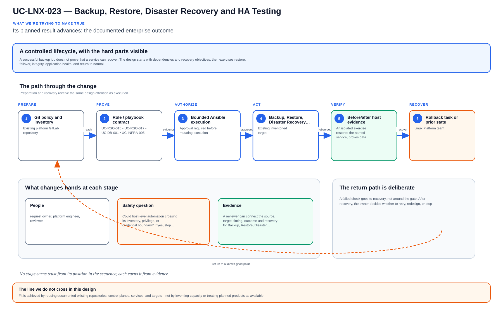

# UC-LNX-023: Backup, Restore, Disaster Recovery and HA Testing

Last verified: 2026-08-02

## Use-case record

| Field | Value |
| --- | --- |
| Portfolio | Enterprise Linux Systems Engineering Platform |
| Supporting use cases | [UC-RSO-015](../resilience/UC-RSO-015-backup-and-recovery-orchestration.md), [UC-RSO-017](../resilience/UC-RSO-017-rto-and-rpo-measurement.md), [UC-DB-001](../database/UC-DB-001-backup-restore-validation.md), [UC-INFRA-005](../infrastructure/UC-INFRA-005-server-configuration-automation-using-ansible.md) |
| Canonical coverage target | Prove recoverability, failover, service continuity and restoration evidence |
| Delivery model | End-to-end infrastructure as code |
| Primary roles | Backup engineer, Linux platform engineer, service owner, SRE, incident commander |
| Target environment | Critical Linux hosts, configuration, system data, and service-specific recovery tiers |
| Current state | **Defined backlog. A backup VM and recovery runbooks exist, but Linux backup policy as code, automated restore canaries, HA/DR exercises, and RPO/RTO evidence are not accepted.** |
| Related change | None; implementation requires a future approved change record |
| Owner | Linux Platform team |

## Purpose

A successful backup job does not prove that a service can recover. The design starts with dependencies and recovery objectives, then exercises restore, failover, integrity, application health, and return to normal.

## Expected outcome

An isolated exercise restores the named service, proves data consistency and consumer health, and measures actual RPO and RTO. Gaps become owned backlog work.

## Platform and enterprise fit

| Relationship | Detailed fit |
| --- | --- |
| Owning platform | **Backup, Restore, Disaster Recovery and HA Testing** belongs to the the documented enterprise outcome because that platform turns GitLab-reviewed standards through Jenkins approval and Terraform/image or AWX/Ansible execution into verified operating-system state. |
| Enterprise consumers | The capability supports the Linux foundation beneath provider, payer, database, Kubernetes, observability, and shared services. |
| Enterprise outcome | Its planned result advances: the documented enterprise outcome. |
| Control contribution | The design adds repeatability, least privilege, canary scope, idempotence, recovery, and host-level evidence. |
| Cross-platform handoff | Supporting platforms consume a reviewed result or evidence artifact; they do not take ownership away from the primary platform. |
| Infrastructure boundary | Fit is achieved by reusing documented existing repositories, control planes, services, and targets—not by inventing capacity or treating planned products as available. |

The platform fit is therefore based on ownership and a reusable decision, not
on the presence of a particular tool. Enterprise fit requires evidence that the
named outcome was observed for the bounded scope; completing documentation or
running an isolated technology demonstration is insufficient.

## Trigger and actors

| Item | Definition |
| --- | --- |
| Trigger | A scheduled recovery exercise, new service onboarding, backup change, or incident requires restoration |
| Engineering owners | Backup engineer, Linux platform engineer, service owner, SRE, incident commander |
| Approver | Confirms scope, risk, window, plan, and recovery readiness |
| Operations/SRE | Reviews health, evidence, incident linkage, and acceptance |

## Preconditions

- The sequential change record authorizes this exact use case and no conflicting infrastructure work is active.
- GitLab, tagged runner, Jenkins, AWX, inventory, DNS, and observability dependencies are healthy.
- Exact target/canary limits and owners are known; secrets are referenced from approved systems.
- The selected SHA passed source, syntax, lint, policy, security, and plan/check gates.
- Recovery prerequisites and stop conditions are verified before mutation.

## Scope and exclusions

**In scope:** Backup policy, include/exclude, encryption, retention, immutability, job monitoring, restore canary, integrity/application validation, failover/failback, RPO/RTO, and evidence.

**Excluded:** Backup success without restore, copying secrets into Git, destructive production drills without isolation, and assuming VM snapshots replace application-consistent backup.

## Design walkthrough

In practice, Backup, Restore, Disaster Recovery and HA Testing makes sense when you treat the
host or fleet change as a canary-led operating procedure rather than a collection of commands.
The result MidhHealth needs is to Its planned result advances: the documented enterprise
outcome. Linux Platform team owns the platform decision, while the consuming service or business
owner still accepts the effect on its workflow.

Follow the object from creation through change, operation and retirement; every transition needs
an owner and a recoverable prior state. In this page, **UC-RSO-015: Backup and Recovery
Orchestration** contributes backup identity, recovery orchestration, and restoration evidence;
**UC-RSO-017: RTO and RPO Measurement** contributes owned RTO/RPO targets and measurement
method. The first buildable boundary is the accepted existing lab boundary named by the page.
The design stops at this rule: Fit is achieved by reusing documented existing repositories,
control planes, services, and targets—not by inventing capacity or treating planned products as
available.

The walkthrough becomes useful when the happy path breaks. If a required dependency or
verification result is unavailable, the expected response is to stop before mutation, preserve
the evidence and return the decision to the accountable owner. The leading design threat is
host-level automation crossing its inventory, privilege, or credential boundary; therefore a
green source job, screenshot or reachable endpoint is supporting evidence, not acceptance by
itself.

## Architecture context

Backup, Restore, Disaster Recovery and HA Testing is evaluated inside the existing enterprise lab and the owning
platform's current source-control and execution boundaries. The architectural
unit is the governed outcome—**Prove recoverability, failover, service continuity and restoration evidence**—rather than a new product or
environment.

| Context element | Architecture statement |
| --- | --- |
| Business and operational setting | Enterprise consumers: Enterprise Linux Systems Engineering Platform. The result must be explainable, repeatable, and owned. |
| Current state | **Defined backlog. A backup VM and recovery runbooks exist, but Linux backup policy as code, automated restore canaries, HA/DR exercises, and RPO/RTO evidence are not accepted.** |
| Desired state | A reviewed contract drives a bounded result, machine-readable evidence, and a safe stop or recovery decision. |
| Existing target boundary | Critical Linux hosts, configuration, system data, and service-specific recovery tiers |
| Infrastructure constraint | Use existing GitLab, Jenkins, AWX, libvirt, and inventoried hosts; no VM, IP, product, or capacity is authorized by this page |
| Accountable platform owner | Linux Platform team; the consuming service, data, security, or workflow owner remains accountable for accepting business impact. |

The page owns the contract, control logic, evidence, and recovery behavior for
Backup, Restore, Disaster Recovery and HA Testing. It does not absorb the responsibilities of the dependency use cases
listed below.

## Architecture diagram

Read the timeline as a controlled change, not a happy-path checklist. Preparation, authorization, verification, and recovery are peers, and failure returns to a known-good point.

## IaC delivery model

| Layer | Responsibility |
| --- | --- |
| GitLab | Source of truth, merge request, protected branch, CI, immutable SHA, artifacts |
| Jenkins | Manual PLAN/CHECK/APPLY/ROLLBACK, approval, concurrency, evidence aggregation |
| Terraform/image automation | VM/image/volume/network lifecycle only when required |
| AWX and Ansible | OS desired state, inventory limit, check mode, serial rollout, job events |
| Observability/evidence | Health, logs, metrics, expected-versus-observed, incidents, acceptance |

Current-source reality: The environment has backup.example.com and break-glass/lifecycle runbooks; end-to-end Linux recovery automation is not implemented.

## End-to-end implementation

### Code and configuration map

| State | Repository path | Responsibility |
| --- | --- | --- |
| Existing | `enterprise-architecture-docs: docs/vm-inventory.md` | Canonical backup service and Linux target inventory facts |
| Planned | `linux-systems-platform: roles/backup_client and vars/recovery_tiers.yml` | Agent, policy, schedules, retention, encryption, and monitoring state |
| Planned | `linux-systems-platform: playbooks/restore-canary.yml and dr-exercise.yml` | Isolated restore, integrity, service validation, failover/failback, and evidence |

### Required variables and controls

| Variable/control | Example or constraint | Purpose |
| --- | --- | --- |
| `recovery_tier` | tier-0/1/2/3 | RPO/RTO and exercise frequency |
| `backup_policy_id` | immutable reviewed policy | Traceability |
| `restore_isolation_network` | non-production segment | Safe validation |
| `recovery_evidence_id` | job plus restore manifest | Acceptance proof |

### Delivery sequence

1. Classify service/data owner, consistency method, RPO, RTO, retention, encryption, dependencies, failover order, and recovery acceptance tests.
2. Configure backup client/policy as code and verify schedules, protected paths, exclusions, credentials, repository capacity, and alerts.
3. Select a recovery point and restore into an isolated canary without overwriting production.
4. Verify checksums, ownership, SELinux context, service start, application/data integrity, dependencies, and consumer probes.
5. For HA/DR, execute approved failover and failback while recording impact, data loss, recovery time, and decision points.
6. Repeat automation for convergence, remediate gaps, and retain backup-job plus restore evidence.

## Dependencies and handoffs

Backup, Restore, Disaster Recovery and HA Testing remains accountable to its primary platform. The dependencies below
provide explicit contracts or assurance evidence; they do not become alternate owners.

| Relationship | Use case | Required handoff | Failure propagation |
| --- | --- | --- | --- |
| Required upstream contract | [UC-RSO-015: Backup and Recovery Orchestration](../resilience/UC-RSO-015-backup-and-recovery-orchestration.md) | backup identity, recovery orchestration, and restoration evidence | Missing, stale, or failed evidence blocks promotion or runtime action. |
| Required upstream contract | [UC-RSO-017: RTO and RPO Measurement](../resilience/UC-RSO-017-rto-and-rpo-measurement.md) | owned RTO/RPO targets and measurement method | Missing, stale, or failed evidence blocks promotion or runtime action. |
| Coordinated assurance handoff | [UC-DB-001: Automated PostgreSQL Restore Validation](../database/UC-DB-001-backup-restore-validation.md) | backup provenance, isolated restore, and recovery verification | Missing, stale, or failed evidence blocks promotion or runtime action. |
| Coordinated assurance handoff | [UC-INFRA-005: Server Configuration Automation Using Ansible](../infrastructure/UC-INFRA-005-server-configuration-automation-using-ansible.md) | server configuration source and bounded Ansible execution | Missing, stale, or failed evidence blocks promotion or runtime action. |

Before Backup, Restore, Disaster Recovery and HA Testing is implemented, every handoff must resolve to an immutable
revision and machine-readable artifact. A URL, screenshot, or verbal approval
alone is not sufficient dependency evidence.

## Quality attributes

For Backup, Restore, Disaster Recovery and HA Testing, quality is measured against the bounded enterprise outcome—not
document length or a green job. Unapproved business thresholds remain explicit
decisions and must not be invented.

| Attribute | Required measure or invariant | Decision state |
| --- | --- | --- |
| Functional correctness | Every required input is validated; **Prove recoverability, failover, service continuity and restoration evidence** is evaluated against positive, negative, missing-input, and unauthorized-scope cases. | Fixed design requirement |
| Performance and scale | Establish a baseline for convergence time, idempotence, service health, and configuration drift on existing capacity; the owner must approve warning and blocking thresholds before runtime promotion. | Thresholds `TBD` before implementation |
| Reliability | Missing prerequisites, stale dependencies, malformed evidence, and partial results fail closed without widening scope. | Fixed design requirement |
| Recovery | Record owner-approved RTO/RPO and consistency point before a stateful drill; use `TBD` with owner and decision date until approved. | Owner decision required before runtime exercise |
| Observability | Emit use-case ID, revision, target, executor, start/end time, duration, decision, reason code, and recovery reference. | Required in the result schema |
| Evidence retention | Assign classification, retention period, and deletion owner before storing runtime evidence. | Security/compliance decision required |

Load, latency, availability, retention, RTO, and RPO values for Backup, Restore, Disaster Recovery and HA Testing become
requirements only after the named service or business owner approves them. Until
then, the implementation gate records them as unresolved instead of quietly
choosing defaults.

## Security and privacy architecture

The Backup, Restore, Disaster Recovery and HA Testing design separates source validation, privileged execution, target
access, and evidence review. Those boundaries remain in force even when one
engineer can access more than one system.

| Trust boundary | Allowed flow | Required control |
| --- | --- | --- |
| Contributor → GitLab | Reviewed source, contract, and synthetic/sanitized fixtures | Protected branch rules, peer review, secret scanning, and immutable commit identity |
| GitLab runner → result artifact | Read-only evaluation inputs and machine-readable output | No target-changing credential; pinned tool versions; artifact checksum and expiry |
| Approval plane → executor | Approved revision, target allowlist, mode, canary, and change reference | Separate authorization through the existing Jenkins/AWX or platform control path |
| Executor → existing target | Minimum commands or API operations required for Backup, Restore, Disaster Recovery and HA Testing | Least-privilege identity, explicit target limit, timeout, and stop condition |
| Target → evidence store | Sanitized metadata, measurements, decision, and recovery result | Exclude credentials, tokens, private keys, kubeconfigs, packet payloads, PHI, PII, and unrelated records |

For Backup, Restore, Disaster Recovery and HA Testing, the primary threat is **host-level automation crossing its inventory, privilege, or credential boundary**. The mandatory response is
AWX inventory limits, purpose-specific credentials, check mode, canaries, protected variables, and exact rollback tasks. Authentication and authorization mappings must name
the existing identity source, principal or service account, permitted actions,
credential owner, rotation path, and emergency revocation procedure before a
runtime story can move beyond `Planned`.

## Architecture decisions and trade-offs

| Decision | Selected architecture | Alternative deferred or rejected | Rationale and status |
| --- | --- | --- | --- |
| First implementation slice | Contract, schema, fixtures, and read-only evidence on the existing GitLab runner | Product installation or broad runtime rollout | Proves behavior without expanding infrastructure; **approved design direction** |
| Runtime execution | Use only AWX controlled execution when current inventory and change approval confirm it is available | Direct operator changes or credentials in CI | Preserves separation of duties; **conditional on implementation review** |
| Evidence | Machine-readable result is authoritative; screenshots are optional supporting material | Screenshot-only acceptance | Enables repeatable audit and automated gates; **approved design direction** |
| Failure handling | Fail closed, preserve bounded diagnostics, and recover only the named scope | Continue with partial or stale evidence | Prevents false success and hidden blast radius; **approved design direction** |
| New capacity or product | Stop and raise a separate architecture decision | Silently add a VM, service, cloud dependency, or cluster add-on | Maintains the existing-lab constraint; **mandatory** |

### Open decisions before implementation

| Open decision | Decision owner | Resolution gate |
| --- | --- | --- |
| Exact inventory object and first canary | Platform owner plus consuming service/data owner | Must resolve before the implementation story leaves `Planned` |
| Performance, scale, and reliability thresholds | Service owner and SRE | Must be recorded before a runtime acceptance run |
| Identity-to-action authorization matrix | Platform owner and security reviewer | Must be approved before target credentials are attached |
| Evidence classification and retention | Data/security owner | Must be approved before runtime artifacts are retained |

If any selected approach changes, record the rationale beside UC-LNX-023 in
the implementation repository before code review. A documentation edit alone
does not approve the new architecture.

## Implementation design

The existing Linux code/configuration map remains authoritative; extend its named role and playbook rather than creating parallel automation.

| Planned source responsibility | Exact planned location |
| --- | --- |
| Use-case contract and target allowlist | `midhhealth/platform-engineering/linux-systems-platform/contracts/uc-lnx-023.yaml` |
| Primary implementation | `midhhealth/platform-engineering/linux-systems-platform/roles/backup-restore-disaster-recovery-ha-testing/tasks/main.yml`; entry point: the page's named Ansible role and verification tasks |
| Machine-readable result schema | `midhhealth/platform-engineering/linux-systems-platform/schemas/uc-lnx-023-result.schema.json` |
| Positive, negative, malformed, and recovery fixtures | `midhhealth/platform-engineering/linux-systems-platform/tests/fixtures/uc-lnx-023/` |
| GitLab source gate | `midhhealth/platform-engineering/linux-systems-platform/.gitlab/ci/uc-lnx-023.yml` |
| Operator diagnosis and recovery | `midhhealth/platform-engineering/linux-systems-platform/docs/runbooks/uc-lnx-023.md` |

### Delivery stages

1. **Contract:** add the contract, schema, owners, dependency revisions, target
   allowlist, modes, reason codes, and open-decision values.
2. **Source validation:** lint exact paths, validate schema compatibility, scan
   for sensitive content, and run every fixture on the existing runner.
3. **Read-only proof:** execute the page's named Ansible role and verification tasks, publish a checksummed result, and
   prove that blocked cases cannot reach a mutating path.
4. **Bounded execution:** only after separate approval, pass the immutable
   revision, target, mode, canary, and change ID to AWX controlled execution.
5. **Independent verification:** measure the expected result, confirm unrelated
   state is unchanged, run recovery or zero-change proof, and obtain owner
   review.

The implementation merge request must link this page, the dependency artifacts,
the decision values above, and the eventual pipeline/job/run identifiers. Code
completion alone cannot promote the page to runtime verified.

## Code and configuration map

The implementation map above distinguishes observed `Existing` paths from `Planned` IaC design targets. Planned paths must not be used as evidence of completion.

## Jira breakdown

### STORY-LNX-023-001: Implement and validate the source model

**Description:** The platform team keeps the inputs, roles or modules, tests, pipeline gates, and operating boundaries for Backup, Restore, Disaster Recovery and HA Testing in Git. A reviewer can reproduce the proposal from the selected commit without relying on settings that exist only in a console.

**Status:** In progress only where supporting source is listed; the full source gate is not accepted.

**Acceptance criteria:**

- Inputs have schemas/defaults, safe bounds, ownership, and secret references.
- CI rejects malformed, unsafe, non-idempotent, and out-of-scope changes.
- CI publishes immutable SHA, exact assumptions, and plan/check artifacts.

**Implementation steps:**

1. Classify service/data owner, consistency method, RPO, RTO, retention, encryption, dependencies, failover order, and recovery acceptance tests.
2. Configure backup client/policy as code and verify schedules, protected paths, exclusions, credentials, repository capacity, and alerts.
3. Select a recovery point and restore into an isolated canary without overwriting production.

**Completed work:** The environment has backup.example.com and break-glass/lifecycle runbooks; end-to-end Linux recovery automation is not implemented.

**Validation and rollback:** Validate without runtime mutation; revert source and regenerate artifacts from the prior accepted revision if incorrect.

**Required attachments:** `ART-LNX-023-001` and `ATT-LNX-023-001`.

### STORY-LNX-023-002: Execute the bounded canary and rollout

**Description:** The operator reviews PLAN or CHECK output against one named canary before applying Backup, Restore, Disaster Recovery and HA Testing. Failed health or negative tests stop the run, and expansion requires explicit approval.

**Status:** Planned; no runtime acceptance is claimed.

**Acceptance criteria:**

- Execution uses the reviewed SHA, credential references, inventory, variables, and canary limit.
- Health and negative tests pass before any cohort expansion.
- Failure thresholds stop the workflow and preserve evidence without hidden manual correction.

**Implementation steps:**

1. Verify checksums, ownership, SELinux context, service start, application/data integrity, dependencies, and consumer probes.
2. For HA/DR, execute approved failover and failback while recording impact, data loss, recovery time, and decision points.
3. Repeat automation for convergence, remediate gaps, and retain backup-job plus restore evidence.

**Completed work:** The execution design is documented; no successful live canary is claimed.

**Validation and rollback:** Backup job success includes target, policy, bytes, recovery point, encryption, and retention; Isolated restore passes file and application-level integrity tests; Measured RPO/RTO and failover/failback meet the approved tier. A restore drill is isolated and discarded through IaC. During failover, return to the last known healthy site/node only after data direction and split-brain controls are verified; preserve all recovery evidence.

**Required attachments:** `ART-LNX-023-002`, `ATT-LNX-023-002`, and `ATT-LNX-023-003`.

### STORY-LNX-023-003: Prove convergence, recovery, and handoff

**Description:** Operations accepts Backup, Restore, Disaster Recovery and HA Testing only after the same revision converges cleanly, runtime health is visible, and the recovery path has been exercised. The evidence must explain what moved, what stayed stable, and how the team recovered it.

**Status:** Planned; blocked until the canary story succeeds.

**Acceptance criteria:**

- Repeating identical code and inputs produces zero unexpected change.
- Recovery is exercised and service returns within the approved objective.
- Logs, metrics, job output, owner, result, and incidents are linked.

**Implementation steps:**

1. Repeat the identical execution and compare the changed set.
2. Exercise the documented recovery path on the bounded target.
3. Verify service health, monitoring, security posture, and consumer access.
4. Publish sanitized evidence and obtain owner/SRE acceptance.

**Completed work:** Acceptance requirements are defined; no runtime proof is claimed.

**Validation and rollback:** Policy rerun is unchanged and a repeat restore remains successful. A restore drill is isolated and discarded through IaC. During failover, return to the last known healthy site/node only after data direction and split-brain controls are verified; preserve all recovery evidence.

**Required attachments:** `ART-LNX-023-003`, `ATT-LNX-023-004`, and `ATT-LNX-023-005`.

## Evidence and screenshot register

| ID | Required evidence | Source | Status |
| --- | --- | --- | --- |
| `ART-LNX-023-001` | CI, immutable SHA, and plan/check artifact | GitLab | Pending |
| `ATT-LNX-023-001` | Successful source pipeline | GitLab | Pending |
| `ART-LNX-023-002` | Canary execution and changed set | Jenkins/AWX/Terraform | Pending |
| `ATT-LNX-023-002` | Canary result | Control plane | Pending |
| `ATT-LNX-023-003` | Runtime health and expected state | Dashboard/CLI | Pending |
| `ART-LNX-023-003` | Second convergence and recovery log | Control plane | Pending |
| `ATT-LNX-023-004` | Recovery result | Control plane | Pending |
| `ATT-LNX-023-005` | Final accepted state | Dashboard/CLI | Pending |

## Expected versus current result

| Area | Expected | Current observation | Decision |
| --- | --- | --- | --- |
| Source | Complete IaC and pipeline for Backup, Restore, Disaster Recovery and HA Testing | The environment has backup.example.com and break-glass/lifecycle runbooks; end-to-end Linux recovery automation is not implemented. | Not yet code complete |
| Runtime | Approved canary/cohort execution | No accepted use-case run | Pending |
| Idempotence | Identical second run has zero unexpected change | No accepted convergence proof | Pending |
| Recovery | Recovery exercised and timed | No accepted recovery artifact | Pending |
| Evidence | Sanitized artifacts tied to immutable executions | Register defined; captures pending | Pending |

## Validation, idempotence, and rollback

- Backup job success includes target, policy, bytes, recovery point, encryption, and retention.
- Isolated restore passes file and application-level integrity tests.
- Measured RPO/RTO and failover/failback meet the approved tier.
- Policy rerun is unchanged and a repeat restore remains successful.

**Rollback/recovery:** A restore drill is isolated and discarded through IaC. During failover, return to the last known healthy site/node only after data direction and split-brain controls are verified; preserve all recovery evidence.

Idempotence means the same reviewed revision, target, variables, and action produces zero unexplained changes plus stable consumer health. First-run success is not enough.

## Troubleshooting guide

Primary scenario: **Backup jobs are green, but the restored service cannot start because certificate keys and SELinux contexts are missing.**

1. Stop propagation and preserve SHA, plan/check, execution IDs, timestamps, and targets.
2. Isolate source, orchestration, infrastructure, connectivity, privilege, host state, and consumer health.
3. Compare live facts with intended variables and the last accepted baseline; correlate logs/metrics to the window.
4. Reproduce only on the canary or in PLAN/CHECK and change one hypothesis at a time.
5. Recover through the documented path and record unexpected failures or near misses.

## Interview preparation

1. **Question:** Explain the end-to-end IaC architecture for Backup, Restore, Disaster Recovery and HA Testing.
   **Answer signals:** Cover GitLab review and CI, Jenkins approval, Terraform/image ownership where relevant, AWX/Ansible execution, observability, convergence, recovery, and evidence.

2. **Question:** How would you make the implementation idempotent and reusable?
   **Answer signals:** recovery_tier, backup_policy_id, restore_isolation_network, recovery_evidence_id; explicit schemas, stable identities, bounded targets, deterministic tasks, and no UI-only state.

3. **Question:** What pipeline and plan/check evidence is required before APPLY?
   **Answer signals:** Backup job success includes target, policy, bytes, recovery point, encryption, and retention; Isolated restore passes file and application-level integrity tests; immutable SHA, runner identity, target assumptions, scan/test results, and no exposed secret.

4. **Question:** Troubleshooting scenario: Backup jobs are green, but the restored service cannot start because certificate keys and SELinux contexts are missing. How do you respond?
   **Answer signals:** Stop propagation, preserve execution evidence, verify target and source revision, isolate the failed layer, compare live facts to desired/baseline, and test recovery on the canary.

5. **Question:** How do you prove idempotence?
   **Answer signals:** Repeat identical SHA, inputs, target, credentials scope, and action; require zero unexplained changes plus stable health and equivalent evidence.

6. **Question:** What rollback or recovery path would you defend?
   **Answer signals:** A restore drill is isolated and discarded through IaC. During failover, return to the last known healthy site/node only after data direction and split-brain controls are verified; preserve all recovery evidence.

7. **Question:** Which security/audit controls should an interviewer hear?
   **Answer signals:** Protected source, least privilege, secret references, approval gates, short-lived access, canary limits, immutable artifacts, exception expiry, and incident linkage.

8. **Question:** Discuss the tradeoff between backup scope/cost and complete recoverability.
   **Answer signals:** Frame business impact and failure modes, choose a safe default, measure canary results, keep recovery available, and document justified exceptions.

9. **Question:** Tell me about a time you owned a difficult Backup, Restore, Disaster Recovery and HA Testing change or incident across multiple teams. What did you do?
   **Answer signals:** Use a concise STAR example showing ownership, risk communication, evidence-based decisions, a safe stop or rollback, collaboration with service/security/SRE owners, measurable recovery or improvement, and a durable IaC correction.

## Safety and security controls

- Protected source, merge requests, tagged runners, immutable revisions, and retained artifacts.
- Least-privilege credentials referenced from approved secret systems.
- PLAN/CHECK by default; APPLY/ROLLBACK requires confirmation and exact target limits.
- Canary rollout, failure thresholds, health gates, and stop conditions.
- No credentials, private keys, secrets, or protected health information in artifacts.

## Acceptance decision

UC-LNX-023 is **not yet accepted**. Acceptance requires implemented source, passing CI, controlled execution, runtime health, zero-change second convergence, exercised recovery, reviewed evidence, and publication on the canonical branch.
