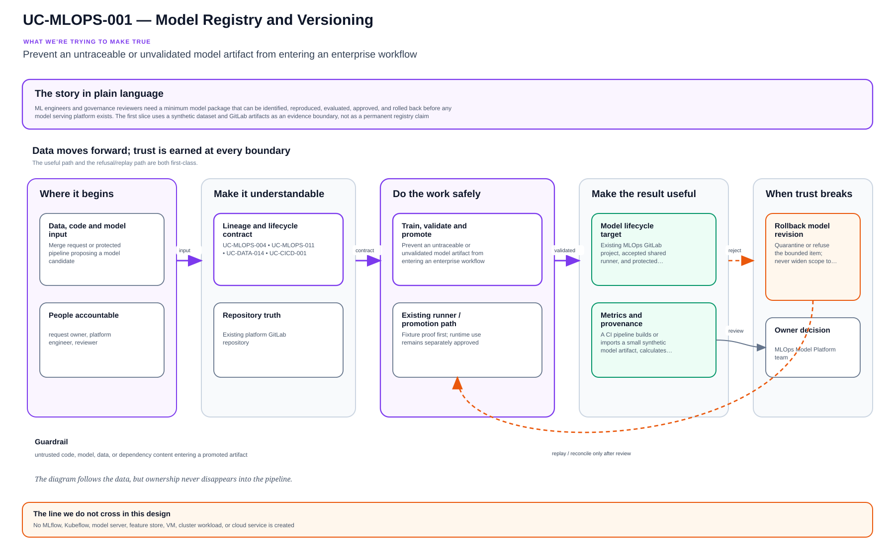

# UC-MLOPS-001: Model Registry and Versioning

Last verified: 2026-08-13

## Use-case record

| Field | Value |
| --- | --- |
| Canonical portfolio use case | Model Registry and Versioning |
| Primary platform | Enterprise MLOps Model Platform |
| Supporting use cases | [UC-MLOPS-004](UC-MLOPS-004-model-validation-gates.md), [UC-MLOPS-011](UC-MLOPS-011-model-rollback.md), [UC-DATA-014](../data/UC-DATA-014-data-lineage.md), [UC-CICD-001](../devsecops/UC-CICD-001-end-to-end-cicd-pipeline.md) |
| Enterprise alignment | Provider operations, payer operations, shared digital platform, risk and compliance |
| Enterprise outcome | Prevent an untraceable or unvalidated model artifact from entering an enterprise workflow |
| Supporting platforms | Data engineering, healthcare AI, DevSecOps delivery, governance, observability |
| Jira epic | `EPIC-MLOPS-001` — Register and validate one synthetic model artifact |
| Change record | Not required for CI-only artifact validation; required before serving or workflow integration |
| Target | Existing MLOps GitLab project, accepted shared runner, and protected GitLab artifacts |
| Current state | **Planned — repository scaffold exists; no registry or serving platform is claimed** |
| Infrastructure boundary | No MLflow, Kubeflow, model server, feature store, VM, cluster workload, or cloud service is created |
| Owner | MLOps Model Platform team |

## Purpose

ML engineers and governance reviewers need a minimum model package that can be
identified, reproduced, evaluated, approved, and rolled back before any model
serving platform exists. The first slice uses a synthetic dataset and GitLab
artifacts as an evidence boundary, not as a permanent registry claim.

## Expected outcome

A CI pipeline builds or imports a small synthetic model artifact, calculates
its checksum, validates its model card, dataset fingerprint, dependency lock,
metrics, fairness/safety placeholders, and approval state, then publishes an
immutable evidence bundle tied to the Git commit. Promotion remains blocked
until every required gate passes.

## Platform and enterprise fit

| Relationship | Detailed fit |
| --- | --- |
| Owning platform | **Model Registry and Versioning** belongs to the Enterprise MLOps Model Platform because that platform turns versioned code, data, features, models, evaluations, promotion, monitoring, and retirement into a governed lifecycle. |
| Enterprise consumers | The capability supports reproducible model capabilities used by provider, payer, AI, analytics, and shared platforms. |
| Enterprise outcome | Its planned result advances: Prevent an untraceable or unvalidated model artifact from entering an enterprise workflow. |
| Control contribution | The design adds lineage, reproducibility, model-risk review, drift response, rollback, and retirement evidence. |
| Cross-platform handoff | Supporting platforms consume a reviewed result or evidence artifact; they do not take ownership away from the primary platform. |
| Infrastructure boundary | Fit is achieved by reusing documented existing repositories, control planes, services, and targets—not by inventing capacity or treating planned products as available. |

The platform fit is therefore based on ownership and a reusable decision, not
on the presence of a particular tool. Enterprise fit requires evidence that the
named outcome was observed for the bounded scope; completing documentation or
running an isolated technology demonstration is insufficient.

## Trigger and actors

| Item | Definition |
| --- | --- |
| Trigger | Merge request or protected pipeline proposing a model candidate |
| ML engineer | Produces reproducible artifact and evaluation metrics |
| Data owner | Approves synthetic dataset contract and lineage |
| MLOps engineer | Owns package schema, CI gates, and artifact identity |
| Governance/workflow owner | Reviews intended use, exclusions, and approval |

## Preconditions

- Training and evaluation data are synthetic and contain no PHI or member data.
- `gitlab-runner-shared01` supplies the bounded CI execution environment.
- Dependencies are locked and the model format is safe to inspect without
  arbitrary code execution.
- The intended use maps to a provider, payer, or shared-platform decision but
  cannot yet influence that decision at runtime.

## Scope and exclusions

In scope are synthetic training fixture, data fingerprint, model checksum,
model card, metrics, package schema, validation gates, approval metadata, and
rollback reference. Online serving, batch scoring of live data, feature stores,
registry products, retraining, Kubernetes deployment, cloud ML services, and
clinical or payer decisions are excluded.

## Design walkthrough

Rather than beginning with a product, explain Model Registry and Versioning by asking an
engineer to keep dataset, code, parameters, model artifact, evaluation and serving decision tied
together. The result MidhHealth needs is to Prevent an untraceable or unvalidated model artifact
from entering an enterprise workflow. MLOps Model Platform team owns the platform decision,
while the consuming service or business owner still accepts the effect on its workflow.

Follow the information rather than the products: ownership and classification travel with it,
including on rejected and replayed paths. In this page, **UC-MLOPS-004: Model Validation Gates**
contributes model quality/safety gate and reviewer decision; **UC-MLOPS-011: Model Rollback**
contributes accepted model revision and rollback eligibility. The first buildable boundary is
Existing MLOps GitLab project, accepted shared runner, and protected GitLab artifacts. The
design stops at this rule: No MLflow, Kubeflow, model server, feature store, VM, cluster
workload, or cloud service is created.

The walkthrough becomes useful when the happy path breaks. If a required dependency or
verification result is unavailable, the expected response is to stop before mutation, preserve
the evidence and return the decision to the accountable owner. The leading design threat is
untrusted code, model, data, or dependency content entering a promoted artifact; therefore a
green source job, screenshot or reachable endpoint is supporting evidence, not acceptance by
itself.

## Architecture context

Model Registry and Versioning is evaluated inside the existing enterprise lab and the owning
platform's current source-control and execution boundaries. The architectural
unit is the governed outcome—**Prevent an untraceable or unvalidated model artifact from entering an enterprise workflow**—rather than a new product or
environment.

| Context element | Architecture statement |
| --- | --- |
| Business and operational setting | Enterprise consumers: Provider operations, payer operations, shared digital platform, risk and compliance. The result must be explainable, repeatable, and owned. |
| Current state | **Planned — repository scaffold exists; no registry or serving platform is claimed** |
| Desired state | A reviewed contract drives a bounded result, machine-readable evidence, and a safe stop or recovery decision. |
| Existing target boundary | Existing MLOps GitLab project, accepted shared runner, and protected GitLab artifacts |
| Infrastructure constraint | No MLflow, Kubeflow, model server, feature store, VM, cluster workload, or cloud service is created |
| Accountable platform owner | MLOps Model Platform team; the consuming service, data, security, or workflow owner remains accountable for accepting business impact. |

The page owns the contract, control logic, evidence, and recovery behavior for
Model Registry and Versioning. It does not absorb the responsibilities of the dependency use cases
listed below.

## Architecture diagram

Follow the information, not the boxes. The main route keeps contract, classification, processing, and consumption visible; the orange route is where refused or replayable work waits for a human decision.

## Dependencies and handoffs

Model Registry and Versioning remains accountable to its primary platform. The dependencies below
provide explicit contracts or assurance evidence; they do not become alternate owners.

| Relationship | Use case | Required handoff | Failure propagation |
| --- | --- | --- | --- |
| Required upstream contract | [UC-MLOPS-004: Model Validation Gates](UC-MLOPS-004-model-validation-gates.md) | model quality/safety gate and reviewer decision | Missing, stale, or failed evidence blocks promotion or runtime action. |
| Required upstream contract | [UC-MLOPS-011: Model Rollback](UC-MLOPS-011-model-rollback.md) | accepted model revision and rollback eligibility | Missing, stale, or failed evidence blocks promotion or runtime action. |
| Coordinated assurance handoff | [UC-DATA-014: Data Lineage](../data/UC-DATA-014-data-lineage.md) | source-to-consumer lineage and transformation revisions | Missing, stale, or failed evidence blocks promotion or runtime action. |
| Coordinated assurance handoff | [UC-CICD-001: End-to-End CI/CD Pipeline Setup](../devsecops/UC-CICD-001-end-to-end-cicd-pipeline.md) | source-to-artifact pipeline provenance and stage outcome | Missing, stale, or failed evidence blocks promotion or runtime action. |

Before Model Registry and Versioning is implemented, every handoff must resolve to an immutable
revision and machine-readable artifact. A URL, screenshot, or verbal approval
alone is not sufficient dependency evidence.

## Quality attributes

For Model Registry and Versioning, quality is measured against the bounded enterprise outcome—not
document length or a green job. Unapproved business thresholds remain explicit
decisions and must not be invented.

| Attribute | Required measure or invariant | Decision state |
| --- | --- | --- |
| Functional correctness | Every required input is validated; **Prevent an untraceable or unvalidated model artifact from entering an enterprise workflow** is evaluated against positive, negative, missing-input, and unauthorized-scope cases. | Fixed design requirement |
| Performance and scale | Establish a baseline for reproducibility, validation coverage, evaluation duration, drift sensitivity, and rollback readiness on existing capacity; the owner must approve warning and blocking thresholds before runtime promotion. | Thresholds `TBD` before implementation |
| Reliability | Missing prerequisites, stale dependencies, malformed evidence, and partial results fail closed without widening scope. | Fixed design requirement |
| Recovery | Record the maximum acceptable interruption and recovery time before runtime use; source-only validation must remain zero-change. | Owner decision required before runtime exercise |
| Observability | Emit use-case ID, revision, target, executor, start/end time, duration, decision, reason code, and recovery reference. | Required in the result schema |
| Evidence retention | Assign classification, retention period, and deletion owner before storing runtime evidence. | Security/compliance decision required |

Load, latency, availability, retention, RTO, and RPO values for Model Registry and Versioning become
requirements only after the named service or business owner approves them. Until
then, the implementation gate records them as unresolved instead of quietly
choosing defaults.

## Security and privacy architecture

The Model Registry and Versioning design separates source validation, privileged execution, target
access, and evidence review. Those boundaries remain in force even when one
engineer can access more than one system.

| Trust boundary | Allowed flow | Required control |
| --- | --- | --- |
| Contributor → GitLab | Reviewed source, contract, and synthetic/sanitized fixtures | Protected branch rules, peer review, secret scanning, and immutable commit identity |
| GitLab runner → result artifact | Read-only evaluation inputs and machine-readable output | No target-changing credential; pinned tool versions; artifact checksum and expiry |
| Approval plane → executor | Approved revision, target allowlist, mode, canary, and change reference | Separate authorization through the existing Jenkins/AWX or platform control path |
| Executor → existing target | Minimum commands or API operations required for Model Registry and Versioning | Least-privilege identity, explicit target limit, timeout, and stop condition |
| Target → evidence store | Sanitized metadata, measurements, decision, and recovery result | Exclude credentials, tokens, private keys, kubeconfigs, packet payloads, PHI, PII, and unrelated records |

For Model Registry and Versioning, the primary threat is **untrusted code, model, data, or dependency content entering a promoted artifact**. The mandatory response is
pinned environments, provenance checks, protected artifacts, approval separation, data classification, and rollback lineage. Authentication and authorization mappings must name
the existing identity source, principal or service account, permitted actions,
credential owner, rotation path, and emergency revocation procedure before a
runtime story can move beyond `Planned`.

## Architecture decisions and trade-offs

| Decision | Selected architecture | Alternative deferred or rejected | Rationale and status |
| --- | --- | --- | --- |
| First implementation slice | Contract, schema, fixtures, and read-only evidence on the existing GitLab runner | Product installation or broad runtime rollout | Proves behavior without expanding infrastructure; **approved design direction** |
| Runtime execution | Use only Existing GitLab shared runner when current inventory and change approval confirm it is available | Direct operator changes or credentials in CI | Preserves separation of duties; **conditional on implementation review** |
| Evidence | Machine-readable result is authoritative; screenshots are optional supporting material | Screenshot-only acceptance | Enables repeatable audit and automated gates; **approved design direction** |
| Failure handling | Fail closed, preserve bounded diagnostics, and recover only the named scope | Continue with partial or stale evidence | Prevents false success and hidden blast radius; **approved design direction** |
| New capacity or product | Stop and raise a separate architecture decision | Silently add a VM, service, cloud dependency, or cluster add-on | Maintains the existing-lab constraint; **mandatory** |

### Open decisions before implementation

| Open decision | Decision owner | Resolution gate |
| --- | --- | --- |
| Exact inventory object and first canary | Platform owner plus consuming service/data owner | Must resolve before the implementation story leaves `Planned` |
| Performance, scale, and reliability thresholds | Service owner and SRE | Must be recorded before a runtime acceptance run |
| Identity-to-action authorization matrix | Platform owner and security reviewer | Must be approved before target credentials are attached |
| Evidence classification and retention | Data/security owner | Must be approved before runtime artifacts are retained |

If any selected approach changes, record the rationale beside UC-MLOPS-001 in
the implementation repository before code review. A documentation edit alone
does not approve the new architecture.

## Implementation design

The first Model Registry and Versioning implementation is deliberately source-only. Its planned files live in the existing repository; none provisions infrastructure.

| Planned source responsibility | Exact planned location |
| --- | --- |
| Use-case contract and target allowlist | `midhhealth/ai-and-ml-platform/mlops-model-platform/contracts/uc-mlops-001.yaml` |
| Primary implementation | `midhhealth/ai-and-ml-platform/mlops-model-platform/src/lifecycle/model-registry-versioning.py`; entry point: the `run_model_registry_versioning` lifecycle evaluator |
| Machine-readable result schema | `midhhealth/ai-and-ml-platform/mlops-model-platform/schemas/uc-mlops-001-result.schema.json` |
| Positive, negative, malformed, and recovery fixtures | `midhhealth/ai-and-ml-platform/mlops-model-platform/tests/fixtures/uc-mlops-001/` |
| GitLab source gate | `midhhealth/ai-and-ml-platform/mlops-model-platform/.gitlab/ci/uc-mlops-001.yml` |
| Operator diagnosis and recovery | `midhhealth/ai-and-ml-platform/mlops-model-platform/docs/runbooks/uc-mlops-001.md` |

### Delivery stages

1. **Contract:** add the contract, schema, owners, dependency revisions, target
   allowlist, modes, reason codes, and open-decision values.
2. **Source validation:** lint exact paths, validate schema compatibility, scan
   for sensitive content, and run every fixture on the existing runner.
3. **Read-only proof:** execute the `run_model_registry_versioning` lifecycle evaluator, publish a checksummed result, and
   prove that blocked cases cannot reach a mutating path.
4. **Bounded execution:** only after separate approval, pass the immutable
   revision, target, mode, canary, and change ID to Existing GitLab shared runner.
5. **Independent verification:** measure the expected result, confirm unrelated
   state is unchanged, run recovery or zero-change proof, and obtain owner
   review.

The implementation merge request must link this page, the dependency artifacts,
the decision values above, and the eventual pipeline/job/run identifiers. Code
completion alone cannot promote the page to runtime verified.

## Code and configuration map

| Repository | Planned path | Responsibility |
| --- | --- | --- |
| `mlops-model-platform` | `examples/synthetic-risk-model/` | Small non-production model and synthetic data generator |
| same | `schemas/model-card.schema.json` | Intended use, exclusions, owners, data, metrics, and risks |
| same | `schemas/model-package.schema.json` | Artifact, checksum, environment, evidence, and approval contract |
| same | `scripts/build-model-package.py` | Reproducible package and hashes |
| same | `scripts/validate-model-package.py` | Schema, threshold, lineage, and safe-format gates |
| same | `evals/synthetic-risk-model.yml` | Deterministic metric and negative fixtures |

## Jira breakdown

### STORY-MLOPS-001: Define a model package tied to enterprise intent

**Description:** MLOps and workflow owners need a package contract that states
what a model is for, who owns it, what data produced it, where it must not be
used, and how it is identified.

**Status:** Planned.

**Acceptance criteria:** Schema requires model ID/version, owner, enterprise
workflow, intended use, excluded use, data fingerprint, code commit, dependency
lock, artifact checksum, metrics, risks, approval, and rollback reference.

**Implementation steps:** Write schemas, examples, and valid/invalid fixtures;
review fields with data, governance, and workflow owners.

**Completed work:** Required traceability is specified; package schemas are
pending.

**Validation and rollback:** Run schema fixtures. Revert fields that imply an
unapproved runtime, dataset, or decision authority.

**Required attachments:** `ART-MLOPS-001A` package-schema validation.

### STORY-MLOPS-002: Build one reproducible synthetic model artifact

**Description:** ML engineers need a small candidate whose data, code,
environment, output, and metrics reproduce on the existing runner.

**Status:** Planned.

**Acceptance criteria:** Two clean runs from the same source and seed produce
matching dataset and artifact hashes or a documented deterministic equivalence;
dependencies are locked; the format does not execute code during validation.

**Implementation steps:** Add synthetic generator and model, pin dependencies,
build twice in CI, compare hashes/metrics, and publish the package.

**Completed work:** No model or dataset artifact is claimed.

**Validation and rollback:** Test changed seed, dependency drift, corrupted
artifact, and unsafe-format fixtures. Revert the candidate on any failure.

**Required attachments:** `ART-MLOPS-002A` reproducibility report.

### STORY-MLOPS-003: Gate, approve, and supersede model candidates

**Description:** Governance and MLOps owners need a review state that blocks
promotion when lineage, metrics, safety, or ownership evidence is missing.

**Status:** Planned.

**Acceptance criteria:** Required gates produce pass/fail with thresholds;
approval names reviewers and timestamp; rejected packages cannot be promoted;
a new candidate points to the superseded approved package for rollback.

**Implementation steps:** Implement the validator, add approval metadata,
protect artifacts, test negative cases, and document the separate serving gate.

**Completed work:** Decision states are specified; no approved candidate exists.

**Validation and rollback:** Exercise approve, reject, expire, corrupt, and
supersede fixtures. Restore the prior artifact reference if a candidate is
withdrawn; no runtime rollback is needed.

**Required attachments:** `ART-MLOPS-003A` gate and approval report.

## Evidence and screenshot register

| ID | Evidence | Source | Status |
| --- | --- | --- | --- |
| `ART-MLOPS-001A` | Package-schema fixtures | GitLab CI | Pending |
| `ART-MLOPS-002A` | Reproducibility and checksum report | GitLab CI | Pending |
| `ART-MLOPS-003A` | Validation and approval decision | Protected GitLab artifact | Pending |

## Expected versus current result

| Measure | Expected | Current |
| --- | --- | --- |
| Enterprise intent | Intended and excluded decisions explicit | Specification only |
| Reproducibility | Repeat build evidence with immutable hashes | Not implemented |
| Runtime | No serving or live scoring in first slice | No runtime claimed |

## Acceptance decision

**Planned.** Accept the CI-only package after schema review, reproducibility,
negative fixtures, protected artifact publication, and approval/supersede tests.
Serving and live-data use remain separately approved work.

## Operational, security, and follow-up notes

- GitLab artifacts are an interim evidence boundary, not a claim that a model
  registry product is installed.
- Avoid model formats that execute arbitrary code during inspection.
- Never use the synthetic candidate for clinical, coverage, payment, or member
  decisions.
- Copy implementation stories to the MLOps GitLab project and return CI
  evidence here.
