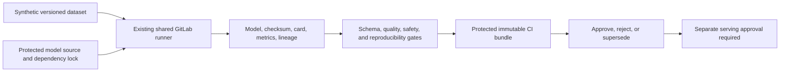

# UC-MLOPS-001: Model Registry and Versioning

Last verified: 2026-08-13

## Use-case record

| Field | Value |
| --- | --- |
| Canonical portfolio use case | Model Registry and Versioning |
| Primary platform | Enterprise MLOps Model Platform |
| Enterprise alignment | Provider operations, payer operations, shared digital platform, risk and compliance |
| Enterprise outcome | Prevent an untraceable or unvalidated model artifact from entering an enterprise workflow |
| Supporting platforms | Data engineering, healthcare AI, DevSecOps delivery, governance, observability |
| Jira epic | `EPIC-MLOPS-001` — Register and validate one synthetic model artifact |
| Change record | Not required for CI-only artifact validation; required before serving or workflow integration |
| Target | Existing MLOps GitLab project, accepted shared runner, and protected GitLab artifacts |
| Current state | **Planned — repository scaffold exists; no registry or serving platform is claimed** |
| Infrastructure boundary | No MLflow, Kubeflow, model server, feature store, VM, cluster workload, or cloud service is created |
| Owner | MLOps Model Platform team |

## Purpose

ML engineers and governance reviewers need a minimum model package that can be
identified, reproduced, evaluated, approved, and rolled back before any model
serving platform exists. The first slice uses a synthetic dataset and GitLab
artifacts as an evidence boundary, not as a permanent registry claim.

## Expected outcome

A CI pipeline builds or imports a small synthetic model artifact, calculates
its checksum, validates its model card, dataset fingerprint, dependency lock,
metrics, fairness/safety placeholders, and approval state, then publishes an
immutable evidence bundle tied to the Git commit. Promotion remains blocked
until every required gate passes.

## Trigger and actors

| Item | Definition |
| --- | --- |
| Trigger | Merge request or protected pipeline proposing a model candidate |
| ML engineer | Produces reproducible artifact and evaluation metrics |
| Data owner | Approves synthetic dataset contract and lineage |
| MLOps engineer | Owns package schema, CI gates, and artifact identity |
| Governance/workflow owner | Reviews intended use, exclusions, and approval |

## Preconditions

- Training and evaluation data are synthetic and contain no PHI or member data.
- `gitlab-runner-shared01` supplies the bounded CI execution environment.
- Dependencies are locked and the model format is safe to inspect without
  arbitrary code execution.
- The intended use maps to a provider, payer, or shared-platform decision but
  cannot yet influence that decision at runtime.

## Scope and exclusions

In scope are synthetic training fixture, data fingerprint, model checksum,
model card, metrics, package schema, validation gates, approval metadata, and
rollback reference. Online serving, batch scoring of live data, feature stores,
registry products, retraining, Kubernetes deployment, cloud ML services, and
clinical or payer decisions are excluded.

## End-to-end execution flow

## Code and configuration map

| Repository | Planned path | Responsibility |
| --- | --- | --- |
| `mlops-model-platform` | `examples/synthetic-risk-model/` | Small non-production model and synthetic data generator |
| same | `schemas/model-card.schema.json` | Intended use, exclusions, owners, data, metrics, and risks |
| same | `schemas/model-package.schema.json` | Artifact, checksum, environment, evidence, and approval contract |
| same | `scripts/build-model-package.py` | Reproducible package and hashes |
| same | `scripts/validate-model-package.py` | Schema, threshold, lineage, and safe-format gates |
| same | `evals/synthetic-risk-model.yml` | Deterministic metric and negative fixtures |

## Jira breakdown

### STORY-MLOPS-001: Define a model package tied to enterprise intent

**Description:** MLOps and workflow owners need a package contract that states
what a model is for, who owns it, what data produced it, where it must not be
used, and how it is identified.

**Status:** Planned.

**Acceptance criteria:** Schema requires model ID/version, owner, enterprise
workflow, intended use, excluded use, data fingerprint, code commit, dependency
lock, artifact checksum, metrics, risks, approval, and rollback reference.

**Implementation steps:** Write schemas, examples, and valid/invalid fixtures;
review fields with data, governance, and workflow owners.

**Completed work:** Required traceability is specified; package schemas are
pending.

**Validation and rollback:** Run schema fixtures. Revert fields that imply an
unapproved runtime, dataset, or decision authority.

**Required attachments:** `ART-MLOPS-001A` package-schema validation.

### STORY-MLOPS-002: Build one reproducible synthetic model artifact

**Description:** ML engineers need a small candidate whose data, code,
environment, output, and metrics reproduce on the existing runner.

**Status:** Planned.

**Acceptance criteria:** Two clean runs from the same source and seed produce
matching dataset and artifact hashes or a documented deterministic equivalence;
dependencies are locked; the format does not execute code during validation.

**Implementation steps:** Add synthetic generator and model, pin dependencies,
build twice in CI, compare hashes/metrics, and publish the package.

**Completed work:** No model or dataset artifact is claimed.

**Validation and rollback:** Test changed seed, dependency drift, corrupted
artifact, and unsafe-format fixtures. Revert the candidate on any failure.

**Required attachments:** `ART-MLOPS-002A` reproducibility report.

### STORY-MLOPS-003: Gate, approve, and supersede model candidates

**Description:** Governance and MLOps owners need a review state that blocks
promotion when lineage, metrics, safety, or ownership evidence is missing.

**Status:** Planned.

**Acceptance criteria:** Required gates produce pass/fail with thresholds;
approval names reviewers and timestamp; rejected packages cannot be promoted;
a new candidate points to the superseded approved package for rollback.

**Implementation steps:** Implement the validator, add approval metadata,
protect artifacts, test negative cases, and document the separate serving gate.

**Completed work:** Decision states are specified; no approved candidate exists.

**Validation and rollback:** Exercise approve, reject, expire, corrupt, and
supersede fixtures. Restore the prior artifact reference if a candidate is
withdrawn; no runtime rollback is needed.

**Required attachments:** `ART-MLOPS-003A` gate and approval report.

## Evidence and screenshot register

| ID | Evidence | Source | Status |
| --- | --- | --- | --- |
| `ART-MLOPS-001A` | Package-schema fixtures | GitLab CI | Pending |
| `ART-MLOPS-002A` | Reproducibility and checksum report | GitLab CI | Pending |
| `ART-MLOPS-003A` | Validation and approval decision | Protected GitLab artifact | Pending |

## Expected versus current result

| Measure | Expected | Current |
| --- | --- | --- |
| Enterprise intent | Intended and excluded decisions explicit | Specification only |
| Reproducibility | Repeat build evidence with immutable hashes | Not implemented |
| Runtime | No serving or live scoring in first slice | No runtime claimed |

## Acceptance decision

**Planned.** Accept the CI-only package after schema review, reproducibility,
negative fixtures, protected artifact publication, and approval/supersede tests.
Serving and live-data use remain separately approved work.

## Operational, security, and follow-up notes

- GitLab artifacts are an interim evidence boundary, not a claim that a model
  registry product is installed.
- Avoid model formats that execute arbitrary code during inspection.
- Never use the synthetic candidate for clinical, coverage, payment, or member
  decisions.
- Copy implementation stories to the MLOps GitLab project and return CI
  evidence here.
