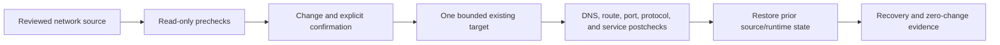

# UC-NET-001: Network Change Validation and Rollback

Last verified: 2026-08-13

## Use-case record

| Field | Value |
| --- | --- |
| Canonical portfolio use case | Network Change Validation and Rollback |
| Primary platform | Enterprise Network Engineering and Automation Platform |
| Enterprise alignment | Shared digital platform, operational resilience, provider and payer operations |
| Enterprise outcome | Protect service connectivity and name resolution during changes to the existing lab |
| Supporting platforms | Linux systems, Kubernetes, observability, resilience operations |
| Jira epic | `EPIC-NET-001` — Prove network precheck, postcheck, and rollback |
| Change record | Required for every mutating canary |
| Target | Existing DNS, NGINX, KVM bridges, Kubernetes paths, GitLab, Jenkins, and AWX inventories |
| Current state | **Planned — several component changes have evidence; reusable cross-path workflow is pending** |
| Infrastructure boundary | No router, switch, VM, IP, VLAN, load balancer, CNI, or network product is created |
| Owner | Network Engineering and Automation team |

## Purpose

Network engineers need a reusable validation contract before and after a
bounded change to existing DNS, proxy, host, or Kubernetes connectivity. The
workflow must prove the tested path, not infer success from a single ping.

## Expected outcome

An operator selects an allowlisted path and runs read-only prechecks for DNS,
route, listener, firewall, TLS/HTTP, and service health. A separately approved
canary change captures source and runtime state, runs the same postchecks,
executes rollback, and proves restoration.

## Platform and enterprise fit

| Relationship | Detailed fit |
| --- | --- |
| Owning platform | **Network Change Validation and Rollback** belongs to the Enterprise Network Engineering and Automation Platform because that platform turns reviewed connectivity intent into discovery, validation, approved canary change, reachability proof, and configuration recovery. |
| Enterprise consumers | The capability supports the trusted network, naming, ingress, egress, and service paths used by every enterprise platform. |
| Enterprise outcome | Its planned result advances: Protect service connectivity and name resolution during changes to the existing lab. |
| Control contribution | The design adds segmentation, least privilege, bounded change, configuration backup, and allowed/denied-path evidence. |
| Cross-platform handoff | Supporting platforms consume a reviewed result or evidence artifact; they do not take ownership away from the primary platform. |
| Infrastructure boundary | Fit is achieved by reusing documented existing repositories, control planes, services, and targets—not by inventing capacity or treating planned products as available. |

The platform fit is therefore based on ownership and a reusable decision, not
on the presence of a particular tool. Enterprise fit requires evidence that the
named outcome was observed for the bounded scope; completing documentation or
running an isolated technology demonstration is insufficient.

## Trigger and actors

| Item | Definition |
| --- | --- |
| Trigger | Approved network-related change or scheduled read-only path audit |
| Network engineer | Owns path model, checks, canary, and rollback |
| Service owner | Defines expected endpoint behavior and impact |
| Platform engineer | Owns host, proxy, DNS, or Kubernetes component source |
| SRE | Reviews telemetry and recovery evidence |

## Preconditions

- Every target hostname and IP is present in canonical inventory and DNS docs.
- The AWX inventory and playbook use an explicit limit and purpose-specific
  credential.
- The selected path is existing and active; absent products and intentional
  503 routes are not converted into success claims.
- Rollback source is known before mutation begins.

## Scope and exclusions

In scope are existing DNS, NGINX, bridge, route, firewall, Kubernetes Service,
and endpoint checks; bounded canary changes; rollback; and evidence. New
addresses, VLANs, appliances, VPNs, load balancers, CNI replacement, or cloud
networking are excluded.

## End-to-end execution flow

## Code and configuration map

| Repository | Planned path | Responsibility |
| --- | --- | --- |
| `network-engineering-platform` | `config/validated-paths.yml` | Existing source, destination, protocol, owner, and expected result |
| same | `playbooks/validate-network-path.yml` | Read-only pre/post path evidence |
| same | `roles/network_path_validation/` | DNS, route, listener, firewall, and application-layer checks |
| same | `schemas/network-change-report.schema.json` | Pre, post, rollback, and restoration evidence |
| `jenkins-jobs` | planned network validation job | PLAN/CANARY/ROLLBACK interface |
| `enterprise-architecture-docs` | `docs/environment-details.md` and `docs/vm-inventory.md` | Canonical endpoint and inventory state |

## Jira breakdown

### STORY-NET-001: Model an existing enterprise service path

**Description:** Network and service owners need a path record that connects an
existing client to DNS, route, firewall, proxy, and service expectations.

**Status:** Planned.

**Acceptance criteria:** The record names existing endpoints, protocol, ports,
DNS answer, route boundary, service owner, business capability, and expected
application result; unknown inventory values fail validation.

**Implementation steps:** Select one accepted path, create the record, validate
against inventory, and review with the service owner.

**Completed work:** Canonical endpoint and network state exist; the reusable
path map is pending.

**Validation and rollback:** Run schema, DNS, and inventory reference tests.
Revert an invalid record; no network change occurs.

**Required attachments:** `ART-NET-001A` validated path definition.

### STORY-NET-002: Run deterministic prechecks and postchecks

**Description:** Operators need the same layered checks before and after a
change so success cannot be inferred from an unrelated protocol or host.

**Status:** Planned.

**Acceptance criteria:** Checks cover authoritative DNS, route, target listener,
firewall policy, protocol response, and service health; results identify source
host and timestamp; intentional 503 and NXDOMAIN states remain explicit.

**Implementation steps:** Implement the read-only role, add positive and
negative fixtures, run with a canary inventory limit, and publish a schema-valid
report.

**Completed work:** Prior component changes provide examples; the generic role
is not implemented.

**Validation and rollback:** Run unchanged and failure fixtures. Disable the job
if source/destination identity or protocol interpretation is wrong.

**Required attachments:** `ART-NET-002A` precheck/postcheck matrix.

### STORY-NET-003: Exercise rollback on one bounded change

**Description:** Network and platform engineers need proof that the prior state
can be restored when postchecks fail.

**Status:** Planned.

**Acceptance criteria:** Mutation requires change ID and confirmation; only one
allowlisted target changes; failed postcheck triggers operator rollback;
restoration and second convergence pass.

**Implementation steps:** Choose an approved low-risk canary, capture prior
state, apply through AWX, validate, restore prior source/runtime state, and run
zero-change convergence.

**Completed work:** Guardrails are specified; no canary is authorized by this
page.

**Validation and rollback:** The story's acceptance is the successful rollback
and recovered service path. Any unexpected failure is added to the incident
register before work continues.

**Required attachments:** `ART-NET-003A` change job,
`ART-NET-003B` rollback job, and `ART-NET-003C` recovery report.

## Evidence and screenshot register

| ID | Evidence | Source | Status |
| --- | --- | --- | --- |
| `ART-NET-001A` | Existing path definition | GitLab CI | Pending |
| `ART-NET-002A` | Layered pre/post checks | AWX artifact | Pending |
| `ART-NET-003A` | Bounded change | AWX/Jenkins | Pending |
| `ART-NET-003B` | Rollback execution | AWX/Jenkins | Pending |
| `ART-NET-003C` | Restored path and convergence | AWX artifact | Pending |

## Expected versus current result

| Measure | Expected | Current |
| --- | --- | --- |
| Path definition | Existing endpoints and owners fully resolved | Pending |
| Validation | Same layered checks before and after | Pending |
| Recovery | Rollback restores expected result and converges | Not exercised |

## Acceptance decision

**Planned.** Accept only after a reviewed existing path, read-only validation,
one authorized canary, successful rollback, recovered application response,
zero-change convergence, and incident reconciliation.

## Operational, security, and follow-up notes

- Do not broaden firewall or DNS scope to make a test pass.
- Capture commands and results without credentials or unrelated host data.
- One path and one target per canary keeps the rollback bounded.
- Copy implementation stories to the network GitLab project and return the
  accepted change and recovery evidence here.
