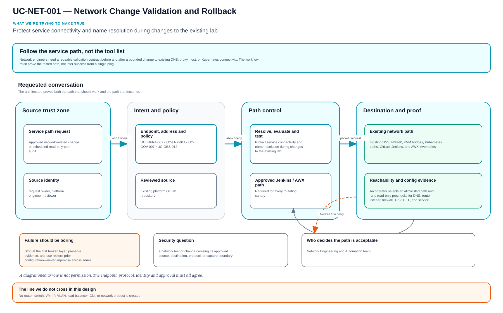

# UC-NET-001: Network Change Validation and Rollback

Last verified: 2026-08-13

## Use-case record

| Field | Value |
| --- | --- |
| Canonical portfolio use case | Network Change Validation and Rollback |
| Primary platform | Enterprise Network Engineering and Automation Platform |
| Supporting use cases | [UC-INFRA-007](../infrastructure/UC-INFRA-007-infrastructure-change-impact-analysis.md), [UC-LNX-011](../linux/UC-LNX-011-dns-ntp-host-networking.md), [UC-GOV-007](../governance/UC-GOV-007-infrastructure-security-hardening.md), [UC-OBS-012](../observability/UC-OBS-012-synthetic-monitoring.md) |
| Enterprise alignment | Shared digital platform, operational resilience, provider and payer operations |
| Enterprise outcome | Protect service connectivity and name resolution during changes to the existing lab |
| Supporting platforms | Linux systems, Kubernetes, observability, resilience operations |
| Jira epic | `EPIC-NET-001` — Prove network precheck, postcheck, and rollback |
| Change record | Required for every mutating canary |
| Target | Existing DNS, NGINX, KVM bridges, Kubernetes paths, GitLab, Jenkins, and AWX inventories |
| Current state | **Planned — several component changes have evidence; reusable cross-path workflow is pending** |
| Infrastructure boundary | No router, switch, VM, IP, VLAN, load balancer, CNI, or network product is created |
| Owner | Network Engineering and Automation team |

## Purpose

Network engineers need a reusable validation contract before and after a
bounded change to existing DNS, proxy, host, or Kubernetes connectivity. The
workflow must prove the tested path, not infer success from a single ping.

## Expected outcome

An operator selects an allowlisted path and runs read-only prechecks for DNS,
route, listener, firewall, TLS/HTTP, and service health. A separately approved
canary change captures source and runtime state, runs the same postchecks,
executes rollback, and proves restoration.

## Platform and enterprise fit

| Relationship | Detailed fit |
| --- | --- |
| Owning platform | **Network Change Validation and Rollback** belongs to the Enterprise Network Engineering and Automation Platform because that platform turns reviewed connectivity intent into discovery, validation, approved canary change, reachability proof, and configuration recovery. |
| Enterprise consumers | The capability supports the trusted network, naming, ingress, egress, and service paths used by every enterprise platform. |
| Enterprise outcome | Its planned result advances: Protect service connectivity and name resolution during changes to the existing lab. |
| Control contribution | The design adds segmentation, least privilege, bounded change, configuration backup, and allowed/denied-path evidence. |
| Cross-platform handoff | Supporting platforms consume a reviewed result or evidence artifact; they do not take ownership away from the primary platform. |
| Infrastructure boundary | Fit is achieved by reusing documented existing repositories, control planes, services, and targets—not by inventing capacity or treating planned products as available. |

The platform fit is therefore based on ownership and a reusable decision, not
on the presence of a particular tool. Enterprise fit requires evidence that the
named outcome was observed for the bounded scope; completing documentation or
running an isolated technology demonstration is insufficient.

## Trigger and actors

| Item | Definition |
| --- | --- |
| Trigger | Approved network-related change or scheduled read-only path audit |
| Network engineer | Owns path model, checks, canary, and rollback |
| Service owner | Defines expected endpoint behavior and impact |
| Platform engineer | Owns host, proxy, DNS, or Kubernetes component source |
| SRE | Reviews telemetry and recovery evidence |

## Preconditions

- Every target hostname and IP is present in canonical inventory and DNS docs.
- The AWX inventory and playbook use an explicit limit and purpose-specific
  credential.
- The selected path is existing and active; absent products and intentional
  503 routes are not converted into success claims.
- Rollback source is known before mutation begins.

## Scope and exclusions

In scope are existing DNS, NGINX, bridge, route, firewall, Kubernetes Service,
and endpoint checks; bounded canary changes; rollback; and evidence. New
addresses, VLANs, appliances, VPNs, load balancers, CNI replacement, or cloud
networking are excluded.

## Design walkthrough

Rather than beginning with a product, explain Network Change Validation and Rollback by asking
an engineer to trace the actual packet or request path and make every ownership boundary
observable. The result MidhHealth needs is to Protect service connectivity and name resolution
during changes to the existing lab. Network Engineering and Automation team owns the platform
decision, while the consuming service or business owner still accepts the effect on its
workflow.

Trace one user or system request from source to destination and back; DNS, identity, policy and
dependency failures are part of that same path. In this page, **UC-INFRA-007: Infrastructure
Change Impact Analysis** contributes resource-to-service impact and affected-owner list;
**UC-LNX-011: DNS, NTP and Host Networking** contributes host DNS, time, and network readiness
evidence. The first buildable boundary is Existing DNS, NGINX, KVM bridges, Kubernetes paths,
GitLab, Jenkins, and AWX inventories. The design stops at this rule: No router, switch, VM, IP,
VLAN, load balancer, CNI, or network product is created.

The walkthrough becomes useful when the happy path breaks. If a required dependency or
verification result is unavailable, the expected response is to stop before mutation, preserve
the evidence and return the decision to the accountable owner. The leading design threat is a
network test or change crossing its approved source, destination, protocol, or capture boundary;
therefore a green source job, screenshot or reachable endpoint is supporting evidence, not
acceptance by itself.

## Architecture context

Network Change Validation and Rollback is evaluated inside the existing enterprise lab and the owning
platform's current source-control and execution boundaries. The architectural
unit is the governed outcome—**Protect service connectivity and name resolution during changes to the existing lab**—rather than a new product or
environment.

| Context element | Architecture statement |
| --- | --- |
| Business and operational setting | Enterprise consumers: Shared digital platform, operational resilience, provider and payer operations. The result must be explainable, repeatable, and owned. |
| Current state | **Planned — several component changes have evidence; reusable cross-path workflow is pending** |
| Desired state | A reviewed contract drives a bounded result, machine-readable evidence, and a safe stop or recovery decision. |
| Existing target boundary | Existing DNS, NGINX, KVM bridges, Kubernetes paths, GitLab, Jenkins, and AWX inventories |
| Infrastructure constraint | No router, switch, VM, IP, VLAN, load balancer, CNI, or network product is created |
| Accountable platform owner | Network Engineering and Automation team; the consuming service, data, security, or workflow owner remains accountable for accepting business impact. |

The page owns the contract, control logic, evidence, and recovery behavior for
Network Change Validation and Rollback. It does not absorb the responsibilities of the dependency use cases
listed below.

## Architecture diagram

Trace the requested conversation from source zone to destination. Each boundary answers a different question—identity, intent, policy, path, and proof—and a drawn arrow never substitutes for permission.

## Dependencies and handoffs

Network Change Validation and Rollback remains accountable to its primary platform. The dependencies below
provide explicit contracts or assurance evidence; they do not become alternate owners.

| Relationship | Use case | Required handoff | Failure propagation |
| --- | --- | --- | --- |
| Required upstream contract | [UC-INFRA-007: Infrastructure Change Impact Analysis](../infrastructure/UC-INFRA-007-infrastructure-change-impact-analysis.md) | resource-to-service impact and affected-owner list | Missing, stale, or failed evidence blocks promotion or runtime action. |
| Required upstream contract | [UC-LNX-011: DNS, NTP and Host Networking](../linux/UC-LNX-011-dns-ntp-host-networking.md) | host DNS, time, and network readiness evidence | Missing, stale, or failed evidence blocks promotion or runtime action. |
| Coordinated assurance handoff | [UC-GOV-007: Infrastructure Security Hardening](../governance/UC-GOV-007-infrastructure-security-hardening.md) | security-hardening baseline and exception record | Missing, stale, or failed evidence blocks promotion or runtime action. |
| Coordinated assurance handoff | [UC-OBS-012: Synthetic Monitoring](../observability/UC-OBS-012-synthetic-monitoring.md) | synthetic path definition and observed response | Missing, stale, or failed evidence blocks promotion or runtime action. |

Before Network Change Validation and Rollback is implemented, every handoff must resolve to an immutable
revision and machine-readable artifact. A URL, screenshot, or verbal approval
alone is not sufficient dependency evidence.

## Quality attributes

For Network Change Validation and Rollback, quality is measured against the bounded enterprise outcome—not
document length or a green job. Unapproved business thresholds remain explicit
decisions and must not be invented.

| Attribute | Required measure or invariant | Decision state |
| --- | --- | --- |
| Functional correctness | Every required input is validated; **Protect service connectivity and name resolution during changes to the existing lab** is evaluated against positive, negative, missing-input, and unauthorized-scope cases. | Fixed design requirement |
| Performance and scale | Establish a baseline for reachability accuracy, convergence time, latency baseline, and configuration drift on existing capacity; the owner must approve warning and blocking thresholds before runtime promotion. | Thresholds `TBD` before implementation |
| Reliability | Missing prerequisites, stale dependencies, malformed evidence, and partial results fail closed without widening scope. | Fixed design requirement |
| Recovery | Record the maximum acceptable interruption and recovery time before runtime use; source-only validation must remain zero-change. | Owner decision required before runtime exercise |
| Observability | Emit use-case ID, revision, target, executor, start/end time, duration, decision, reason code, and recovery reference. | Required in the result schema |
| Evidence retention | Assign classification, retention period, and deletion owner before storing runtime evidence. | Security/compliance decision required |

Load, latency, availability, retention, RTO, and RPO values for Network Change Validation and Rollback become
requirements only after the named service or business owner approves them. Until
then, the implementation gate records them as unresolved instead of quietly
choosing defaults.

## Security and privacy architecture

The Network Change Validation and Rollback design separates source validation, privileged execution, target
access, and evidence review. Those boundaries remain in force even when one
engineer can access more than one system.

| Trust boundary | Allowed flow | Required control |
| --- | --- | --- |
| Contributor → GitLab | Reviewed source, contract, and synthetic/sanitized fixtures | Protected branch rules, peer review, secret scanning, and immutable commit identity |
| GitLab runner → result artifact | Read-only evaluation inputs and machine-readable output | No target-changing credential; pinned tool versions; artifact checksum and expiry |
| Approval plane → executor | Approved revision, target allowlist, mode, canary, and change reference | Separate authorization through the existing Jenkins/AWX or platform control path |
| Executor → existing target | Minimum commands or API operations required for Network Change Validation and Rollback | Least-privilege identity, explicit target limit, timeout, and stop condition |
| Target → evidence store | Sanitized metadata, measurements, decision, and recovery result | Exclude credentials, tokens, private keys, kubeconfigs, packet payloads, PHI, PII, and unrelated records |

For Network Change Validation and Rollback, the primary threat is **a network test or change crossing its approved source, destination, protocol, or capture boundary**. The mandatory response is
path allowlists, configuration backup, least-privilege execution, denied-path tests, and capture redaction. Authentication and authorization mappings must name
the existing identity source, principal or service account, permitted actions,
credential owner, rotation path, and emergency revocation procedure before a
runtime story can move beyond `Planned`.

## Architecture decisions and trade-offs

| Decision | Selected architecture | Alternative deferred or rejected | Rationale and status |
| --- | --- | --- | --- |
| First implementation slice | Contract, schema, fixtures, and read-only evidence on the existing GitLab runner | Product installation or broad runtime rollout | Proves behavior without expanding infrastructure; **approved design direction** |
| Runtime execution | Use only Approved Jenkins/AWX network action when current inventory and change approval confirm it is available | Direct operator changes or credentials in CI | Preserves separation of duties; **conditional on implementation review** |
| Evidence | Machine-readable result is authoritative; screenshots are optional supporting material | Screenshot-only acceptance | Enables repeatable audit and automated gates; **approved design direction** |
| Failure handling | Fail closed, preserve bounded diagnostics, and recover only the named scope | Continue with partial or stale evidence | Prevents false success and hidden blast radius; **approved design direction** |
| New capacity or product | Stop and raise a separate architecture decision | Silently add a VM, service, cloud dependency, or cluster add-on | Maintains the existing-lab constraint; **mandatory** |

### Open decisions before implementation

| Open decision | Decision owner | Resolution gate |
| --- | --- | --- |
| Exact inventory object and first canary | Platform owner plus consuming service/data owner | Must resolve before the implementation story leaves `Planned` |
| Performance, scale, and reliability thresholds | Service owner and SRE | Must be recorded before a runtime acceptance run |
| Identity-to-action authorization matrix | Platform owner and security reviewer | Must be approved before target credentials are attached |
| Evidence classification and retention | Data/security owner | Must be approved before runtime artifacts are retained |

If any selected approach changes, record the rationale beside UC-NET-001 in
the implementation repository before code review. A documentation edit alone
does not approve the new architecture.

## Implementation design

The first Network Change Validation and Rollback implementation is deliberately source-only. Its planned files live in the existing repository; none provisions infrastructure.

| Planned source responsibility | Exact planned location |
| --- | --- |
| Use-case contract and target allowlist | `midhhealth/platform-engineering/network-engineering-platform/contracts/uc-net-001.yaml` |
| Primary implementation | `midhhealth/platform-engineering/network-engineering-platform/playbooks/network-change-validation.yml`; entry point: the `network-change-validation` validation role and bounded change entry point |
| Machine-readable result schema | `midhhealth/platform-engineering/network-engineering-platform/schemas/uc-net-001-result.schema.json` |
| Positive, negative, malformed, and recovery fixtures | `midhhealth/platform-engineering/network-engineering-platform/tests/fixtures/uc-net-001/` |
| GitLab source gate | `midhhealth/platform-engineering/network-engineering-platform/.gitlab/ci/uc-net-001.yml` |
| Operator diagnosis and recovery | `midhhealth/platform-engineering/network-engineering-platform/docs/runbooks/uc-net-001.md` |

### Delivery stages

1. **Contract:** add the contract, schema, owners, dependency revisions, target
   allowlist, modes, reason codes, and open-decision values.
2. **Source validation:** lint exact paths, validate schema compatibility, scan
   for sensitive content, and run every fixture on the existing runner.
3. **Read-only proof:** execute the `network-change-validation` validation role and bounded change entry point, publish a checksummed result, and
   prove that blocked cases cannot reach a mutating path.
4. **Bounded execution:** only after separate approval, pass the immutable
   revision, target, mode, canary, and change ID to Approved Jenkins/AWX network action.
5. **Independent verification:** measure the expected result, confirm unrelated
   state is unchanged, run recovery or zero-change proof, and obtain owner
   review.

The implementation merge request must link this page, the dependency artifacts,
the decision values above, and the eventual pipeline/job/run identifiers. Code
completion alone cannot promote the page to runtime verified.

## Code and configuration map

| Repository | Planned path | Responsibility |
| --- | --- | --- |
| `network-engineering-platform` | `config/validated-paths.yml` | Existing source, destination, protocol, owner, and expected result |
| same | `playbooks/validate-network-path.yml` | Read-only pre/post path evidence |
| same | `roles/network_path_validation/` | DNS, route, listener, firewall, and application-layer checks |
| same | `schemas/network-change-report.schema.json` | Pre, post, rollback, and restoration evidence |
| `jenkins-jobs` | planned network validation job | PLAN/CANARY/ROLLBACK interface |
| `enterprise-architecture-docs` | `docs/environment-details.md` and `docs/vm-inventory.md` | Canonical endpoint and inventory state |

## Jira breakdown

### STORY-NET-001: Model an existing enterprise service path

**Description:** Network and service owners need a path record that connects an
existing client to DNS, route, firewall, proxy, and service expectations.

**Status:** Planned.

**Acceptance criteria:** The record names existing endpoints, protocol, ports,
DNS answer, route boundary, service owner, business capability, and expected
application result; unknown inventory values fail validation.

**Implementation steps:** Select one accepted path, create the record, validate
against inventory, and review with the service owner.

**Completed work:** Canonical endpoint and network state exist; the reusable
path map is pending.

**Validation and rollback:** Run schema, DNS, and inventory reference tests.
Revert an invalid record; no network change occurs.

**Required attachments:** `ART-NET-001A` validated path definition.

### STORY-NET-002: Run deterministic prechecks and postchecks

**Description:** Operators need the same layered checks before and after a
change so success cannot be inferred from an unrelated protocol or host.

**Status:** Planned.

**Acceptance criteria:** Checks cover authoritative DNS, route, target listener,
firewall policy, protocol response, and service health; results identify source
host and timestamp; intentional 503 and NXDOMAIN states remain explicit.

**Implementation steps:** Implement the read-only role, add positive and
negative fixtures, run with a canary inventory limit, and publish a schema-valid
report.

**Completed work:** Prior component changes provide examples; the generic role
is not implemented.

**Validation and rollback:** Run unchanged and failure fixtures. Disable the job
if source/destination identity or protocol interpretation is wrong.

**Required attachments:** `ART-NET-002A` precheck/postcheck matrix.

### STORY-NET-003: Exercise rollback on one bounded change

**Description:** Network and platform engineers need proof that the prior state
can be restored when postchecks fail.

**Status:** Planned.

**Acceptance criteria:** Mutation requires change ID and confirmation; only one
allowlisted target changes; failed postcheck triggers operator rollback;
restoration and second convergence pass.

**Implementation steps:** Choose an approved low-risk canary, capture prior
state, apply through AWX, validate, restore prior source/runtime state, and run
zero-change convergence.

**Completed work:** Guardrails are specified; no canary is authorized by this
page.

**Validation and rollback:** The story's acceptance is the successful rollback
and recovered service path. Any unexpected failure is added to the incident
register before work continues.

**Required attachments:** `ART-NET-003A` change job,
`ART-NET-003B` rollback job, and `ART-NET-003C` recovery report.

## Evidence and screenshot register

| ID | Evidence | Source | Status |
| --- | --- | --- | --- |
| `ART-NET-001A` | Existing path definition | GitLab CI | Pending |
| `ART-NET-002A` | Layered pre/post checks | AWX artifact | Pending |
| `ART-NET-003A` | Bounded change | AWX/Jenkins | Pending |
| `ART-NET-003B` | Rollback execution | AWX/Jenkins | Pending |
| `ART-NET-003C` | Restored path and convergence | AWX artifact | Pending |

## Expected versus current result

| Measure | Expected | Current |
| --- | --- | --- |
| Path definition | Existing endpoints and owners fully resolved | Pending |
| Validation | Same layered checks before and after | Pending |
| Recovery | Rollback restores expected result and converges | Not exercised |

## Acceptance decision

**Planned.** Accept only after a reviewed existing path, read-only validation,
one authorized canary, successful rollback, recovered application response,
zero-change convergence, and incident reconciliation.

## Operational, security, and follow-up notes

- Do not broaden firewall or DNS scope to make a test pass.
- Capture commands and results without credentials or unrelated host data.
- One path and one target per canary keeps the rollback bounded.
- Copy implementation stories to the network GitLab project and return the
  accepted change and recovery evidence here.
