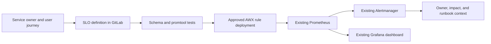

# UC-OBS-001: SLO as Code

Last verified: 2026-08-13

## Use-case record

| Field | Value |
| --- | --- |
| Canonical portfolio use case | SLO as Code |
| Primary platform | Enterprise Observability and SRE Reliability Platform |
| Enterprise alignment | Operational resilience, shared digital platform |
| Enterprise outcome | Detect sustained risk to provider, payer, and platform services before raw symptom alerts become outages |
| Supporting platforms | Resilience operations, DevSecOps delivery, governance |
| Jira epic | `EPIC-OBS-001` — Operate one service SLO through existing telemetry |
| Change record | To be assigned before Prometheus or Alertmanager mutation |
| Target | Existing Prometheus, Alertmanager, Grafana, Blackbox Exporter, and GitLab source |
| Current state | **Planned — services are installed; SLO rule acceptance is not claimed** |
| Infrastructure boundary | No VM, collector, database, cluster, or monitoring product is created |
| Owner | Observability and SRE team |

## Purpose

SRE needs a version-controlled service objective that turns existing metrics
into fast- and slow-burn signals. The first slice uses one already reachable
lab service and existing Prometheus/Alertmanager capacity.

## Expected outcome

A reviewed SLO definition produces recording rules, burn-rate alerts, a
dashboard view, and test evidence. Alerts identify service owner, objective,
window, current burn, dashboard, and runbook. A fixture proves firing and
recovery without creating a real outage.

## Trigger and actors

| Item | Definition |
| --- | --- |
| Trigger | GitLab merge request for an SLO definition or scheduled rule evaluation |
| Service owner | Defines the user-visible success condition and target |
| SRE | Reviews windows, budget policy, runbook, and paging severity |
| Observability engineer | Generates and validates rules and dashboards |
| Release engineer | Consumes SLO state as later promotion evidence |

## Preconditions

- Prometheus `3.13.1`, Alertmanager `0.33.1`, Grafana `13.1.1`, and Blackbox
  Exporter `0.25.0` remain healthy.
- The selected endpoint is already active and named in environment docs.
- Existing scrape or probe data has enough history to calculate the objective.
- Alert notification remains bounded to the lab; no external paging route is
  assumed.

## Scope and exclusions

In scope are one existing service, SLO schema, generated Prometheus rules,
`promtool` tests, dashboard panels, alert annotations, and non-disruptive
fixtures. New monitoring products, new VMs, production paging, TLS/SSO rollout,
and synthetic traffic that changes business data are excluded.

## End-to-end execution flow

## Code and configuration map

| Repository | Planned path | Responsibility |
| --- | --- | --- |
| `observability-sre-platform` | `slos/services.yml` | Service owner, SLI query, objective, windows, and runbook |
| same | `scripts/render-slo-rules.py` | Deterministic recording and alert rule generation |
| same | `tests/test_slo_rules.yml` | No-burn, fast-burn, slow-burn, missing-data, and recovery fixtures |
| `ansible-prometheus` | existing rule deployment role; exact path to confirm | Approved convergence on `prometheus.example.com` |
| `ansible-prometheus` | existing Grafana provisioning role; exact path to confirm | SLO dashboard publication |
| `enterprise-architecture-docs` | `docs/sre-incident-register.md` | Unexpected failure and corrective-action record |

## Jira breakdown

### STORY-OBS-001: Define one enterprise service objective

**Description:** A service owner and SRE need one measurable success ratio tied
to a real provider, payer, or shared-platform user journey.

**Status:** Planned.

**Acceptance criteria:** The definition names owner, service tier, users,
success and total queries, objective, windows, exclusions, runbook, and review
date; it uses an existing metric or blackbox probe.

**Implementation steps:** Select one active endpoint, inspect metric history,
write the SLO record, and validate query behavior for success and no-data cases.

**Completed work:** Monitoring services and endpoint inventory exist; no SLO
record is claimed.

**Validation and rollback:** Run schema and query checks. Revert the definition
if it misrepresents the user journey; no runtime state changes yet.

**Required attachments:** `ART-OBS-001A` query and baseline report.

### STORY-OBS-002: Generate and test burn-rate rules

**Description:** Observability engineers need deterministic fast- and slow-burn
rules that page on budget risk rather than transient symptoms.

**Status:** Planned.

**Acceptance criteria:** Generated rules pass `promtool`; fixtures cover clean,
fast burn, slow burn, missing data, and recovery; annotations include owner,
objective, dashboard, and runbook.

**Implementation steps:** Implement the renderer, commit generated rules, add
rule tests, and fail CI when generated output differs from source.

**Completed work:** Tool versions and target services are verified; generator
and fixtures are pending.

**Validation and rollback:** Run rule unit tests and compare generated files.
Rollback is a source revert before any AWX deployment.

**Required attachments:** `ART-OBS-002A` CI and promtool output.

### STORY-OBS-003: Deploy, exercise, and recover the SLO

**Description:** SRE needs proof that existing Prometheus, Alertmanager, and
Grafana load the rule, show the budget, fire from a safe fixture, and recover.

**Status:** Planned.

**Acceptance criteria:** AWX convergence succeeds, Prometheus reports rules
healthy, Grafana displays the SLO, a non-disruptive fixture fires the expected
alert, and the alert resolves after fixture removal.

**Implementation steps:** Assign a change, deploy through the existing role,
run the fixture, capture machine-readable evidence, remove the fixture, and
run a second zero-change convergence.

**Completed work:** The observability stack is accepted for existing telemetry;
the SLO deployment has not occurred.

**Validation and rollback:** Validate API rule state and Alertmanager state.
Rollback to the prior rule revision and reload Prometheus; verify the removed
alert is absent.

**Required attachments:** `ART-OBS-003A` AWX result,
`ART-OBS-003B` alert lifecycle, and `ATT-OBS-003A` dashboard capture.

## Evidence and screenshot register

| ID | Evidence | Source | Status |
| --- | --- | --- | --- |
| `ART-OBS-001A` | SLI query baseline | Prometheus API artifact | Pending |
| `ART-OBS-002A` | Rule tests | GitLab CI | Pending |
| `ART-OBS-003A` | Deployment and idempotence | AWX jobs | Pending |
| `ART-OBS-003B` | Firing-to-resolved lifecycle | Prometheus/Alertmanager APIs | Pending |
| `ATT-OBS-003A` | Sanitized SLO dashboard | Grafana | Pending |

## Expected versus current result

| Measure | Expected | Current |
| --- | --- | --- |
| Service SLO | One approved objective tied to a real journey | None accepted by this page |
| Rule quality | CI-tested fast/slow burn and recovery | Pending |
| Runtime | Rule healthy, fixture fires, alert resolves | Pending |

## Acceptance decision

**Planned.** Installed products are prerequisites, not acceptance. Runtime
acceptance requires AWX deployment, rule/API evidence, safe alert exercise,
recovery, idempotence, and documentation publication.

## Operational, security, and follow-up notes

- Do not encode credentials, patient identifiers, or sensitive labels in SLOs.
- A missing-data condition must be explicit and cannot silently count as good.
- Add release gating only after the alert proves stable in the lab.
- Copy implementation stories to the observability GitLab repositories and
  return accepted runtime evidence here.
