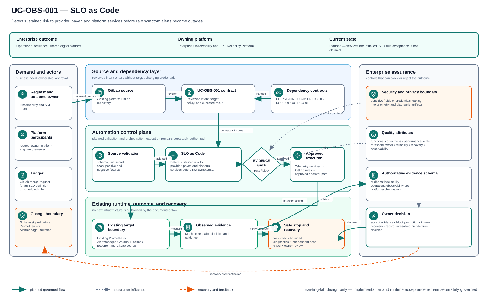

# UC-OBS-001: SLO as Code

Last verified: 2026-08-13

## Use-case record

| Field | Value |
| --- | --- |
| Canonical portfolio use case | SLO as Code |
| Primary platform | Enterprise Observability and SRE Reliability Platform |
| Supporting use cases | [UC-RSO-002](../resilience/UC-RSO-002-sli-and-slo-governance.md), [UC-RSO-003](../resilience/UC-RSO-003-error-budget-management.md), [UC-RSO-009](../resilience/UC-RSO-009-service-ownership.md), [UC-RSO-010](../resilience/UC-RSO-010-dependency-mapping.md) |
| Enterprise alignment | Operational resilience, shared digital platform |
| Enterprise outcome | Detect sustained risk to provider, payer, and platform services before raw symptom alerts become outages |
| Supporting platforms | Resilience operations, DevSecOps delivery, governance |
| Jira epic | `EPIC-OBS-001` — Operate one service SLO through existing telemetry |
| Change record | To be assigned before Prometheus or Alertmanager mutation |
| Target | Existing Prometheus, Alertmanager, Grafana, Blackbox Exporter, and GitLab source |
| Current state | **Planned — services are installed; SLO rule acceptance is not claimed** |
| Infrastructure boundary | No VM, collector, database, cluster, or monitoring product is created |
| Owner | Observability and SRE team |

## Purpose

SRE needs a version-controlled service objective that turns existing metrics
into fast- and slow-burn signals. The first slice uses one already reachable
lab service and existing Prometheus/Alertmanager capacity.

## Expected outcome

A reviewed SLO definition produces recording rules, burn-rate alerts, a
dashboard view, and test evidence. Alerts identify service owner, objective,
window, current burn, dashboard, and runbook. A fixture proves firing and
recovery without creating a real outage.

## Platform and enterprise fit

| Relationship | Detailed fit |
| --- | --- |
| Owning platform | **SLO as Code** belongs to the Enterprise Observability and SRE Reliability Platform because that platform turns metrics, logs, traces, events, and service objectives into actionable reliability decisions. |
| Enterprise consumers | The capability supports the services and workflows used by providers, payers, operators, and shared platforms. |
| Enterprise outcome | Its planned result advances: Detect sustained risk to provider, payer, and platform services before raw symptom alerts become outages. |
| Control contribution | The design adds signal provenance, measurable objectives, incident context, and release feedback. |
| Cross-platform handoff | Supporting platforms consume a reviewed result or evidence artifact; they do not take ownership away from the primary platform. |
| Infrastructure boundary | Fit is achieved by reusing documented existing repositories, control planes, services, and targets—not by inventing capacity or treating planned products as available. |

The platform fit is therefore based on ownership and a reusable decision, not
on the presence of a particular tool. Enterprise fit requires evidence that the
named outcome was observed for the bounded scope; completing documentation or
running an isolated technology demonstration is insufficient.

## Trigger and actors

| Item | Definition |
| --- | --- |
| Trigger | GitLab merge request for an SLO definition or scheduled rule evaluation |
| Service owner | Defines the user-visible success condition and target |
| SRE | Reviews windows, budget policy, runbook, and paging severity |
| Observability engineer | Generates and validates rules and dashboards |
| Release engineer | Consumes SLO state as later promotion evidence |

## Preconditions

- Prometheus `3.13.1`, Alertmanager `0.33.1`, Grafana `13.1.1`, and Blackbox
  Exporter `0.25.0` remain healthy.
- The selected endpoint is already active and named in environment docs.
- Existing scrape or probe data has enough history to calculate the objective.
- Alert notification remains bounded to the lab; no external paging route is
  assumed.

## Scope and exclusions

In scope are one existing service, SLO schema, generated Prometheus rules,
`promtool` tests, dashboard panels, alert annotations, and non-disruptive
fixtures. New monitoring products, new VMs, production paging, TLS/SSO rollout,
and synthetic traffic that changes business data are excluded.

## Architecture context

SLO as Code is evaluated inside the existing enterprise lab and the owning
platform's current source-control and execution boundaries. The architectural
unit is the governed outcome—**Detect sustained risk to provider, payer, and platform services before raw symptom alerts become outages**—rather than a new product or
environment.

| Context element | Architecture statement |
| --- | --- |
| Business and operational setting | Enterprise consumers: Operational resilience, shared digital platform. The result must be explainable, repeatable, and owned. |
| Current state | **Planned — services are installed; SLO rule acceptance is not claimed** |
| Desired state | A reviewed contract drives a bounded result, machine-readable evidence, and a safe stop or recovery decision. |
| Existing target boundary | Existing Prometheus, Alertmanager, Grafana, Blackbox Exporter, and GitLab source |
| Infrastructure constraint | No VM, collector, database, cluster, or monitoring product is created |
| Accountable platform owner | Observability and SRE team; the consuming service, data, security, or workflow owner remains accountable for accepting business impact. |

The page owns the contract, control logic, evidence, and recovery behavior for
SLO as Code. It does not absorb the responsibilities of the dependency use cases
listed below.

## Architecture diagram

The solid paths show how reviewed demand becomes a bounded decision and evidence. The dashed return path makes recovery and owner acceptance part of the architecture, not an afterthought. Planned control logic remains separate from the existing execution and target boundaries.

## Dependencies and handoffs

SLO as Code remains accountable to its primary platform. The dependencies below
provide explicit contracts or assurance evidence; they do not become alternate owners.

| Relationship | Use case | Required handoff | Failure propagation |
| --- | --- | --- | --- |
| Required upstream contract | [UC-RSO-002: SLI and SLO Governance](../resilience/UC-RSO-002-sli-and-slo-governance.md) | approved SLI/SLO definition and review cadence | Missing, stale, or failed evidence blocks promotion or runtime action. |
| Required upstream contract | [UC-RSO-003: Error-Budget Management](../resilience/UC-RSO-003-error-budget-management.md) | error-budget state and release decision boundary | Missing, stale, or failed evidence blocks promotion or runtime action. |
| Coordinated assurance handoff | [UC-RSO-009: Service Ownership](../resilience/UC-RSO-009-service-ownership.md) | accountable service owner and operational tier | Missing, stale, or failed evidence blocks promotion or runtime action. |
| Coordinated assurance handoff | [UC-RSO-010: Dependency Mapping](../resilience/UC-RSO-010-dependency-mapping.md) | upstream/downstream service dependency and failure effect | Missing, stale, or failed evidence blocks promotion or runtime action. |

Before SLO as Code is implemented, every handoff must resolve to an immutable
revision and machine-readable artifact. A URL, screenshot, or verbal approval
alone is not sufficient dependency evidence.

## Quality attributes

For SLO as Code, quality is measured against the bounded enterprise outcome—not
document length or a green job. Unapproved business thresholds remain explicit
decisions and must not be invented.

| Attribute | Required measure or invariant | Decision state |
| --- | --- | --- |
| Functional correctness | Every required input is validated; **Detect sustained risk to provider, payer, and platform services before raw symptom alerts become outages** is evaluated against positive, negative, missing-input, and unauthorized-scope cases. | Fixed design requirement |
| Performance and scale | Establish a baseline for signal freshness, query latency, coverage, false-positive rate, and evidence cost on existing capacity; the owner must approve warning and blocking thresholds before runtime promotion. | Thresholds `TBD` before implementation |
| Reliability | Missing prerequisites, stale dependencies, malformed evidence, and partial results fail closed without widening scope. | Fixed design requirement |
| Recovery | Record the maximum acceptable interruption and recovery time before runtime use; source-only validation must remain zero-change. | Owner decision required before runtime exercise |
| Observability | Emit use-case ID, revision, target, executor, start/end time, duration, decision, reason code, and recovery reference. | Required in the result schema |
| Evidence retention | Assign classification, retention period, and deletion owner before storing runtime evidence. | Security/compliance decision required |

Load, latency, availability, retention, RTO, and RPO values for SLO as Code become
requirements only after the named service or business owner approves them. Until
then, the implementation gate records them as unresolved instead of quietly
choosing defaults.

## Security and privacy architecture

The SLO as Code design separates source validation, privileged execution, target
access, and evidence review. Those boundaries remain in force even when one
engineer can access more than one system.

| Trust boundary | Allowed flow | Required control |
| --- | --- | --- |
| Contributor → GitLab | Reviewed source, contract, and synthetic/sanitized fixtures | Protected branch rules, peer review, secret scanning, and immutable commit identity |
| GitLab runner → result artifact | Read-only evaluation inputs and machine-readable output | No target-changing credential; pinned tool versions; artifact checksum and expiry |
| Approval plane → executor | Approved revision, target allowlist, mode, canary, and change reference | Separate authorization through the existing Jenkins/AWX or platform control path |
| Executor → existing target | Minimum commands or API operations required for SLO as Code | Least-privilege identity, explicit target limit, timeout, and stop condition |
| Target → evidence store | Sanitized metadata, measurements, decision, and recovery result | Exclude credentials, tokens, private keys, kubeconfigs, packet payloads, PHI, PII, and unrelated records |

For SLO as Code, the primary threat is **sensitive fields or credentials leaking into telemetry and diagnostic artifacts**. The mandatory response is
field allowlists, redaction, access-controlled dashboards, scoped collectors, and bounded diagnostic queries. Authentication and authorization mappings must name
the existing identity source, principal or service account, permitted actions,
credential owner, rotation path, and emergency revocation procedure before a
runtime story can move beyond `Planned`.

## Architecture decisions and trade-offs

| Decision | Selected architecture | Alternative deferred or rejected | Rationale and status |
| --- | --- | --- | --- |
| First implementation slice | Contract, schema, fixtures, and read-only evidence on the existing GitLab runner | Product installation or broad runtime rollout | Proves behavior without expanding infrastructure; **approved design direction** |
| Runtime execution | Use only Existing observability collection path when current inventory and change approval confirm it is available | Direct operator changes or credentials in CI | Preserves separation of duties; **conditional on implementation review** |
| Evidence | Machine-readable result is authoritative; screenshots are optional supporting material | Screenshot-only acceptance | Enables repeatable audit and automated gates; **approved design direction** |
| Failure handling | Fail closed, preserve bounded diagnostics, and recover only the named scope | Continue with partial or stale evidence | Prevents false success and hidden blast radius; **approved design direction** |
| New capacity or product | Stop and raise a separate architecture decision | Silently add a VM, service, cloud dependency, or cluster add-on | Maintains the existing-lab constraint; **mandatory** |

### Open decisions before implementation

| Open decision | Decision owner | Resolution gate |
| --- | --- | --- |
| Exact inventory object and first canary | Platform owner plus consuming service/data owner | Must resolve before the implementation story leaves `Planned` |
| Performance, scale, and reliability thresholds | Service owner and SRE | Must be recorded before a runtime acceptance run |
| Identity-to-action authorization matrix | Platform owner and security reviewer | Must be approved before target credentials are attached |
| Evidence classification and retention | Data/security owner | Must be approved before runtime artifacts are retained |

If any selected approach changes, record the rationale beside UC-OBS-001 in
the implementation repository before code review. A documentation edit alone
does not approve the new architecture.

## Implementation design

The first SLO as Code implementation is deliberately source-only. Its planned files live in the existing repository; none provisions infrastructure.

| Planned source responsibility | Exact planned location |
| --- | --- |
| Use-case contract and target allowlist | `midhhealth/reliability-operations/observability-sre-platform/contracts/uc-obs-001.yaml` |
| Primary implementation | `midhhealth/reliability-operations/observability-sre-platform/rules/slo-as-code.yaml`; entry point: the `slo-as-code` rule, query, or scoring evaluator |
| Machine-readable result schema | `midhhealth/reliability-operations/observability-sre-platform/schemas/uc-obs-001-result.schema.json` |
| Positive, negative, malformed, and recovery fixtures | `midhhealth/reliability-operations/observability-sre-platform/tests/fixtures/uc-obs-001/` |
| GitLab source gate | `midhhealth/reliability-operations/observability-sre-platform/.gitlab/ci/uc-obs-001.yml` |
| Operator diagnosis and recovery | `midhhealth/reliability-operations/observability-sre-platform/docs/runbooks/uc-obs-001.md` |

### Delivery stages

1. **Contract:** add the contract, schema, owners, dependency revisions, target
   allowlist, modes, reason codes, and open-decision values.
2. **Source validation:** lint exact paths, validate schema compatibility, scan
   for sensitive content, and run every fixture on the existing runner.
3. **Read-only proof:** execute the `slo-as-code` rule, query, or scoring evaluator, publish a checksummed result, and
   prove that blocked cases cannot reach a mutating path.
4. **Bounded execution:** only after separate approval, pass the immutable
   revision, target, mode, canary, and change ID to Existing observability collection path.
5. **Independent verification:** measure the expected result, confirm unrelated
   state is unchanged, run recovery or zero-change proof, and obtain owner
   review.

The implementation merge request must link this page, the dependency artifacts,
the decision values above, and the eventual pipeline/job/run identifiers. Code
completion alone cannot promote the page to runtime verified.

## Code and configuration map

| Repository | Planned path | Responsibility |
| --- | --- | --- |
| `observability-sre-platform` | `slos/services.yml` | Service owner, SLI query, objective, windows, and runbook |
| same | `scripts/render-slo-rules.py` | Deterministic recording and alert rule generation |
| same | `tests/test_slo_rules.yml` | No-burn, fast-burn, slow-burn, missing-data, and recovery fixtures |
| `ansible-prometheus` | existing rule deployment role; exact path to confirm | Approved convergence on `prometheus.example.com` |
| `ansible-prometheus` | existing Grafana provisioning role; exact path to confirm | SLO dashboard publication |
| `enterprise-architecture-docs` | `docs/sre-incident-register.md` | Unexpected failure and corrective-action record |

## Jira breakdown

### STORY-OBS-001: Define one enterprise service objective

**Description:** A service owner and SRE need one measurable success ratio tied
to a real provider, payer, or shared-platform user journey.

**Status:** Planned.

**Acceptance criteria:** The definition names owner, service tier, users,
success and total queries, objective, windows, exclusions, runbook, and review
date; it uses an existing metric or blackbox probe.

**Implementation steps:** Select one active endpoint, inspect metric history,
write the SLO record, and validate query behavior for success and no-data cases.

**Completed work:** Monitoring services and endpoint inventory exist; no SLO
record is claimed.

**Validation and rollback:** Run schema and query checks. Revert the definition
if it misrepresents the user journey; no runtime state changes yet.

**Required attachments:** `ART-OBS-001A` query and baseline report.

### STORY-OBS-002: Generate and test burn-rate rules

**Description:** Observability engineers need deterministic fast- and slow-burn
rules that page on budget risk rather than transient symptoms.

**Status:** Planned.

**Acceptance criteria:** Generated rules pass `promtool`; fixtures cover clean,
fast burn, slow burn, missing data, and recovery; annotations include owner,
objective, dashboard, and runbook.

**Implementation steps:** Implement the renderer, commit generated rules, add
rule tests, and fail CI when generated output differs from source.

**Completed work:** Tool versions and target services are verified; generator
and fixtures are pending.

**Validation and rollback:** Run rule unit tests and compare generated files.
Rollback is a source revert before any AWX deployment.

**Required attachments:** `ART-OBS-002A` CI and promtool output.

### STORY-OBS-003: Deploy, exercise, and recover the SLO

**Description:** SRE needs proof that existing Prometheus, Alertmanager, and
Grafana load the rule, show the budget, fire from a safe fixture, and recover.

**Status:** Planned.

**Acceptance criteria:** AWX convergence succeeds, Prometheus reports rules
healthy, Grafana displays the SLO, a non-disruptive fixture fires the expected
alert, and the alert resolves after fixture removal.

**Implementation steps:** Assign a change, deploy through the existing role,
run the fixture, capture machine-readable evidence, remove the fixture, and
run a second zero-change convergence.

**Completed work:** The observability stack is accepted for existing telemetry;
the SLO deployment has not occurred.

**Validation and rollback:** Validate API rule state and Alertmanager state.
Rollback to the prior rule revision and reload Prometheus; verify the removed
alert is absent.

**Required attachments:** `ART-OBS-003A` AWX result,
`ART-OBS-003B` alert lifecycle, and `ATT-OBS-003A` dashboard capture.

## Evidence and screenshot register

| ID | Evidence | Source | Status |
| --- | --- | --- | --- |
| `ART-OBS-001A` | SLI query baseline | Prometheus API artifact | Pending |
| `ART-OBS-002A` | Rule tests | GitLab CI | Pending |
| `ART-OBS-003A` | Deployment and idempotence | AWX jobs | Pending |
| `ART-OBS-003B` | Firing-to-resolved lifecycle | Prometheus/Alertmanager APIs | Pending |
| `ATT-OBS-003A` | Sanitized SLO dashboard | Grafana | Pending |

## Expected versus current result

| Measure | Expected | Current |
| --- | --- | --- |
| Service SLO | One approved objective tied to a real journey | None accepted by this page |
| Rule quality | CI-tested fast/slow burn and recovery | Pending |
| Runtime | Rule healthy, fixture fires, alert resolves | Pending |

## Acceptance decision

**Planned.** Installed products are prerequisites, not acceptance. Runtime
acceptance requires AWX deployment, rule/API evidence, safe alert exercise,
recovery, idempotence, and documentation publication.

## Operational, security, and follow-up notes

- Do not encode credentials, patient identifiers, or sensitive labels in SLOs.
- A missing-data condition must be explicit and cannot silently count as good.
- Add release gating only after the alert proves stable in the lab.
- Copy implementation stories to the observability GitLab repositories and
  return accepted runtime evidence here.
