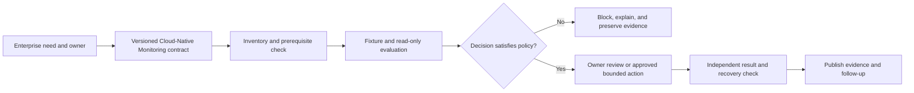

# UC-OBS-013: Cloud-Native Monitoring

Last reviewed: 2026-08-13

## Use-case record

| Field | Value |
| --- | --- |
| Canonical portfolio use case | Cloud-Native Monitoring |
| Primary platform | Enterprise Observability and SRE Reliability Platform |
| Enterprise alignment | Operational resilience, shared digital platform |
| Enterprise outcome | turn existing telemetry into actionable health and incident evidence for enterprise services |
| Primary GitLab repository | `midhhealth/reliability-operations/observability-sre-platform` |
| Jira epic | `EPIC-OBS-013` — Implement Cloud-Native Monitoring |
| Change record | Required before any mutating or runtime action; not required for fixture-only CI |
| Target | existing Prometheus, Alertmanager, Grafana, Loki, Tempo, OpenTelemetry, Elastic, and GitLab/AWX paths |
| Current state | **Planned — detailed design only; implementation and runtime evidence are not claimed** |
| Infrastructure boundary | Reuse the existing lab; do not create a new monitoring VM, telemetry backend, paging product, or unapproved data source |
| Owner | Enterprise Observability and SRE Reliability Platform team |

## Purpose

**Cloud-Native Monitoring** addresses a specific operating need inside the
Enterprise Observability and SRE Reliability Platform: **Cloud-managed services included in dashboards**. Without a shared design, teams can perform
the activity differently, omit critical controls, or report success without
enough context for another engineer or reviewer to reproduce the decision.

The design connects defined telemetry signal, service objective, and existing monitored target to a controlled result. It gives
SRE, service owner, platform engineer, incident responder, and risk reviewer a common description of the trigger, inputs, boundaries,
failure behavior, evidence, and ownership. Documentation here defines the
future implementation contract; it does not claim that the capability has been
built or exercised.

## Expected outcome

For an approved scope, the future workflow evaluates **Cloud-Native Monitoring** through
read-only collection and evaluation through the existing metrics, logs, traces, dashboard, and alerting paths. It produces a deterministic allow, block, escalate, or
not-applicable decision tied to immutable source and the named target. The
decision supports alerting, incident response, release-health, capacity, and reliability decisions and advances measurable reliability and faster diagnosis for provider, payer, and shared-platform services.

A missing prerequisite, unauthorized target, malformed result, unavailable
product, or failed safety check stops the workflow. No new infrastructure is
created under this design.

## Platform and enterprise fit

| Relationship | Detailed fit |
| --- | --- |
| Owning platform | Cloud-Native Monitoring turns a versioned platform intent into a repeatable decision rather than an isolated operator action. |
| Platform workflow | existing Prometheus, Grafana, Loki, Tempo, Elastic, and accepted automation paths are reused only where current inventory marks them available. |
| Enterprise outcome | The result contributes to turn existing telemetry into actionable health and incident evidence for enterprise services and remains traceable to its owner and source. |
| Provider and payer value | The control reduces inconsistent or unreviewed behavior in systems supporting healthcare and enterprise operations. |
| Risk and compliance | Decisions, exceptions, evidence, and review ownership are explicit and auditable. |
| Operational resilience | Fail-closed behavior, bounded execution, and recovery evidence prevent an ambiguous result from becoming a wider service change. |

## Trigger and actors

| Item | Definition |
| --- | --- |
| Trigger | Merge request, protected scheduled evaluation, approved operator request, source/data event, or monitored condition defined by the implementation contract |
| Primary actors | SRE, service owner, platform engineer, incident responder, and risk reviewer |
| Request owner | States the desired outcome, scope, urgency, and enterprise consumer |
| Platform owner | Owns the policy, accepted execution path, target boundary, and safe-stop behavior |
| Reviewer or approver | Confirms risk, prerequisites, evidence requirements, and any exception before a mutating step |
| Evidence consumer | Uses the result for alerting, incident response, release-health, capacity, and reliability decisions |

## Preconditions

- The named repository, source revision, and target resolve to current
  enterprise inventory; synthetic fixtures are permitted for source-only tests.
- The implementation contract defines the scope required to demonstrate:
  **Cloud-managed services included in dashboards**
- Credentials, if later required, come only from an existing protected
  credential boundary and are never stored in source, logs, screenshots, or
  result artifacts.
- Protected healthcare data is excluded unless a separate approved data
  classification and handling design explicitly permits it.
- Tool, API, schema, rule, query, model, or configuration versions that affect
  the decision are pinned or recorded.
- A non-mutating plan, fixture, query, or dry-run path is available before any
  approved bounded change.
- Recovery means either a verified zero-change stop or an identified restore
  source and tested reversal procedure.

## Scope and exclusions

In scope:

- the versioned contract for Cloud-Native Monitoring;
- explicit input, owner, target, policy, threshold, and decision semantics;
- positive, negative, missing-input, unauthorized-target, and malformed-result
  fixture behavior;
- read-only evaluation or an approved bounded action on an existing target;
- sanitized machine-readable evidence and reviewer-visible diagnostics;
- exception ownership and expiry; and
- safe stop, idempotence, rollback, restore, or reconciliation evidence as
  appropriate to the activity.

Out of scope:

- installing a product, creating a VM/runner/cluster/database/service, or
  allocating new capacity;
- treating a provisioned-only, planned, or unverified product as available;
- broad production rollout, unrestricted remediation, or bypass of change
  approval;
- embedding credentials or protected data in source and evidence;
- claiming source completion, runtime verification, or acceptance from this
  documentation; and
- replacing adjacent platform gates owned by other use cases.

## Detailed operational flow

1. The request identifies **Cloud-Native Monitoring**, the enterprise outcome, owner, immutable
   source or policy revision, named target, and expected coverage.
2. Preflight resolves the target against canonical inventory and verifies that
   every required product and execution path is currently accepted, not merely
   planned or provisioned.
3. The future workflow loads the versioned contract, validates required inputs,
   rejects secrets and protected data, and computes a digest for decision-
   affecting configuration.
4. Positive and negative source fixtures establish the intended behavior before
   any live evaluation. An invalid contract or unexpected fixture result stops.
5. A read-only plan, query, comparison, or offline evaluation measures the
   bounded target and predicts the decision and possible impact.
6. If mutation is necessary, the owner obtains the required change approval and
   limits execution to the documented canary. Otherwise, the workflow remains
   non-mutating.
7. The result records query or rule revision, target, evaluation window, source timestamps, dashboard/alert state, decision, and incident link and explains why the coverage was or
   was not satisfied.
8. An independent post-check proves expected state and detects partial,
   ambiguous, or out-of-scope effects. Failed post-checks invoke safe stop or
   the documented recovery path.
9. Platform and enterprise reviewers accept, reject, or assign follow-up work.
   Only reviewed evidence changes the status of this page.

## Design considerations

| Concern | Required design treatment |
| --- | --- |
| Operational signal | Define source, window, thresholds, ownership, missing-data behavior, and the decision driven by the signal. |
| Auditability | Record immutable input and policy versions, executor identity, target, timestamps, result, evidence checksum, reviewer, and related change/incident identifiers. |
| Safe failure | Missing data, unavailable dependencies, ambiguous scope, or incomplete evidence blocks the decision instead of producing a false success. |

These considerations make the page specific to **Cloud-Native Monitoring** while preserving the
same enterprise control language used across the owning platform. In particular,
the later implementation must demonstrate operational signal.

## Decision and control rules

- The canonical coverage test is: **Cloud-managed services included in dashboards**
- Immutable identifiers are used for source, policy, data, configuration, and
  evaluated target wherever the underlying platform provides them.
- The workflow fails closed when a required input, result, or provenance field
  is missing, malformed, stale, or outside its allowed scope.
- Read-only and fixture modes never receive credentials capable of changing the
  target.
- A mutating mode, if relevant, requires explicit approval, an allowlisted
  target, a bounded canary, stop conditions, and a verified recovery source.
- Exceptions require rationale, owner, reviewer, issue/change reference, scope,
  and expiry; an expired exception fails the gate.
- Success enables only the explicitly named downstream decision. It does not
  imply that adjacent security, reliability, data, release, or runtime gates
  passed.
- A screenshot can support human review but cannot replace machine-readable
  evidence.

## Information and evidence contract

| Evidence element | Requirement |
| --- | --- |
| Identity | Use-case ID, repository/project, immutable revision, target, and environment or dataset scope |
| Execution | Pipeline/build/job/run ID, executor or runner, mode, start/end time, and tool/API version |
| Inputs | Sanitized parameter names, contract/policy digest, baseline or comparison point, and owner |
| Result | Expected statement, observed value, threshold/policy evaluation, decision, and explicit blocking reason |
| Safety | Approval/change ID when required, canary boundary, non-mutation or before/after proof, and unexpected effects |
| Recovery | Rollback/restore source, recovery execution ID, post-recovery verification, or documented zero-change stop |
| Governance | Reviewer, exceptions, incident/action links, evidence checksum, retention class, and final status |

Evidence must be concise enough for a reviewer to evaluate but complete enough
for another engineer to reproduce the reasoning. Secrets, credentials, private
keys, tokens, kubeconfigs, and protected healthcare data are prohibited.

## Code and configuration map

The following locations are planned implementation responsibilities. They are
not represented as existing files until a future reviewed commit is linked.

| Planned location | Responsibility |
| --- | --- |
| `midhhealth/reliability-operations/observability-sre-platform` | Own the future platform implementation and use-case-specific operating notes |
| Planned `UC-OBS-013/contract` | Define inputs, owner, target allowlist, mode, coverage, policy, outputs, and safe stop |
| Planned `UC-OBS-013/result-schema` | Normalize provenance, observed values, decision, safety, recovery, and review fields |
| Planned `UC-OBS-013/fixtures` | Exercise passing, blocking, malformed, unauthorized, unavailable-dependency, and recovery cases |
| Existing GitLab CI path or planned reviewed include | Validate source and fixtures on an accepted existing runner |
| Existing Jenkins/AWX/platform path, if applicable | Perform only a separately approved bounded action against an inventoried target |
| Planned operating documentation | Explain prerequisites, evaluation, evidence review, troubleshooting, exception handling, and recovery |

Exact paths and tool choices must be confirmed against the named repository at
implementation planning time. This design intentionally avoids inventing source
files or implying that an unavailable product exists.

## Failure and recovery model

| Failure condition | Expected behavior | Recovery or safe stop |
| --- | --- | --- |
| Contract or policy is missing/invalid | Fail before target access | Correct through reviewed source and rerun fixtures |
| Target is absent, ambiguous, or outside inventory | Deny execution | Update authoritative inventory through separate governance; do not guess |
| Required product or executor is unavailable | Block and report the unmet prerequisite | Wait for separately approved acceptance or select only an already accepted compatible path |
| Read-only result differs from expectation | Stop before mutation | Review baseline, scope, data freshness, and policy; revise source if needed |
| Bounded action partially succeeds | Trigger the documented stop and recovery decision | Restore from the named source or reconcile to the last accepted revision |
| Evidence is missing, malformed, or contains sensitive material | Reject and quarantine the result | Remove exposure, rotate affected credentials if needed, record an incident, and rerun safely |
| Post-check fails or an unrelated object changes | Do not expand beyond the canary | Recover the canary, reconcile unexpected state, and require owner review |
| Recovery cannot be proven | Mark blocked, not accepted | Preserve state/evidence and escalate through incident and change governance |

## Jira breakdown

### STORY-OBS-013-001: Define the Cloud-Native Monitoring contract

**Description:** The platform owner and enterprise consumer need Cloud-Native Monitoring defined
as a versioned, reviewable contract so its scope, decision, evidence, and safety
boundary are consistent before implementation begins.

**Status:** Planned.

**Acceptance criteria:** Given current enterprise inventory, when the contract
is reviewed, then it names the owner, immutable input, accepted target/executor,
coverage statement, policy or threshold, output, evidence, exception process,
and safe stop; it rejects unavailable products, sensitive inputs, and new-
infrastructure actions.

**Implementation steps:** Confirm the named repository and current target;
identify producers and consumers; define inputs, decision states, thresholds,
evidence, and recovery semantics; add future positive and negative fixtures;
obtain platform and enterprise-owner review.

**Completed work:** The purpose, platform fit, enterprise outcome, operational
flow, controls, and future delivery contract are documented on this page. No
implementation commit or runtime result is claimed.

**Validation and rollback:** Review the design against the canonical portfolio,
inventory, product state, and no-new-infrastructure rule. Revert the
documentation revision if an incorrect dependency or boundary is found.

**Required attachments:** Future `ART-OBS-013-001A` contract and fixture review.

### STORY-OBS-013-002: Build the source and evidence gate

**Description:** The implementation owner needs a fail-closed source workflow
that evaluates Cloud-Native Monitoring, produces normalized evidence, and controls only its
declared downstream decisions.

**Status:** Planned.

**Acceptance criteria:** Given valid fixtures, the future job produces the
expected allow or not-applicable decision and complete provenance; given an
invalid contract, unauthorized target, failed policy, malformed result, or
sensitive output, it fails and blocks the named downstream path.

**Implementation steps:** Implement the reviewed contract and result schema in
the named repository; pin decision-affecting tools; connect an accepted runner;
add fixture and redaction checks; declare downstream dependencies; document
diagnosis and safe stop.

**Completed work:** Source responsibilities and required fixture behaviors are
specified. Implementation is intentionally deferred.

**Validation and rollback:** Exercise positive, blocking, missing-input,
malformed-output, unauthorized-target, exception-expiry, and redaction cases.
Revert the source commit if the new gate misclassifies established behavior.

**Required attachments:** Future `ART-OBS-013-002A` source validation and
`ART-OBS-013-002B` downstream-block proof.

### STORY-OBS-013-003: Verify the bounded outcome and recovery

**Description:** Platform and enterprise reviewers need evidence that the
future workflow satisfies **Cloud-managed services included in dashboards** on its named scope without hidden
effects and can stop or recover safely.

**Status:** Planned.

**Acceptance criteria:** Given approved prerequisites and target, when the
future evaluation or canary runs, then the observed result is compared with the
expected statement, unrelated objects remain unchanged, recovery or zero-change
is proven, exceptions and incidents are reconciled, and reviewers publish an
explicit acceptance or rejection.

**Implementation steps:** Reconfirm inventory and idle state; run fixture or
read-only mode; obtain change approval if mutation applies; execute one bounded
canary; collect the normalized result; run independent post-check and recovery;
publish evidence and owner decision here.

**Completed work:** Acceptance, evidence, and recovery requirements are fully
planned. No live evaluation, mutation, rollback, or acceptance is claimed.

**Validation and rollback:** Compare expected and observed state, verify the
evidence checksum and sensitive-data boundary, exercise the recovery or non-
mutation proof, and retain incident/action links. Failed recovery leaves the
use case blocked.

**Required attachments:** Future `ART-OBS-013-003A` bounded result,
`ART-OBS-013-003B` recovery/non-mutation proof, and an optional sanitized
`ATT-OBS-013-003A` only when a real capture adds review value.

## Evidence and screenshot register

| ID | Planned evidence | Source | Current status |
| --- | --- | --- | --- |
| `ART-OBS-013-001A` | Reviewed contract, inventory, dependency, and fixture design | Architecture and implementation repository review | Pending future implementation |
| `ART-OBS-013-002A` | Positive and negative source-gate results | Existing GitLab and accepted runner | Pending future execution |
| `ART-OBS-013-002B` | Failed-decision proof showing the declared downstream path blocked | Existing delivery pipeline | Pending future execution |
| `ART-OBS-013-003A` | Bounded observed result compared with **Cloud-managed services included in dashboards** | Approved existing execution path | Pending future execution |
| `ART-OBS-013-003B` | Recovery, restore, idempotence, reconciliation, or zero-change proof | Approved existing execution path | Pending future execution |

## Expected versus current result

| Measure | Expected future result | Current result |
| --- | --- | --- |
| Canonical coverage | Cloud-managed services included in dashboards | Detailed behavior and decision semantics documented |
| Platform fit | Controlled result supports alerting, incident response, release-health, capacity, and reliability decisions | Owning-platform relationships documented |
| Enterprise fit | turn existing telemetry into actionable health and incident evidence for enterprise services | Enterprise value, ownership, and evidence contract documented |
| Infrastructure | Existing inventoried targets and accepted execution paths only | No new infrastructure authorized |
| Implementation | Reviewed source contract, schema, fixtures, and fail-closed gate | Not scheduled |
| Runtime or bounded acceptance | Observed result plus recovery/non-mutation evidence and owner review | Not run |

## Acceptance decision

**Planned.** The page is a detailed organizational and platform design, not an
implementation-completion claim. Code complete will require reviewed source and
passing positive and negative validation in `midhhealth/reliability-operations/observability-sre-platform`. Runtime verified requires
the expected result on the named existing scope plus independent post-check and
recovery/non-mutation evidence. Accepted additionally requires owner review,
exception and incident reconciliation, evidence publication, and a clean
architecture repository.

## Operational, security, and follow-up notes

- Schedule implementation separately; documentation approval does not authorize
  code execution or a lab change.
- Recheck current environment state before selecting any product, endpoint,
  runner, inventory, cluster, database, model, dataset, or network target.
- Use synthetic or approved de-identified fixtures and sanitize diagnostics.
- Stop when scope, ownership, capacity, data classification, or recovery is
  unclear.
- Preserve the separation between source validation, approval, bounded
  execution, evidence review, and acceptance.
- Return future commit, pipeline/job/run, observed-result, recovery, exception,
  incident, and owner-review evidence to this page.
