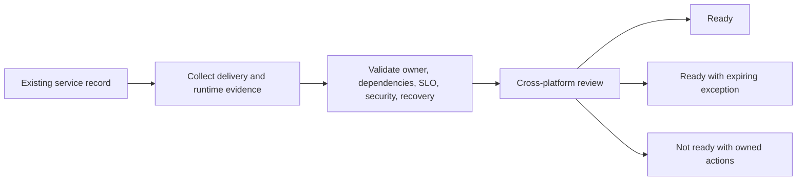

# UC-RSO-001: Operational Readiness Review

Last verified: 2026-08-13

## Use-case record

| Field | Value |
| --- | --- |
| Canonical portfolio use case | Operational Readiness Reviews |
| Primary platform | Enterprise Resilience and Service Operations Platform |
| Enterprise alignment | Provider operations, payer operations, operational resilience |
| Enterprise outcome | Prevent a service from being declared ready without ownership, dependencies, telemetry, recovery, and evidence |
| Supporting platforms | Observability, DevSecOps delivery, database, network, governance |
| Jira epic | `EPIC-RSO-001` — Gate one lab service through operational readiness |
| Change record | Uses the service's release/change record |
| Target | Existing service catalog evidence, GitLab, observability APIs, Jenkins/AWX results, and runbooks |
| Current state | **Planned — first-slice evidence playbooks exist; readiness acceptance is pending** |
| Infrastructure boundary | No VM, service, monitoring stack, or ticketing product is created |
| Owner | Resilience and Service Operations team |

## Purpose

Service owners need a consistent decision record before an existing lab
service is called operationally ready. The review joins evidence already
produced by delivery, runtime, data, network, security, and recovery workflows.

## Expected outcome

A versioned service record names the business capability, technical owner,
dependencies, SLO, dashboards, alerts, runbooks, backup/recovery expectations,
security boundary, and rollback. An automated collector validates references
and produces `Ready`, `Ready with expiring exception`, or `Not ready`.

## Platform and enterprise fit

| Relationship | Detailed fit |
| --- | --- |
| Owning platform | **Operational Readiness Review** belongs to the Enterprise Resilience and Service Operations Platform because that platform turns service ownership, objectives, telemetry, exercises, incidents, and recovery into an operating-readiness decision. |
| Enterprise consumers | The capability supports continuity of provider, payer, and shared-platform services. |
| Enterprise outcome | Its planned result advances: Prevent a service from being declared ready without ownership, dependencies, telemetry, recovery, and evidence. |
| Control contribution | The design adds measurable resilience, bounded failure exercises, accountable recovery, and follow-up closure. |
| Cross-platform handoff | Supporting platforms consume a reviewed result or evidence artifact; they do not take ownership away from the primary platform. |
| Infrastructure boundary | Fit is achieved by reusing documented existing repositories, control planes, services, and targets—not by inventing capacity or treating planned products as available. |

The platform fit is therefore based on ownership and a reusable decision, not
on the presence of a particular tool. Enterprise fit requires evidence that the
named outcome was observed for the bounded scope; completing documentation or
running an isolated technology demonstration is insufficient.

## Trigger and actors

| Item | Definition |
| --- | --- |
| Trigger | Release candidate, material platform change, annual review, or incident corrective action |
| Service owner | Owns business fit and acceptance decision |
| Platform owner | Supplies runtime and dependency evidence |
| SRE | Reviews SLO, alerts, runbooks, capacity, and recovery |
| Security/governance reviewer | Reviews access, secrets, data, and exceptions |

## Preconditions

- The service already exists in the canonical environment or is clearly marked
  as a planned application on existing capacity.
- Evidence URLs or IDs point to the private GitLab, Jenkins, AWX, Prometheus,
  Grafana, or approved documentation systems.
- No checklist item treats an endpoint response alone as product acceptance.
- Exceptions have owners and expiry dates.

## Scope and exclusions

In scope are service metadata, evidence validation, readiness scoring, review,
exceptions, and follow-up ownership. Provisioning, product installation,
automatic remediation, new monitoring, and bypass of platform-specific
acceptance are excluded.

## End-to-end execution flow

## Code and configuration map

| Repository | Planned path | Responsibility |
| --- | --- | --- |
| `resilience-service-operations` | `services/catalog.yml` | Business capability, owner, dependencies, tier, and data class |
| same | `schemas/operational-readiness.schema.json` | Required review fields |
| same | `scripts/collect-readiness-evidence.py` | Resolve and validate current evidence references |
| same | `runbooks/operational-readiness-review.md` | Review meeting, exceptions, and decision procedure |
| same | `reports/readiness/` | Generated artifacts only; not manually edited success records |
| `enterprise-architecture-docs` | `docs/current-environment-state.md` | Verified runtime boundary |

## Jira breakdown

### STORY-RSO-001: Define the service and enterprise outcome

**Description:** Service operations needs a canonical record that connects one
technical service to provider, payer, or shared-platform value and names its
owners and consumers.

**Status:** Planned.

**Acceptance criteria:** The record contains business capability, technical and
business owners, service tier, users, dependencies, data class, support hours,
and repository; all references resolve.

**Implementation steps:** Select one existing service, create the catalog
record, validate its schema, and obtain owner review.

**Completed work:** Enterprise alignment fields are defined; no service record
is accepted by this page.

**Validation and rollback:** Run schema and reference checks. Revert an
incorrect record rather than assigning a fictional owner or dependency.

**Required attachments:** `ART-RSO-001A` validated service record.

### STORY-RSO-002: Collect cross-platform readiness evidence

**Description:** Reviewers need current machine-readable evidence for release,
health, SLO, security, dependencies, backup, recovery, and rollback.

**Status:** Planned.

**Acceptance criteria:** Each required control has evidence ID, source,
timestamp, result, and owner; stale or absent evidence fails the gate; provisioned
VM status is never counted as installed-product acceptance.

**Implementation steps:** Implement collectors for approved APIs/artifacts,
normalize results, and test stale, missing, failed, and passing fixtures.

**Completed work:** Existing evidence systems are documented; the collector is
pending.

**Validation and rollback:** Run fixture tests and a read-only live collection.
Disable a collector if it leaks credentials or mislabels runtime state.

**Required attachments:** `ART-RSO-002A` readiness evidence bundle.

### STORY-RSO-003: Record a bounded readiness decision

**Description:** Service owners need a decision that cannot hide missing
controls and gives every exception a responsible owner and expiry.

**Status:** Planned.

**Acceptance criteria:** The result is Ready, Ready with expiring exception, or
Not ready; blockers and exceptions name owner and due date; approval identities
and source revision are recorded.

**Implementation steps:** Generate the scorecard, conduct review, capture the
decision, and create linked actions for every gap.

**Completed work:** Decision vocabulary is specified; no review is claimed.

**Validation and rollback:** Test decision logic. Revoke Ready status when
evidence expires or a critical control fails; retain the prior record for audit.

**Required attachments:** `ART-RSO-003A` signed readiness decision.

## Evidence and screenshot register

| ID | Evidence | Source | Status |
| --- | --- | --- | --- |
| `ART-RSO-001A` | Service record | GitLab CI artifact | Pending |
| `ART-RSO-002A` | Cross-platform evidence bundle | Approved systems | Pending |
| `ART-RSO-003A` | Readiness decision | GitLab release/change record | Pending |

## Expected versus current result

| Measure | Expected | Current |
| --- | --- | --- |
| Enterprise fit | Service maps to one business/shared capability | Specification only |
| Evidence | All required controls current and resolvable | Not collected |
| Decision | Explicit result with owned gaps | Not conducted |

## Acceptance decision

**Planned.** Accept after one existing service passes the full review, every
gap has an owner, exceptions expire automatically, and the decision is
reproducible from the same evidence revision.

## Operational, security, and follow-up notes

- Readiness aggregates platform evidence; it does not replace platform tests.
- Keep evidence access scoped and redact secrets and protected data.
- Re-run after material changes and incidents.
- Copy implementation stories to the resilience GitLab project and return the
  accepted decision here.
