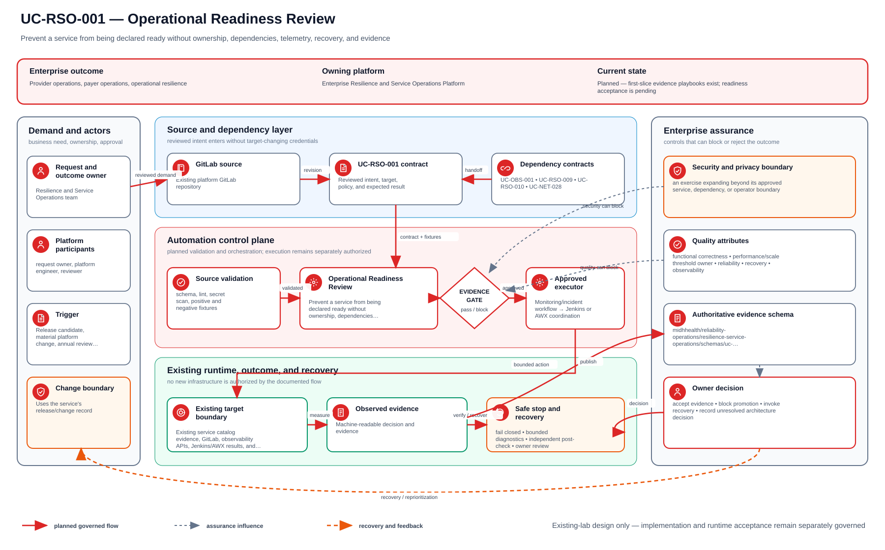

# UC-RSO-001: Operational Readiness Review

Last verified: 2026-08-13

## Use-case record

| Field | Value |
| --- | --- |
| Canonical portfolio use case | Operational Readiness Reviews |
| Primary platform | Enterprise Resilience and Service Operations Platform |
| Supporting use cases | [UC-OBS-001](../observability/UC-OBS-001-slo-as-code.md), [UC-RSO-009](UC-RSO-009-service-ownership.md), [UC-RSO-010](UC-RSO-010-dependency-mapping.md), [UC-NET-028](../network/UC-NET-028-network-availability-testing.md) |
| Enterprise alignment | Provider operations, payer operations, operational resilience |
| Enterprise outcome | Prevent a service from being declared ready without ownership, dependencies, telemetry, recovery, and evidence |
| Supporting platforms | Observability, DevSecOps delivery, database, network, governance |
| Jira epic | `EPIC-RSO-001` — Gate one lab service through operational readiness |
| Change record | Uses the service's release/change record |
| Target | Existing service catalog evidence, GitLab, observability APIs, Jenkins/AWX results, and runbooks |
| Current state | **Planned — first-slice evidence playbooks exist; readiness acceptance is pending** |
| Infrastructure boundary | No VM, service, monitoring stack, or ticketing product is created |
| Owner | Resilience and Service Operations team |

## Purpose

Service owners need a consistent decision record before an existing lab
service is called operationally ready. The review joins evidence already
produced by delivery, runtime, data, network, security, and recovery workflows.

## Expected outcome

A versioned service record names the business capability, technical owner,
dependencies, SLO, dashboards, alerts, runbooks, backup/recovery expectations,
security boundary, and rollback. An automated collector validates references
and produces `Ready`, `Ready with expiring exception`, or `Not ready`.

## Platform and enterprise fit

| Relationship | Detailed fit |
| --- | --- |
| Owning platform | **Operational Readiness Review** belongs to the Enterprise Resilience and Service Operations Platform because that platform turns service ownership, objectives, telemetry, exercises, incidents, and recovery into an operating-readiness decision. |
| Enterprise consumers | The capability supports continuity of provider, payer, and shared-platform services. |
| Enterprise outcome | Its planned result advances: Prevent a service from being declared ready without ownership, dependencies, telemetry, recovery, and evidence. |
| Control contribution | The design adds measurable resilience, bounded failure exercises, accountable recovery, and follow-up closure. |
| Cross-platform handoff | Supporting platforms consume a reviewed result or evidence artifact; they do not take ownership away from the primary platform. |
| Infrastructure boundary | Fit is achieved by reusing documented existing repositories, control planes, services, and targets—not by inventing capacity or treating planned products as available. |

The platform fit is therefore based on ownership and a reusable decision, not
on the presence of a particular tool. Enterprise fit requires evidence that the
named outcome was observed for the bounded scope; completing documentation or
running an isolated technology demonstration is insufficient.

## Trigger and actors

| Item | Definition |
| --- | --- |
| Trigger | Release candidate, material platform change, annual review, or incident corrective action |
| Service owner | Owns business fit and acceptance decision |
| Platform owner | Supplies runtime and dependency evidence |
| SRE | Reviews SLO, alerts, runbooks, capacity, and recovery |
| Security/governance reviewer | Reviews access, secrets, data, and exceptions |

## Preconditions

- The service already exists in the canonical environment or is clearly marked
  as a planned application on existing capacity.
- Evidence URLs or IDs point to the private GitLab, Jenkins, AWX, Prometheus,
  Grafana, or approved documentation systems.
- No checklist item treats an endpoint response alone as product acceptance.
- Exceptions have owners and expiry dates.

## Scope and exclusions

In scope are service metadata, evidence validation, readiness scoring, review,
exceptions, and follow-up ownership. Provisioning, product installation,
automatic remediation, new monitoring, and bypass of platform-specific
acceptance are excluded.

## Design walkthrough

A useful way for a new engineer to understand Operational Readiness Review is to begin with user
impact and decision authority, then connect diagnosis, mitigation and verified recovery. The
result MidhHealth needs is to Prevent a service from being declared ready without ownership,
dependencies, telemetry, recovery, and evidence. Resilience and Service Operations team owns the
platform decision, while the consuming service or business owner still accepts the effect on its
workflow.

Read the diagram from left to right as a sequence of gates; a later stage cannot repair missing
identity or evidence from an earlier one. In this page, **UC-OBS-001: SLO as Code** contributes
service-level indicator, objective, and measurement window; **UC-RSO-009: Service Ownership**
contributes accountable service owner and operational tier. The first buildable boundary is
Existing service catalog evidence, GitLab, observability APIs, Jenkins/AWX results, and
runbooks. The design stops at this rule: No VM, service, monitoring stack, or ticketing product
is created.

The walkthrough becomes useful when the happy path breaks. If a required dependency or
verification result is unavailable, the expected response is to stop before mutation, preserve
the evidence and return the decision to the accountable owner. The leading design threat is an
exercise expanding beyond its approved service, dependency, or operator boundary; therefore a
green source job, screenshot or reachable endpoint is supporting evidence, not acceptance by
itself.

## Architecture context

Operational Readiness Review is evaluated inside the existing enterprise lab and the owning
platform's current source-control and execution boundaries. The architectural
unit is the governed outcome—**Prevent a service from being declared ready without ownership, dependencies, telemetry, recovery, and evidence**—rather than a new product or
environment.

| Context element | Architecture statement |
| --- | --- |
| Business and operational setting | Enterprise consumers: Provider operations, payer operations, operational resilience. The result must be explainable, repeatable, and owned. |
| Current state | **Planned — first-slice evidence playbooks exist; readiness acceptance is pending** |
| Desired state | A reviewed contract drives a bounded result, machine-readable evidence, and a safe stop or recovery decision. |
| Existing target boundary | Existing service catalog evidence, GitLab, observability APIs, Jenkins/AWX results, and runbooks |
| Infrastructure constraint | No VM, service, monitoring stack, or ticketing product is created |
| Accountable platform owner | Resilience and Service Operations team; the consuming service, data, security, or workflow owner remains accountable for accepting business impact. |

The page owns the contract, control logic, evidence, and recovery behavior for
Operational Readiness Review. It does not absorb the responsibilities of the dependency use cases
listed below.

## Architecture diagram

Read this one left to right. The upper line follows a reviewed change toward a provable outcome; the lower branch shows who can stop it and how the team returns to a known release.

## Dependencies and handoffs

Operational Readiness Review remains accountable to its primary platform. The dependencies below
provide explicit contracts or assurance evidence; they do not become alternate owners.

| Relationship | Use case | Required handoff | Failure propagation |
| --- | --- | --- | --- |
| Required upstream contract | [UC-OBS-001: SLO as Code](../observability/UC-OBS-001-slo-as-code.md) | service-level indicator, objective, and measurement window | Missing, stale, or failed evidence blocks promotion or runtime action. |
| Required upstream contract | [UC-RSO-009: Service Ownership](UC-RSO-009-service-ownership.md) | accountable service owner and operational tier | Missing, stale, or failed evidence blocks promotion or runtime action. |
| Coordinated assurance handoff | [UC-RSO-010: Dependency Mapping](UC-RSO-010-dependency-mapping.md) | upstream/downstream service dependency and failure effect | Missing, stale, or failed evidence blocks promotion or runtime action. |
| Coordinated assurance handoff | [UC-NET-028: Network Availability Testing](../network/UC-NET-028-network-availability-testing.md) | layered service-path availability evidence | Missing, stale, or failed evidence blocks promotion or runtime action. |

Before Operational Readiness Review is implemented, every handoff must resolve to an immutable
revision and machine-readable artifact. A URL, screenshot, or verbal approval
alone is not sufficient dependency evidence.

## Quality attributes

For Operational Readiness Review, quality is measured against the bounded enterprise outcome—not
document length or a green job. Unapproved business thresholds remain explicit
decisions and must not be invented.

| Attribute | Required measure or invariant | Decision state |
| --- | --- | --- |
| Functional correctness | Every required input is validated; **Prevent a service from being declared ready without ownership, dependencies, telemetry, recovery, and evidence** is evaluated against positive, negative, missing-input, and unauthorized-scope cases. | Fixed design requirement |
| Performance and scale | Establish a baseline for detection time, recovery time, objective coverage, and repeatability on existing capacity; the owner must approve warning and blocking thresholds before runtime promotion. | Thresholds `TBD` before implementation |
| Reliability | Missing prerequisites, stale dependencies, malformed evidence, and partial results fail closed without widening scope. | Fixed design requirement |
| Recovery | Record the maximum acceptable interruption and recovery time before runtime use; source-only validation must remain zero-change. | Owner decision required before runtime exercise |
| Observability | Emit use-case ID, revision, target, executor, start/end time, duration, decision, reason code, and recovery reference. | Required in the result schema |
| Evidence retention | Assign classification, retention period, and deletion owner before storing runtime evidence. | Security/compliance decision required |

Load, latency, availability, retention, RTO, and RPO values for Operational Readiness Review become
requirements only after the named service or business owner approves them. Until
then, the implementation gate records them as unresolved instead of quietly
choosing defaults.

## Security and privacy architecture

The Operational Readiness Review design separates source validation, privileged execution, target
access, and evidence review. Those boundaries remain in force even when one
engineer can access more than one system.

| Trust boundary | Allowed flow | Required control |
| --- | --- | --- |
| Contributor → GitLab | Reviewed source, contract, and synthetic/sanitized fixtures | Protected branch rules, peer review, secret scanning, and immutable commit identity |
| GitLab runner → result artifact | Read-only evaluation inputs and machine-readable output | No target-changing credential; pinned tool versions; artifact checksum and expiry |
| Approval plane → executor | Approved revision, target allowlist, mode, canary, and change reference | Separate authorization through the existing Jenkins/AWX or platform control path |
| Executor → existing target | Minimum commands or API operations required for Operational Readiness Review | Least-privilege identity, explicit target limit, timeout, and stop condition |
| Target → evidence store | Sanitized metadata, measurements, decision, and recovery result | Exclude credentials, tokens, private keys, kubeconfigs, packet payloads, PHI, PII, and unrelated records |

For Operational Readiness Review, the primary threat is **an exercise expanding beyond its approved service, dependency, or operator boundary**. The mandatory response is
named exercise authority, explicit blast-radius limits, stop conditions, scoped credentials, and incident escalation. Authentication and authorization mappings must name
the existing identity source, principal or service account, permitted actions,
credential owner, rotation path, and emergency revocation procedure before a
runtime story can move beyond `Planned`.

## Architecture decisions and trade-offs

| Decision | Selected architecture | Alternative deferred or rejected | Rationale and status |
| --- | --- | --- | --- |
| First implementation slice | Contract, schema, fixtures, and read-only evidence on the existing GitLab runner | Product installation or broad runtime rollout | Proves behavior without expanding infrastructure; **approved design direction** |
| Runtime execution | Use only Approved Jenkins/AWX exercise path when current inventory and change approval confirm it is available | Direct operator changes or credentials in CI | Preserves separation of duties; **conditional on implementation review** |
| Evidence | Machine-readable result is authoritative; screenshots are optional supporting material | Screenshot-only acceptance | Enables repeatable audit and automated gates; **approved design direction** |
| Failure handling | Fail closed, preserve bounded diagnostics, and recover only the named scope | Continue with partial or stale evidence | Prevents false success and hidden blast radius; **approved design direction** |
| New capacity or product | Stop and raise a separate architecture decision | Silently add a VM, service, cloud dependency, or cluster add-on | Maintains the existing-lab constraint; **mandatory** |

### Open decisions before implementation

| Open decision | Decision owner | Resolution gate |
| --- | --- | --- |
| Exact inventory object and first canary | Platform owner plus consuming service/data owner | Must resolve before the implementation story leaves `Planned` |
| Performance, scale, and reliability thresholds | Service owner and SRE | Must be recorded before a runtime acceptance run |
| Identity-to-action authorization matrix | Platform owner and security reviewer | Must be approved before target credentials are attached |
| Evidence classification and retention | Data/security owner | Must be approved before runtime artifacts are retained |

If any selected approach changes, record the rationale beside UC-RSO-001 in
the implementation repository before code review. A documentation edit alone
does not approve the new architecture.

## Implementation design

The first Operational Readiness Review implementation is deliberately source-only. Its planned files live in the existing repository; none provisions infrastructure.

| Planned source responsibility | Exact planned location |
| --- | --- |
| Use-case contract and target allowlist | `midhhealth/reliability-operations/resilience-service-operations/contracts/uc-rso-001.yaml` |
| Primary implementation | `midhhealth/reliability-operations/resilience-service-operations/playbooks/operational-readiness-review.yml`; entry point: the `operational-readiness-review` readiness check or bounded exercise |
| Machine-readable result schema | `midhhealth/reliability-operations/resilience-service-operations/schemas/uc-rso-001-result.schema.json` |
| Positive, negative, malformed, and recovery fixtures | `midhhealth/reliability-operations/resilience-service-operations/tests/fixtures/uc-rso-001/` |
| GitLab source gate | `midhhealth/reliability-operations/resilience-service-operations/.gitlab/ci/uc-rso-001.yml` |
| Operator diagnosis and recovery | `midhhealth/reliability-operations/resilience-service-operations/docs/runbooks/uc-rso-001.md` |

### Delivery stages

1. **Contract:** add the contract, schema, owners, dependency revisions, target
   allowlist, modes, reason codes, and open-decision values.
2. **Source validation:** lint exact paths, validate schema compatibility, scan
   for sensitive content, and run every fixture on the existing runner.
3. **Read-only proof:** execute the `operational-readiness-review` readiness check or bounded exercise, publish a checksummed result, and
   prove that blocked cases cannot reach a mutating path.
4. **Bounded execution:** only after separate approval, pass the immutable
   revision, target, mode, canary, and change ID to Approved Jenkins/AWX exercise path.
5. **Independent verification:** measure the expected result, confirm unrelated
   state is unchanged, run recovery or zero-change proof, and obtain owner
   review.

The implementation merge request must link this page, the dependency artifacts,
the decision values above, and the eventual pipeline/job/run identifiers. Code
completion alone cannot promote the page to runtime verified.

## Code and configuration map

| Repository | Planned path | Responsibility |
| --- | --- | --- |
| `resilience-service-operations` | `services/catalog.yml` | Business capability, owner, dependencies, tier, and data class |
| same | `schemas/operational-readiness.schema.json` | Required review fields |
| same | `scripts/collect-readiness-evidence.py` | Resolve and validate current evidence references |
| same | `runbooks/operational-readiness-review.md` | Review meeting, exceptions, and decision procedure |
| same | `reports/readiness/` | Generated artifacts only; not manually edited success records |
| `enterprise-architecture-docs` | `docs/current-environment-state.md` | Verified runtime boundary |

## Jira breakdown

### STORY-RSO-001: Define the service and enterprise outcome

**Description:** Service operations needs a canonical record that connects one
technical service to provider, payer, or shared-platform value and names its
owners and consumers.

**Status:** Planned.

**Acceptance criteria:** The record contains business capability, technical and
business owners, service tier, users, dependencies, data class, support hours,
and repository; all references resolve.

**Implementation steps:** Select one existing service, create the catalog
record, validate its schema, and obtain owner review.

**Completed work:** Enterprise alignment fields are defined; no service record
is accepted by this page.

**Validation and rollback:** Run schema and reference checks. Revert an
incorrect record rather than assigning a fictional owner or dependency.

**Required attachments:** `ART-RSO-001A` validated service record.

### STORY-RSO-002: Collect cross-platform readiness evidence

**Description:** Reviewers need current machine-readable evidence for release,
health, SLO, security, dependencies, backup, recovery, and rollback.

**Status:** Planned.

**Acceptance criteria:** Each required control has evidence ID, source,
timestamp, result, and owner; stale or absent evidence fails the gate; provisioned
VM status is never counted as installed-product acceptance.

**Implementation steps:** Implement collectors for approved APIs/artifacts,
normalize results, and test stale, missing, failed, and passing fixtures.

**Completed work:** Existing evidence systems are documented; the collector is
pending.

**Validation and rollback:** Run fixture tests and a read-only live collection.
Disable a collector if it leaks credentials or mislabels runtime state.

**Required attachments:** `ART-RSO-002A` readiness evidence bundle.

### STORY-RSO-003: Record a bounded readiness decision

**Description:** Service owners need a decision that cannot hide missing
controls and gives every exception a responsible owner and expiry.

**Status:** Planned.

**Acceptance criteria:** The result is Ready, Ready with expiring exception, or
Not ready; blockers and exceptions name owner and due date; approval identities
and source revision are recorded.

**Implementation steps:** Generate the scorecard, conduct review, capture the
decision, and create linked actions for every gap.

**Completed work:** Decision vocabulary is specified; no review is claimed.

**Validation and rollback:** Test decision logic. Revoke Ready status when
evidence expires or a critical control fails; retain the prior record for audit.

**Required attachments:** `ART-RSO-003A` signed readiness decision.

## Evidence and screenshot register

| ID | Evidence | Source | Status |
| --- | --- | --- | --- |
| `ART-RSO-001A` | Service record | GitLab CI artifact | Pending |
| `ART-RSO-002A` | Cross-platform evidence bundle | Approved systems | Pending |
| `ART-RSO-003A` | Readiness decision | GitLab release/change record | Pending |

## Expected versus current result

| Measure | Expected | Current |
| --- | --- | --- |
| Enterprise fit | Service maps to one business/shared capability | Specification only |
| Evidence | All required controls current and resolvable | Not collected |
| Decision | Explicit result with owned gaps | Not conducted |

## Acceptance decision

**Planned.** Accept after one existing service passes the full review, every
gap has an owner, exceptions expire automatically, and the decision is
reproducible from the same evidence revision.

## Operational, security, and follow-up notes

- Readiness aggregates platform evidence; it does not replace platform tests.
- Keep evidence access scoped and redact secrets and protected data.
- Re-run after material changes and incidents.
- Copy implementation stories to the resilience GitLab project and return the
  accepted decision here.
