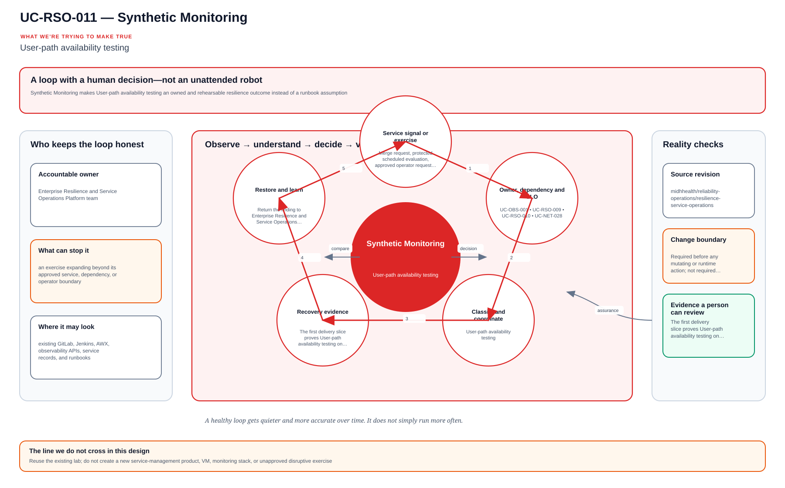

# UC-RSO-011: Synthetic Monitoring

Last reviewed: 2026-08-13

## Use-case record

| Field | Value |
| --- | --- |
| Canonical portfolio use case | Synthetic Monitoring |
| Primary platform | Enterprise Resilience and Service Operations Platform |
| Supporting use cases | [UC-OBS-001](../observability/UC-OBS-001-slo-as-code.md), [UC-RSO-009](UC-RSO-009-service-ownership.md), [UC-RSO-010](UC-RSO-010-dependency-mapping.md), [UC-NET-028](../network/UC-NET-028-network-availability-testing.md) |
| Enterprise alignment | Provider operations, payer operations, operational resilience |
| Enterprise outcome | connect service ownership, evidence, incident response, and recovery for enterprise workflows |
| Primary implementation repository | `midhhealth/reliability-operations/resilience-service-operations` |
| Jira epic | `EPIC-RSO-011` — Implement Synthetic Monitoring |
| Change record | Required before any mutating or runtime action; not required for fixture-only CI |
| Target | existing GitLab, Jenkins, AWX, observability APIs, service records, and runbooks |
| Current state | **Planned — detailed design only; implementation and runtime evidence are not claimed** |
| Infrastructure boundary | Reuse the existing lab; do not create a new service-management product, VM, monitoring stack, or unapproved disruptive exercise |
| Owner | Enterprise Resilience and Service Operations Platform team |

## Purpose

Synthetic Monitoring makes **User-path availability testing** an owned and rehearsable resilience outcome instead of a runbook assumption.

For Synthetic Monitoring, the design fixes the contract, dependency handoffs, target boundary, evidence, decision owners, and recovery path before implementation. Those choices keep the eventual build grounded in the lab that actually exists.

## Expected outcome

The first delivery slice proves **User-path availability testing** on the documented
existing target boundary. It uses a versioned contract plus positive, negative,
malformed-input, unauthorized-scope, and recovery fixtures, then publishes an
attributable machine-readable result.

Acceptance for Synthetic Monitoring requires rejected cases to stop safely and unrelated
state to remain unchanged. Live integration or mutation still requires the
separate approval, identity, canary, and rollback controls named below; this
design does not authorize a product installation, new capacity, or an unlisted
endpoint.

## Platform and enterprise fit

| Relationship | Architecture fit |
| --- | --- |
| Owning responsibility | **Enterprise Resilience and Service Operations Platform** owns the contract, control behavior, evidence schema, and recovery boundary for Synthetic Monitoring. |
| Enterprise use | connect service ownership, evidence, incident response, and recovery for enterprise workflows. |
| Required inputs | service identity, dependency map, objective, scenario, stop condition, and recovery authority. |
| Produced handoff | readiness or exercise result tied to observed service recovery. |
| Supporting platforms | The dependency table below names the exact use cases and artifacts; passing this page never implies that those controls passed. |
| Existing-lab boundary | Reuse the existing lab; do not create a new service-management product, VM, monitoring stack, or unapproved disruptive exercise. |

## Trigger and actors

| Item | Definition |
| --- | --- |
| Trigger | Merge request, protected scheduled evaluation, approved operator request, source/data event, or monitored condition defined by the implementation contract |
| Primary actors | service owner, SRE, incident commander, operations engineer, and risk reviewer |
| Request owner | States the desired outcome, scope, urgency, and enterprise consumer |
| Platform owner | Owns the policy, accepted execution path, target boundary, and safe-stop behavior |
| Reviewer or approver | Confirms risk, prerequisites, evidence requirements, and any exception before a mutating step |
| Evidence consumer | Uses the result for incident, continuity, recovery, capacity, change, and service-acceptance decisions |

## Preconditions

- The named repository, source revision, and target resolve to current
  enterprise inventory; synthetic fixtures are permitted for source-only tests.
- The implementation contract defines the scope required to demonstrate:
  **User-path availability testing**
- Credentials, if later required, come only from an existing protected
  credential boundary and are never stored in source, logs, screenshots, or
  result artifacts.
- Protected healthcare data is excluded unless a separate approved data
  classification and handling design explicitly permits it.
- Tool, API, schema, rule, query, model, or configuration versions that affect
  the decision are pinned or recorded.
- A non-mutating plan, fixture, query, or dry-run path is available before any
  approved bounded change.
- Recovery means either a verified zero-change stop or an identified restore
  source and tested reversal procedure.

## Scope and exclusions

In scope:

- the versioned contract for Synthetic Monitoring;
- explicit input, owner, target, policy, threshold, and decision semantics;
- positive, negative, missing-input, unauthorized-target, and malformed-result
  fixture behavior;
- read-only evaluation or an approved bounded action on an existing target;
- sanitized machine-readable evidence and reviewer-visible diagnostics;
- exception ownership and expiry; and
- safe stop, idempotence, rollback, restore, or reconciliation evidence as
  appropriate to the activity.

Out of scope:

- installing a product, creating a VM/runner/cluster/database/service, or
  allocating new capacity;
- treating a provisioned-only, planned, or unverified product as available;
- broad production rollout, unrestricted remediation, or bypass of change
  approval;
- embedding credentials or protected data in source and evidence;
- claiming source completion, runtime verification, or acceptance from this
  documentation; and
- replacing adjacent platform gates owned by other use cases.

## Design walkthrough

A useful way for a new engineer to understand Synthetic Monitoring is to begin with user impact
and decision authority, then connect diagnosis, mitigation and verified recovery. The result
MidhHealth needs is to connect service ownership, evidence, incident response, and recovery for
enterprise workflows. Enterprise Resilience and Service Operations Platform team owns the
platform decision, while the consuming service or business owner still accepts the effect on its
workflow.

Begin with the observation, then follow the decision and action back to a new observation; the
loop is incomplete until the owner sees the effect. In this page, **UC-OBS-001: SLO as Code**
contributes service-level indicator, objective, and measurement window; **UC-RSO-009: Service
Ownership** contributes accountable service owner and operational tier. The first buildable
boundary is existing GitLab, Jenkins, AWX, observability APIs, service records, and runbooks.
The design stops at this rule: Reuse the existing lab; do not create a new service-management
product, VM, monitoring stack, or unapproved disruptive exercise.

The walkthrough becomes useful when the happy path breaks. If contract or policy is
missing/invalid, the expected response is to Correct through reviewed source and rerun fixtures.
The leading design threat is an exercise expanding beyond its approved service, dependency, or
operator boundary; therefore a green source job, screenshot or reachable endpoint is supporting
evidence, not acceptance by itself.

## Architecture context

Synthetic Monitoring is evaluated inside the existing enterprise lab and the owning
platform's current source-control and execution boundaries. The architectural
unit is the governed outcome—**User-path availability testing**—rather than a new product or
environment.

| Context element | Architecture statement |
| --- | --- |
| Business and operational setting | Enterprise consumers: Provider operations, payer operations, operational resilience. The result must be explainable, repeatable, and owned. |
| Current state | **Planned — detailed design only; implementation and runtime evidence are not claimed** |
| Desired state | A reviewed contract drives a bounded result, machine-readable evidence, and a safe stop or recovery decision. |
| Existing target boundary | existing GitLab, Jenkins, AWX, observability APIs, service records, and runbooks |
| Infrastructure constraint | Reuse the existing lab; do not create a new service-management product, VM, monitoring stack, or unapproved disruptive exercise |
| Accountable platform owner | Enterprise Resilience and Service Operations Platform team; the consuming service, data, security, or workflow owner remains accountable for accepting business impact. |

The page owns the contract, control logic, evidence, and recovery behavior for
Synthetic Monitoring. It does not absorb the responsibilities of the dependency use cases
listed below.

## Architecture diagram

The center is the outcome the team cares about. The surrounding loop senses, compares, decides, verifies, and learns; it only closes when an accountable owner accepts the evidence.

## Dependencies and handoffs

Synthetic Monitoring remains accountable to its primary platform. The dependencies below
provide explicit contracts or assurance evidence; they do not become alternate owners.

| Relationship | Use case | Required handoff | Failure propagation |
| --- | --- | --- | --- |
| Required upstream contract | [UC-OBS-001: SLO as Code](../observability/UC-OBS-001-slo-as-code.md) | service-level indicator, objective, and measurement window | Missing, stale, or failed evidence blocks promotion or runtime action. |
| Required upstream contract | [UC-RSO-009: Service Ownership](UC-RSO-009-service-ownership.md) | accountable service owner and operational tier | Missing, stale, or failed evidence blocks promotion or runtime action. |
| Coordinated assurance handoff | [UC-RSO-010: Dependency Mapping](UC-RSO-010-dependency-mapping.md) | upstream/downstream service dependency and failure effect | Missing, stale, or failed evidence blocks promotion or runtime action. |
| Coordinated assurance handoff | [UC-NET-028: Network Availability Testing](../network/UC-NET-028-network-availability-testing.md) | layered service-path availability evidence | Missing, stale, or failed evidence blocks promotion or runtime action. |

Before Synthetic Monitoring is implemented, every handoff must resolve to an immutable
revision and machine-readable artifact. A URL, screenshot, or verbal approval
alone is not sufficient dependency evidence.

## Quality attributes

For Synthetic Monitoring, quality is measured against the bounded enterprise outcome—not
document length or a green job. Unapproved business thresholds remain explicit
decisions and must not be invented.

| Attribute | Required measure or invariant | Decision state |
| --- | --- | --- |
| Functional correctness | Every required input is validated; **User-path availability testing** is evaluated against positive, negative, missing-input, and unauthorized-scope cases. | Fixed design requirement |
| Performance and scale | Establish a baseline for detection time, recovery time, objective coverage, and repeatability on existing capacity; the owner must approve warning and blocking thresholds before runtime promotion. | Thresholds `TBD` before implementation |
| Reliability | Missing prerequisites, stale dependencies, malformed evidence, and partial results fail closed without widening scope. | Fixed design requirement |
| Recovery | Record the maximum acceptable interruption and recovery time before runtime use; source-only validation must remain zero-change. | Owner decision required before runtime exercise |
| Observability | Emit use-case ID, revision, target, executor, start/end time, duration, decision, reason code, and recovery reference. | Required in the result schema |
| Evidence retention | Assign classification, retention period, and deletion owner before storing runtime evidence. | Security/compliance decision required |

Load, latency, availability, retention, RTO, and RPO values for Synthetic Monitoring become
requirements only after the named service or business owner approves them. Until
then, the implementation gate records them as unresolved instead of quietly
choosing defaults.

## Security and privacy architecture

The Synthetic Monitoring design separates source validation, privileged execution, target
access, and evidence review. Those boundaries remain in force even when one
engineer can access more than one system.

| Trust boundary | Allowed flow | Required control |
| --- | --- | --- |
| Contributor → GitLab | Reviewed source, contract, and synthetic/sanitized fixtures | Protected branch rules, peer review, secret scanning, and immutable commit identity |
| GitLab runner → result artifact | Read-only evaluation inputs and machine-readable output | No target-changing credential; pinned tool versions; artifact checksum and expiry |
| Approval plane → executor | Approved revision, target allowlist, mode, canary, and change reference | Separate authorization through the existing Jenkins/AWX or platform control path |
| Executor → existing target | Minimum commands or API operations required for Synthetic Monitoring | Least-privilege identity, explicit target limit, timeout, and stop condition |
| Target → evidence store | Sanitized metadata, measurements, decision, and recovery result | Exclude credentials, tokens, private keys, kubeconfigs, packet payloads, PHI, PII, and unrelated records |

For Synthetic Monitoring, the primary threat is **an exercise expanding beyond its approved service, dependency, or operator boundary**. The mandatory response is
named exercise authority, explicit blast-radius limits, stop conditions, scoped credentials, and incident escalation. Authentication and authorization mappings must name
the existing identity source, principal or service account, permitted actions,
credential owner, rotation path, and emergency revocation procedure before a
runtime story can move beyond `Planned`.

## Architecture decisions and trade-offs

| Decision | Selected architecture | Alternative deferred or rejected | Rationale and status |
| --- | --- | --- | --- |
| First implementation slice | Contract, schema, fixtures, and read-only evidence on the existing GitLab runner | Product installation or broad runtime rollout | Proves behavior without expanding infrastructure; **approved design direction** |
| Runtime execution | Use only Approved Jenkins/AWX exercise path when current inventory and change approval confirm it is available | Direct operator changes or credentials in CI | Preserves separation of duties; **conditional on implementation review** |
| Evidence | Machine-readable result is authoritative; screenshots are optional supporting material | Screenshot-only acceptance | Enables repeatable audit and automated gates; **approved design direction** |
| Failure handling | Fail closed, preserve bounded diagnostics, and recover only the named scope | Continue with partial or stale evidence | Prevents false success and hidden blast radius; **approved design direction** |
| New capacity or product | Stop and raise a separate architecture decision | Silently add a VM, service, cloud dependency, or cluster add-on | Maintains the existing-lab constraint; **mandatory** |

### Open decisions before implementation

| Open decision | Decision owner | Resolution gate |
| --- | --- | --- |
| Exact inventory object and first canary | Platform owner plus consuming service/data owner | Must resolve before the implementation story leaves `Planned` |
| Performance, scale, and reliability thresholds | Service owner and SRE | Must be recorded before a runtime acceptance run |
| Identity-to-action authorization matrix | Platform owner and security reviewer | Must be approved before target credentials are attached |
| Evidence classification and retention | Data/security owner | Must be approved before runtime artifacts are retained |

If any selected approach changes, record the rationale beside UC-RSO-011 in
the implementation repository before code review. A documentation edit alone
does not approve the new architecture.

## Implementation design

The first Synthetic Monitoring implementation is deliberately source-only. Its planned files live in the existing repository; none provisions infrastructure.

| Planned source responsibility | Exact planned location |
| --- | --- |
| Use-case contract and target allowlist | `midhhealth/reliability-operations/resilience-service-operations/contracts/uc-rso-011.yaml` |
| Primary implementation | `midhhealth/reliability-operations/resilience-service-operations/playbooks/synthetic-monitoring.yml`; entry point: the `synthetic-monitoring` readiness check or bounded exercise |
| Machine-readable result schema | `midhhealth/reliability-operations/resilience-service-operations/schemas/uc-rso-011-result.schema.json` |
| Positive, negative, malformed, and recovery fixtures | `midhhealth/reliability-operations/resilience-service-operations/tests/fixtures/uc-rso-011/` |
| GitLab source gate | `midhhealth/reliability-operations/resilience-service-operations/.gitlab/ci/uc-rso-011.yml` |
| Operator diagnosis and recovery | `midhhealth/reliability-operations/resilience-service-operations/docs/runbooks/uc-rso-011.md` |

### Delivery stages

1. **Contract:** add the contract, schema, owners, dependency revisions, target
   allowlist, modes, reason codes, and open-decision values.
2. **Source validation:** lint exact paths, validate schema compatibility, scan
   for sensitive content, and run every fixture on the existing runner.
3. **Read-only proof:** execute the `synthetic-monitoring` readiness check or bounded exercise, publish a checksummed result, and
   prove that blocked cases cannot reach a mutating path.
4. **Bounded execution:** only after separate approval, pass the immutable
   revision, target, mode, canary, and change ID to Approved Jenkins/AWX exercise path.
5. **Independent verification:** measure the expected result, confirm unrelated
   state is unchanged, run recovery or zero-change proof, and obtain owner
   review.

The implementation merge request must link this page, the dependency artifacts,
the decision values above, and the eventual pipeline/job/run identifiers. Code
completion alone cannot promote the page to runtime verified.

## Code and configuration map

These are exact **planned** repository-relative locations in the existing
GitLab project. Their inclusion is an implementation contract, not a claim that
the files already exist.

| Repository and planned path | Responsibility | Current state |
| --- | --- | --- |
| `midhhealth/reliability-operations/resilience-service-operations/contracts/uc-rso-011.yaml` | Inputs, owner, dependency revisions, target allowlist, modes, thresholds, and stop conditions | Planned |
| `midhhealth/reliability-operations/resilience-service-operations/playbooks/synthetic-monitoring.yml` | Primary implementation through the `synthetic-monitoring` readiness check or bounded exercise | Planned |
| `midhhealth/reliability-operations/resilience-service-operations/schemas/uc-rso-011-result.schema.json` | Provenance, observations, decision, reason codes, safety, and recovery result | Planned |
| `midhhealth/reliability-operations/resilience-service-operations/tests/fixtures/uc-rso-011/` | Passing, blocking, malformed, unauthorized, stale-dependency, and recovery cases | Planned |
| `midhhealth/reliability-operations/resilience-service-operations/.gitlab/ci/uc-rso-011.yml` | Source validation on an accepted existing runner | Planned |
| `midhhealth/reliability-operations/resilience-service-operations/docs/runbooks/uc-rso-011.md` | Preconditions, execution, diagnosis, evidence review, safe stop, and recovery | Planned |

Implementation must verify the repository and current execution path before
creating these files. Discovery of a missing product or capacity stops the
story and raises a separate decision; it does not change this page's
infrastructure boundary.

## Failure and recovery model

| Failure condition | Expected behavior | Recovery or safe stop |
| --- | --- | --- |
| Contract or policy is missing/invalid | Fail before target access | Correct through reviewed source and rerun fixtures |
| Target is absent, ambiguous, or outside inventory | Deny execution | Update authoritative inventory through separate governance; do not guess |
| Required product or executor is unavailable | Block and report the unmet prerequisite | Wait for separately approved acceptance or select only an already accepted compatible path |
| Read-only result differs from expectation | Stop before mutation | Review baseline, scope, data freshness, and policy; revise source if needed |
| Bounded action partially succeeds | Trigger the documented stop and recovery decision | Restore from the named source or reconcile to the last accepted revision |
| Evidence is missing, malformed, or contains sensitive material | Reject and quarantine the result | Remove exposure, rotate affected credentials if needed, record an incident, and rerun safely |
| Post-check fails or an unrelated object changes | Do not expand beyond the canary | Recover the canary, reconcile unexpected state, and require owner review |
| Recovery cannot be proven | Mark blocked, not accepted | Preserve state/evidence and escalate through incident and change governance |

## Jira breakdown

### STORY-RSO-011-001: Define the Synthetic Monitoring contract

**Description:** Exercise one approved scope and publish evidence that the observed result matches the contract, unrelated state remains unchanged, and recovery or zero-change behavior works. The accountable owner records acceptance or rejection.

**Status:** Planned.

**Acceptance criteria:** Given current enterprise inventory, when the contract
is reviewed, then it names the owner, immutable input, accepted target/executor,
coverage statement, policy or threshold, output, evidence, exception process,
and safe stop; it rejects unavailable products, sensitive inputs, and new-
infrastructure actions.

**Implementation steps:** Write `midhhealth/reliability-operations/resilience-service-operations/docs/runbooks/uc-rso-011.md`; reconfirm inventory and dependency evidence; run source and read-only modes; obtain separate approval for one canary if mutation is required; collect the schema-valid result, independent post-check, recovery proof, and owner decision.

**Completed work:** The purpose, platform fit, enterprise outcome, operational
flow, controls, and future delivery contract are documented on this page. No
implementation commit or runtime result is claimed.

**Validation and rollback:** Review the design against the canonical portfolio,
inventory, product state, and no-new-infrastructure rule. Revert the
documentation revision if an incorrect dependency or boundary is found.

**Required attachments:** Future `ART-RSO-011-001A` contract and fixture review.

### STORY-RSO-011-002: Build the source and evidence gate

**Description:** The implementation owner needs a fail-closed source workflow
that evaluates Synthetic Monitoring, produces normalized evidence, and controls only its
declared downstream decisions.

**Status:** Planned.

**Acceptance criteria:** Given valid fixtures, the future job produces the
expected allow or not-applicable decision and complete provenance; given an
invalid contract, unauthorized target, failed policy, malformed result, or
sensitive output, it fails and blocks the named downstream path.

**Implementation steps:** Implement the reviewed contract and result schema in
the named repository; pin decision-affecting tools; connect an accepted runner;
add fixture and redaction checks; declare downstream dependencies; document
diagnosis and safe stop.

**Completed work:** Source responsibilities and required fixture behaviors are
specified. Implementation is intentionally deferred.

**Validation and rollback:** Exercise positive, blocking, missing-input,
malformed-output, unauthorized-target, exception-expiry, and redaction cases.
Revert the source commit if the new gate misclassifies established behavior.

**Required attachments:** Future `ART-RSO-011-002A` source validation and
`ART-RSO-011-002B` downstream-block proof.

### STORY-RSO-011-003: Verify the bounded outcome and recovery

**Description:** Platform and enterprise reviewers need evidence that the
future workflow satisfies **User-path availability testing** on its named scope without hidden
effects and can stop or recover safely.

**Status:** Planned.

**Acceptance criteria:** Given approved prerequisites and target, when the
future evaluation or canary runs, then the observed result is compared with the
expected statement, unrelated objects remain unchanged, recovery or zero-change
is proven, exceptions and incidents are reconciled, and reviewers publish an
explicit acceptance or rejection.

**Implementation steps:** Reconfirm inventory and idle state; run fixture or
read-only mode; obtain change approval if mutation applies; execute one bounded
canary; collect the normalized result; run independent post-check and recovery;
publish evidence and owner decision here.

**Completed work:** Acceptance, evidence, and recovery requirements are fully
planned. No live evaluation, mutation, rollback, or acceptance is claimed.

**Validation and rollback:** Compare expected and observed state, verify the
evidence checksum and sensitive-data boundary, exercise the recovery or non-
mutation proof, and retain incident/action links. Failed recovery leaves the
use case blocked.

**Required attachments:** Future `ART-RSO-011-003A` bounded result,
`ART-RSO-011-003B` recovery/non-mutation proof, and an optional sanitized
`ATT-RSO-011-003A` only when a real capture adds review value.

## Evidence and screenshot register

| ID | Planned evidence | Source | Current status |
| --- | --- | --- | --- |
| `ART-RSO-011-001A` | Reviewed contract, inventory, dependency, and fixture design | Architecture and implementation repository review | Pending future implementation |
| `ART-RSO-011-002A` | Positive and negative source-gate results | Existing GitLab and accepted runner | Pending future execution |
| `ART-RSO-011-002B` | Failed-decision proof showing the declared downstream path blocked | Existing delivery pipeline | Pending future execution |
| `ART-RSO-011-003A` | Bounded observed result compared with **User-path availability testing** | Approved existing execution path | Pending future execution |
| `ART-RSO-011-003B` | Recovery, restore, idempotence, reconciliation, or zero-change proof | Approved existing execution path | Pending future execution |

## Expected versus current result

| Measure | Expected future result | Current result |
| --- | --- | --- |
| Canonical coverage | User-path availability testing | Detailed behavior and decision semantics documented |
| Platform fit | Controlled result supports incident, continuity, recovery, capacity, change, and service-acceptance decisions | Owning-platform relationships documented |
| Enterprise fit | connect service ownership, evidence, incident response, and recovery for enterprise workflows | Enterprise value, ownership, and evidence contract documented |
| Infrastructure | Existing inventoried targets and accepted execution paths only | No new infrastructure authorized |
| Implementation | Reviewed source contract, schema, fixtures, and fail-closed gate | Not scheduled |
| Runtime or bounded acceptance | Observed result plus recovery/non-mutation evidence and owner review | Not run |

## Acceptance decision

**Planned.** The architecture baseline is documented; implementation and runtime acceptance remain separate governed work. Code complete will require reviewed source and
passing positive and negative validation in `midhhealth/reliability-operations/resilience-service-operations`. Runtime verified requires
the expected result on the named existing scope plus independent post-check and
recovery/non-mutation evidence. Accepted additionally requires owner review,
exception and incident reconciliation, evidence publication, and a clean
architecture repository.

## Operational, security, and follow-up notes

- Move into implementation only through the planned source story; this page does not authorize code execution or a lab change.
- Recheck current environment state before selecting any product, endpoint,
  runner, inventory, cluster, database, model, dataset, or network target.
- Use synthetic or approved de-identified fixtures and sanitize diagnostics.
- Stop when scope, ownership, capacity, data classification, or recovery is
  unclear.
- Preserve the separation between source validation, approval, bounded
  execution, evidence review, and acceptance.
- Return future commit, pipeline/job/run, observed-result, recovery, exception,
  incident, and owner-review evidence to this page.

## Interview-derived lab enhancement: connect a failed journey to an owner

Observability owns the probe mechanics; resilience operations owns what happens
when a business journey fails. The enhancement turns a failed synthetic stage
into severity, dependency, owner, escalation and recovery evidence.

Extend the contract with service record, journey revision, business moment,
stage result, SLO effect, release correlation, dependency edge and escalation
policy. The evaluator classifies impact without issuing a page when ownership
or evidence is incomplete. Fixtures cover isolated probe failure, repeated
user-path failure, internal-green/external-red, dependency degradation, stale
result and confirmed recovery. CI validates routing and deduplication; the
runbook requires a fresh outside-in success plus stable service signals before
resolution.

1. When should one failed synthetic check page a human?
2. How do you avoid duplicate incidents from several probes of the same path?
3. Which evidence establishes user recovery rather than alert recovery?
