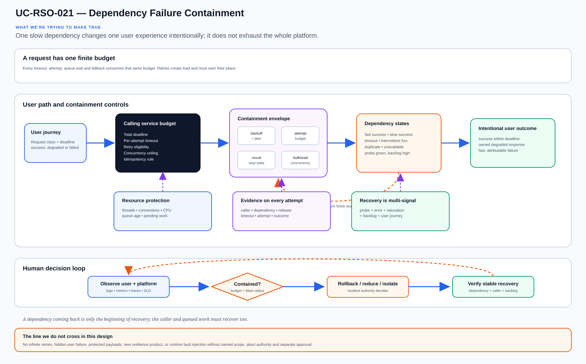

# UC-RSO-021: Dependency Failure Containment

Last reviewed: 2026-08-13

## Use-case record

| Field | Value |
| --- | --- |
| Canonical portfolio use case | Dependency Failure Containment |
| Primary platform | Enterprise Resilience and Service Operations Platform |
| Supporting use cases | [UC-RSO-010](UC-RSO-010-dependency-mapping.md), [UC-OBS-009](../observability/UC-OBS-009-api-error-rate-monitoring.md), [UC-OBS-001](../observability/UC-OBS-001-slo-as-code.md), [UC-K8S-005](../kubernetes/UC-K8S-005-continuous-verification.md), [UC-CICD-015](../devsecops/UC-CICD-015-deployment-health-scoring.md) |
| Enterprise alignment | Provider operations, payer operations, shared digital platform, operational resilience |
| Enterprise outcome | Keep one slow or unavailable dependency from becoming an enterprise-wide outage |
| Primary GitLab repository | `midhhealth/reliability-operations/resilience-service-operations` |
| Jira epic | `EPIC-RSO-021` — Build Dependency Failure Containment |
| Change record | Not required for source and fixture validation; required before fault injection or runtime policy changes |
| Target | existing GitLab runner for deterministic fixtures and the existing Kubernetes application cluster for separately approved bounded exercises |
| Current state | **Planned — architecture and lab contract only; no containment behavior has been runtime verified** |
| Infrastructure boundary | Reuse existing application, Kubernetes and observability paths; do not add a service mesh, queue, cache, gateway, VM, cluster or cloud service |
| Owner | Enterprise Resilience and Service Operations Platform team |

## Purpose

Dependency maps tell an operator where a service calls next. They do not answer
the harder question: what happens when that next hop takes eight seconds,
returns intermittent errors, accepts a request twice, or recovers while a
backlog is still draining?

Dependency Failure Containment makes those decisions explicit. Service owners
define time budgets, retry limits, idempotency expectations, concurrency
boundaries, degraded behavior, observability and recovery. The lab then
rehearses those promises with controlled fixtures before anyone experiments on
a shared runtime.

## Expected outcome

For each critical dependency edge, a versioned resilience profile describes
the caller's deadline, per-attempt timeout, retry eligibility, backoff and
jitter, maximum attempts, concurrency limit, idempotency behavior, degraded
response and recovery condition. Deterministic scenarios prove that a slow or
failed dependency does not create an unbounded retry storm, exhaust the caller,
or report false success.

The machine-readable result connects the scenario to service, dependency,
release, SLO impact, operator decision and recovery. Runtime fault injection
remains separately approved and bounded to a named non-production or canary
target.

## Platform and enterprise fit

| Relationship | Architecture fit |
| --- | --- |
| Owning responsibility | Resilience operations owns the profile schema, scenario grammar, evidence and exercise safety boundary. |
| Application responsibility | The caller owns deadlines, idempotency and degraded user behavior; the dependency owner owns its published limits and recovery signal. |
| Enterprise use | Provider and payer workflows remain understandable when one component is slow, unavailable or partially recovered. |
| Required inputs | Service and dependency identity, request class, SLO, time budget, retry eligibility, concurrency boundary and recovery authority. |
| Produced handoff | Contained, degraded, blocked, unsafe or coverage-incomplete result with evidence. |
| Existing-lab boundary | Source fixtures first; one approved application-cluster exercise only after target and blast radius are reviewed. |

## Trigger and actors

| Item | Definition |
| --- | --- |
| Trigger | New dependency, timeout or retry change, repeated downstream incident, release-readiness review, or scheduled resilience exercise. |
| Calling-service owner | Defines the user promise, total deadline, idempotency and degraded response. |
| Dependency owner | Publishes capacity, failure semantics, rate limits and recovery signal. |
| SRE | Designs safe scenarios, watches saturation and enforces stop conditions. |
| Delivery engineer | Ensures profile and fixture tests block unsafe changes before promotion. |
| Incident commander | Chooses rollback, traffic reduction, isolation or continued degradation during an event. |

## Preconditions

- The caller-to-dependency edge exists in the service dependency record and has
  named owners.
- The end-to-end deadline is divided deliberately; per-attempt timeouts cannot
  exceed the remaining caller budget.
- Only explicitly retryable operations may retry, and non-idempotent actions
  require an idempotency key or zero automated retries.
- Fixtures contain no protected healthcare or payer data.
- Scenario scope, concurrency, duration, abort signal and recovery check are
  specified before any runtime exercise.
- Missing metrics, unknown ownership or an unbounded policy produces `unsafe`
  or `coverage-incomplete`, never `contained`.

## Scope and exclusions

In scope:

- connection and request timeouts;
- bounded retries with exponential backoff and jitter;
- retry budgets and concurrency isolation;
- circuit states or equivalent caller-side stop behavior;
- idempotency and duplicate-delivery handling;
- graceful degradation and partial response;
- queue or work backlog growth represented through fixtures or an existing
  application component;
- dependency-specific SLI, alert and release-health evidence; and
- recovery only after probes and backlog behavior have stabilized.

Out of scope:

- installing a service mesh, broker, cache, API gateway or chaos product;
- prescribing one resilience library for every programming language;
- hiding failures behind infinite retries or stale successful responses;
- fault injection into production without a separate approved change;
- treating a Kubernetes restart as root-cause resolution; and
- inventing multi-region or cloud-provider behavior absent from the lab.

## Design walkthrough

A useful way for a new engineer to understand Dependency Failure Containment is to begin with
user impact and decision authority, then connect diagnosis, mitigation and verified recovery.
The result MidhHealth needs is to Keep one slow or unavailable dependency from becoming an
enterprise-wide outage. Enterprise Resilience and Service Operations Platform team owns the
platform decision, while the consuming service or business owner still accepts the effect on its
workflow.

Trace one user or system request from source to destination and back; DNS, identity, policy and
dependency failures are part of that same path. In this page, **UC-RSO-010: Dependency Mapping**
contributes owned caller-to-dependency edge, criticality and failure effect; **UC-OBS-009: API
Error Rate Monitoring** contributes request rate, error class, latency and dependency labels.
The first buildable boundary is existing GitLab runner for deterministic fixtures and the
existing Kubernetes application cluster for separately approved bounded exercises. The design
stops at this rule: Reuse existing application, Kubernetes and observability paths; do not add a
service mesh, queue, cache, gateway, VM, cluster or cloud service.

The walkthrough becomes useful when the happy path breaks. If a required dependency or
verification result is unavailable, the expected response is to stop before mutation, preserve
the evidence and return the decision to the accountable owner. The leading design threat is an
unsafe false-positive result; therefore a green source job, screenshot or reachable endpoint is
supporting evidence, not acceptance by itself.

## Architecture context

The existing portfolio maps dependencies, monitors errors, scores releases and
runs controlled failure exercises. A gap remains between observing a failing
edge and proving that caller behavior contains it. The planned profile becomes
that connecting contract.

| Context element | Architecture statement |
| --- | --- |
| Current state | Dependency and incident controls exist as designs; no common timeout, retry-budget or degraded-response evidence is recorded. |
| Desired state | Each critical edge has an owned profile and reproducible slow, error, duplicate and recovery scenarios. |
| Existing target boundary | Existing GitLab runner, application Kubernetes cluster and Prometheus/Grafana/Loki/Tempo paths. |
| Human decision | Owners choose user-visible degradation and incident action; automation enforces numeric and safety constraints. |
| Safe stop | Unexpected load, missing telemetry, unrelated errors or exhausted recovery time ends a runtime exercise immediately. |

## Architecture diagram

The diagram reads left to right as a request path and bottom to top as an
operating feedback loop. Containment is not “the call eventually succeeded”;
it means the caller stayed within its time and resource budget while the user
received an intentional outcome.

## Dependencies and handoffs

| Relationship | Use case | Required handoff | Failure propagation |
| --- | --- | --- | --- |
| Required upstream contract | [UC-RSO-010: Dependency Mapping](UC-RSO-010-dependency-mapping.md) | owned caller-to-dependency edge, criticality and failure effect | Unknown edges prevent a complete containment claim. |
| Required upstream contract | [UC-OBS-009: API Error Rate Monitoring](../observability/UC-OBS-009-api-error-rate-monitoring.md) | request rate, error class, latency and dependency labels | Missing or aggregated-away signals block diagnosis and recovery. |
| Required upstream contract | [UC-OBS-001: SLO as Code](../observability/UC-OBS-001-slo-as-code.md) | user indicator, objective, window and missing-data rule | No SLO means degradation cannot be evaluated against user impact. |
| Coordinated assurance handoff | [UC-K8S-005: Continuous Verification](../kubernetes/UC-K8S-005-continuous-verification.md) | workload revision, probe state, resource pressure and post-change check | A locally healthy pod cannot override failing dependency or user evidence. |
| Coordinated assurance handoff | [UC-CICD-015: Deployment Health Scoring](../devsecops/UC-CICD-015-deployment-health-scoring.md) | release identity, score inputs and rollback eligibility | Unsafe containment evidence blocks promotion or triggers owner review. |

## Quality attributes

| Attribute | Required measure or invariant | Decision state |
| --- | --- | --- |
| Functional correctness | Every scenario produces the intended success, degraded, rejected, duplicate-safe or failed outcome. | Fixed design requirement |
| Performance and scale | Record deadline consumption, attempts, concurrency, queue age and recovery duration; owners approve numeric limits. | Thresholds `TBD` before implementation |
| Reliability | Retries are bounded, randomized and subordinate to the caller deadline; partial evidence fails closed. | Fixed design requirement |
| Recovery | Success is restored only after probes, error rate, saturation and backlog meet the owned recovery condition. | Required before runtime acceptance |
| Observability | Emit caller, dependency, release, scenario, attempt, timeout, circuit state, degraded response, SLO impact and recovery. | Required in result schema |
| Evidence retention | Keep sanitized scenario and aggregate evidence; exclude request bodies, tokens, PHI and PII. | Security owner decision required |

## Security and privacy architecture

| Trust boundary | Allowed flow | Required control |
| --- | --- | --- |
| Contributor → GitLab | Reviewed profile, evaluator and synthetic fixtures | Protected branch, peer review, secret scanning and pinned dependencies |
| Runner → fixture harness | Scenario parameters and local test traffic | No cluster or production credential in source-only mode |
| Approved executor → canary | Named scenario, namespace, duration, concurrency and abort condition | Separate change, least-privilege identity and target allowlist |
| Runtime → evidence | Sanitized metrics, logs, traces and result summary | Correlation ID, redaction, checksum, retention and owner review |

An attacker or accidental configuration could amplify traffic through retries.
The evaluator therefore rejects missing attempt limits, negative or excessive
timeouts, retryable non-idempotent operations without protection, absent jitter
and policies whose worst-case duration exceeds the caller budget.

## Architecture decisions and trade-offs

| Decision | Selected architecture | Deferred alternative | Rationale and status |
| --- | --- | --- | --- |
| Control location | Application/caller profile with language-specific adapters | Mandatory service mesh | Exercises the capability without inventing infrastructure; approved design direction |
| First proof | Deterministic virtual-time fixtures | Immediate cluster fault injection | Safer and repeatable; approved design direction |
| Retry policy | Explicit operation eligibility and total retry budget | Retry every transient status | Prevents amplification and duplicate side effects; mandatory |
| Degraded behavior | Owned response tied to user journey and SLO | Generic cached success | Keeps business meaning visible; owner decision required |
| Recovery | Multi-signal stabilization plus backlog check | Close incident when dependency probe turns green | Prevents premature recovery; approved design direction |

### Open decisions before implementation

| Open decision | Owner | Resolution gate |
| --- | --- | --- |
| First caller-dependency fixture | Application and resilience owners | Select a real repository shape without inventing a business application. |
| Language adapters | Application owners and DevSecOps | Implement only languages represented by registered projects. |
| Runtime exercise target | Kubernetes and service owners | Name namespace, resource budget, abort signal and change record. |
| Profile thresholds and retention | Service, SRE and security owners | Approve before runtime promotion. |

## Implementation design

The first slice is a profile validator and virtual-time scenario runner. It
calculates worst-case deadline use, models response sequences, records attempts
and concurrency, and evaluates the intended user outcome without sleeping or
calling an external service.

| Planned source responsibility | Exact planned location |
| --- | --- |
| Profile and target allowlist | `midhhealth/reliability-operations/resilience-service-operations/contracts/uc-rso-021.yaml` |
| Primary implementation | `midhhealth/reliability-operations/resilience-service-operations/src/dependency_resilience/evaluate.py` |
| Machine-readable result schema | `midhhealth/reliability-operations/resilience-service-operations/schemas/uc-rso-021-result.schema.json` |
| Positive, blocking, malformed and recovery fixtures | `midhhealth/reliability-operations/resilience-service-operations/tests/fixtures/uc-rso-021/` |
| GitLab CI include | `midhhealth/reliability-operations/resilience-service-operations/.gitlab/ci/uc-rso-021.yml` |
| Operator diagnosis and recovery | `midhhealth/reliability-operations/resilience-service-operations/docs/runbooks/uc-rso-021.md` |

Fixture sequences cover fast success, timeout then success, sustained timeout,
intermittent 5xx, explicit non-retryable error, duplicate response,
non-idempotent operation, jitter collision, caller saturation, recovery with
backlog, missing telemetry and unauthorized runtime target.

## Code and configuration map

| Planned artifact | Responsibility | Current state |
| --- | --- | --- |
| `/contracts/uc-rso-021.yaml` | Edge identity, deadlines, retry budget, concurrency, degradation and recovery | Planned |
| `/src/dependency_resilience/evaluate.py` | Profile validation, virtual-time execution and decision logic | Planned |
| `/schemas/uc-rso-021-result.schema.json` | Attempts, timing, saturation, user outcome, decision and recovery | Planned |
| `/tests/fixtures/uc-rso-021/` | Healthy, slow, failed, duplicate, storm, malformed and recovery scenarios | Planned |
| `/.gitlab/ci/uc-rso-021.yml` | Schema, unit, fixture, deterministic-repeat and secret gates | Planned |
| `/docs/runbooks/uc-rso-021.md` | Diagnosis order, rollback, isolation, traffic reduction and recovery checks | Planned |

## Jira breakdown

### STORY-RSO-021-001: Define an owned resilience profile

**Description:** Caller, dependency and SRE owners need one reviewable profile
that connects the user deadline to retry, concurrency, degradation and recovery
decisions for a named dependency edge.

**Status:** Planned.

**Acceptance criteria:** A valid profile names owners, revisions, SLO, time
budget, operation class, retry eligibility, attempt limit, backoff, jitter,
concurrency, degraded outcome, abort condition and recovery signal; unsafe or
missing combinations fail schema or semantic validation.

**Implementation steps:** Define YAML and JSON schemas; document invariants;
add safe and unsafe examples; review data handling and runtime boundaries.

**Completed work:** The architecture and required profile fields are
documented; no source exists in the implementation repository.

**Validation and rollback:** Validate positive and malformed profiles. Revert a
profile change when it increases worst-case deadline or concurrency without an
owned decision.

**Required attachments:** Future `ART-RSO-021-001A` profile review and risk
calculation.

### STORY-RSO-021-002: Reproduce failure and recovery without real traffic

**Description:** Reliability engineers need deterministic scenarios that make
retry amplification, duplicate work, saturation and premature recovery visible
before a policy reaches a running application.

**Status:** Planned.

**Acceptance criteria:** Every fixture produces stable attempts, elapsed
virtual time, peak concurrency, user outcome, reason codes and recovery state;
unbounded retry, deadline overflow, unsafe duplicate and missing telemetry
cases fail.

**Implementation steps:** Build the virtual-time evaluator; add fixture
families; validate normalized results; run tests twice; publish CI and the
diagnosis runbook.

**Completed work:** Scenario families and result fields are specified. No
evaluator has been implemented or executed.

**Validation and rollback:** Compare repeat runs and exercise malformed and
recovery cases. Revert evaluator changes that change established decisions
without a reviewed contract revision.

**Required attachments:** Future `ART-RSO-021-002A` scenario matrix and
`ART-RSO-021-002B` retry-storm block evidence.

### STORY-RSO-021-003: Run one bounded containment exercise

**Description:** Service and platform owners need current evidence that the
selected application revision contains a dependency fault inside the approved
namespace and returns to stable service without leaving a backlog or unrelated
damage.

**Status:** Planned.

**Acceptance criteria:** After separate approval, one canary scenario stays
within duration and concurrency bounds; stop conditions work; telemetry links
caller, dependency and release; user impact matches the profile; recovery
checks pass; unrelated workloads remain unchanged.

**Implementation steps:** Reconfirm inventory and capacity; choose the canary;
record change and abort authority; deploy only approved fixture components;
observe existing telemetry; stop or recover; perform independent verification;
publish the owner decision.

**Completed work:** Runtime safeguards and evidence are documented. No fault
has been injected and no application policy has changed.

**Validation and rollback:** Abort on missing telemetry, unexpected load or
unrelated errors. Remove the fixture revision, restore the prior caller policy,
verify baseline traffic and retain incident evidence for any unexpected effect.

**Required attachments:** Future `ART-RSO-021-003A` bounded exercise result and
`ART-RSO-021-003B` recovery and unchanged-scope proof.

## Evidence and screenshot register

| ID | Planned evidence | Source | Current status |
| --- | --- | --- | --- |
| `ART-RSO-021-001A` | Reviewed profile and worst-case budget calculation | Architecture and implementation review | Pending |
| `ART-RSO-021-002A` | Deterministic scenario result matrix | Existing GitLab runner | Pending |
| `ART-RSO-021-002B` | Retry-storm, duplicate and deadline violations blocked | Existing GitLab pipeline | Pending |
| `ART-RSO-021-003A` | Approved canary exercise tied to service and release | Existing Kubernetes and observability paths | Pending separate implementation and approval |
| `ART-RSO-021-003B` | Recovery, backlog drain and unchanged-scope proof | Independent verification | Pending separate implementation and approval |

## Expected versus current result

| Measure | Expected future result | Current result |
| --- | --- | --- |
| Edge ownership | Caller and dependency owners approve one profile | Required fields are documented; no profile exists |
| Failure containment | Slow, error and duplicate scenarios remain inside owned budgets | Fixture behavior is planned, not executed |
| User behavior | Success, degradation and failure are intentional and SLO-linked | No runtime evidence exists |
| Recovery | Dependency, caller, saturation and backlog signals stabilize | Recovery gate is documented, not exercised |
| Infrastructure | Existing runner, cluster and telemetry only | No new product or capacity authorized |

## Acceptance decision

**Planned.** Architecture-ready status means the profile, evaluator, scenarios,
safety controls, evidence and recovery path can be implemented without adding
infrastructure. Code complete requires deterministic fixture results. Runtime
verified requires a separately approved bounded exercise on a named target.
Accepted additionally requires caller, dependency, SRE and platform-owner
review with recovery and unchanged-scope evidence.

## Operational, security, and follow-up notes

- Calculate the total request budget before choosing an attempt count.
- Measure retries as additional load, not as free reliability.
- Separate dependency recovery from caller recovery and backlog recovery.
- Keep user-visible degradation explicit; an internal green probe cannot
  declare success for a failed user journey.
- Prefer rollback or traffic reduction over repeated speculative remediation.
- Retain sanitized correlation and decision evidence, never request bodies or
  credentials.

## Interview questions grounded in the lab

1. How can retries turn a small dependency failure into a larger outage?
2. How do you divide an end-to-end deadline across attempts and dependencies?
3. Which operations are safe to retry, and how does idempotency change the answer?
4. What signals distinguish dependency failure from caller saturation?
5. When should a service degrade instead of fail completely?
6. Why is a recovered dependency probe insufficient to close an incident?
7. How would you stop a bounded exercise if the blast radius expands?
8. What evidence proves the failure was contained rather than merely delayed?
