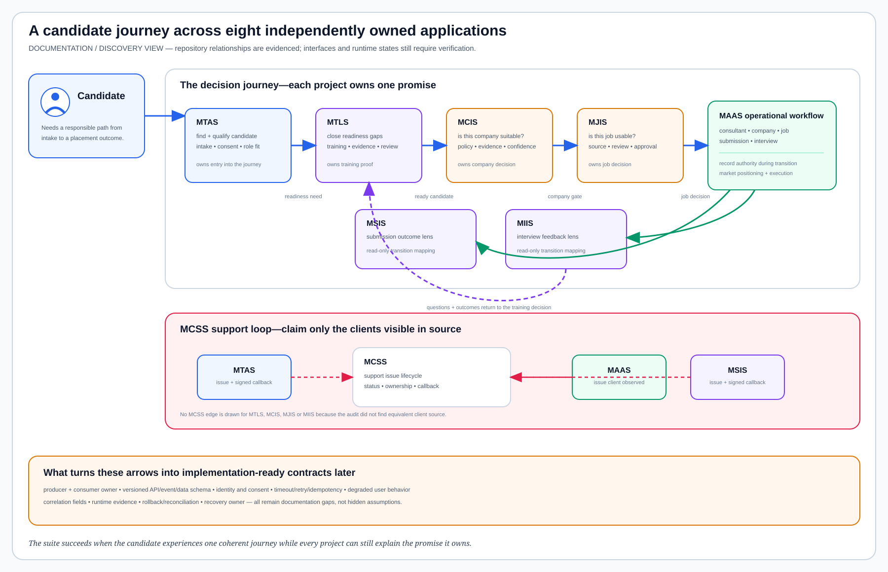

# Workforce and Placement Application Suite

Last verified: 2026-08-13

## What was actually found

Eight real MIDHTECH repositories form a connected workforce and placement
workflow: MAAS, MTAS, MTLS, MCIS, MJIS, MSIS, MIIS and MCSS. Their repository
README files describe distinct business responsibilities and repeatedly name
the order in which the applications contribute to candidate readiness,
company and job selection, submission, interview learning and support.

They are not care-delivery or payer applications. This documentation therefore
records them as a verified internal business-operations suite rather than
forcing them into the still-empty clinical and claims portfolios.

This is a discovery and architecture record only. It does not verify a current
deployment, copy source, run a pipeline, change a database, or authorize a
release.

The machine-readable inventory and relationship evidence are in
[`workforce-placement-application-inventory.json`](workforce-placement-application-inventory.json).

## One journey, eight project boundaries

| Project | Business promise evidenced in its repository | Boundary that must remain visible |
| --- | --- | --- |
| [MAAS](projects/applications/maas.md) | Operates company, consultant, job, submission and interview workflows with reports and automation. | Remains the operational source for shared records during the current intelligence-app transition. |
| [MTAS](https://github.com/MIDHTECH/mtas) | Finds and qualifies candidate leads, captures intake compliance, maps roles and drives outreach. | Owns candidate intake; it does not certify completed training or approve jobs. |
| [MTLS](https://github.com/MIDHTECH/mtls) | Owns training proof, playbooks, lab evidence, mock feedback and readiness review. | Approved training evidence may inform MAAS; draft content must not become market evidence. |
| [MCIS](https://github.com/MIDHTECH/mcis) | Decides whether a company is suitable for consultant placement using sponsorship and outcome evidence. | Owns company fit, not job intake, submission execution or interviews. |
| [MJIS](https://github.com/MIDHTECH/mjis) | Reviews ATS sources and jobs, preserving provenance and approval decisions. | Owns job intelligence; company policy remains in MCIS and downstream execution remains elsewhere. |
| [MSIS](https://github.com/MIDHTECH/msis) | Explains submission flow, readiness, rejection, hire and evidence-quality signals. | Provides submission intelligence while MAAS remains the operational source during transition. |
| [MIIS](https://github.com/MIDHTECH/miis) | Captures interview schedule, rounds, questions, feedback and preparation gaps. | Provides interview intelligence while MAAS retains operational record authority during transition. |
| [MCSS](https://github.com/MIDHTECH/mcss) | Tracks support issues and returns status to evidenced client applications. | Only MAAS, MTAS and MSIS integrations are claimed here because those clients were observed in source. |

## The human operating story

1. MTAS records who the candidate is, why the person entered the funnel, the
   consent and work-authorization context, and the role family being considered.
2. MTLS turns a real readiness gap into training work and retains trainer-reviewed
   evidence. MAAS consumes approved positioning inputs, not draft training prose.
3. MCIS answers whether the company is a responsible target. A negative or
   unresolved company decision prevents the workflow from treating its jobs as
   suitable.
4. MJIS decides whether a particular job is current, traceable and usable. Only
   a reviewed job should enter the MAAS operational submission workflow.
5. MAAS coordinates the consultant, job, company, submission and interview
   records while the intelligence applications remain separated by purpose.
6. MSIS turns submission state and outcomes into an action-oriented operating
   view; MIIS turns interview evidence into preparation feedback.
7. MIIS feedback returns to MTLS so the next learning decision is based on what
   happened, not on a generic curriculum.
8. MCSS receives support issues from repository-evidenced clients and returns
   issue state through authenticated callbacks where those callbacks exist.

## What is linked and what is still missing

The suite relationship is real enough to document, but most interfaces are not
yet precise enough for implementation planning. A named relationship such as
“MTAS identifies the consultant” is not an API contract. Each edge still needs:

- a canonical producer and consumer owner;
- an API, event or shared-data schema and semantic version;
- identity, authorization, consent and minimum-necessary data rules;
- timeout, retry, duplicate, idempotency and reconciliation behavior;
- degraded user experience and escalation ownership;
- correlation fields joining one candidate journey across projects; and
- later implementation, runtime, rollback and recovery evidence.

The two observed shared-data relationships—MAAS to MSIS and MAAS to MIIS—also
need an explicit transition decision. Unmanaged table mappings preserve current
compatibility, but they are tight coupling rather than a long-term integration
contract. Documentation must show current authority and a safe ownership
transfer before either intelligence application becomes the writer.

## Architecture-record sequence

Each repository will receive its own application architecture page and SVG.
The pages should be written in journey order because each one supplies context
for the next:

1. [MAAS](projects/applications/maas.md) as the operational record and shared identity anchor. Its detailed page is now complete.
2. MTAS and MTLS for candidate intake and readiness.
3. MCIS and MJIS for company and job decisions.
4. MSIS and MIIS for submission and interview learning.
5. MCSS for support issue lifecycle and callback boundaries.

No page should claim deployment status until runtime evidence is deliberately
collected in a separately authorized phase. The current machine state for all
eight applications is `not-verified-by-this-documentation`.
